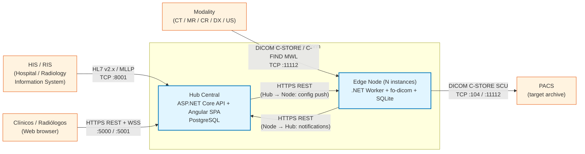
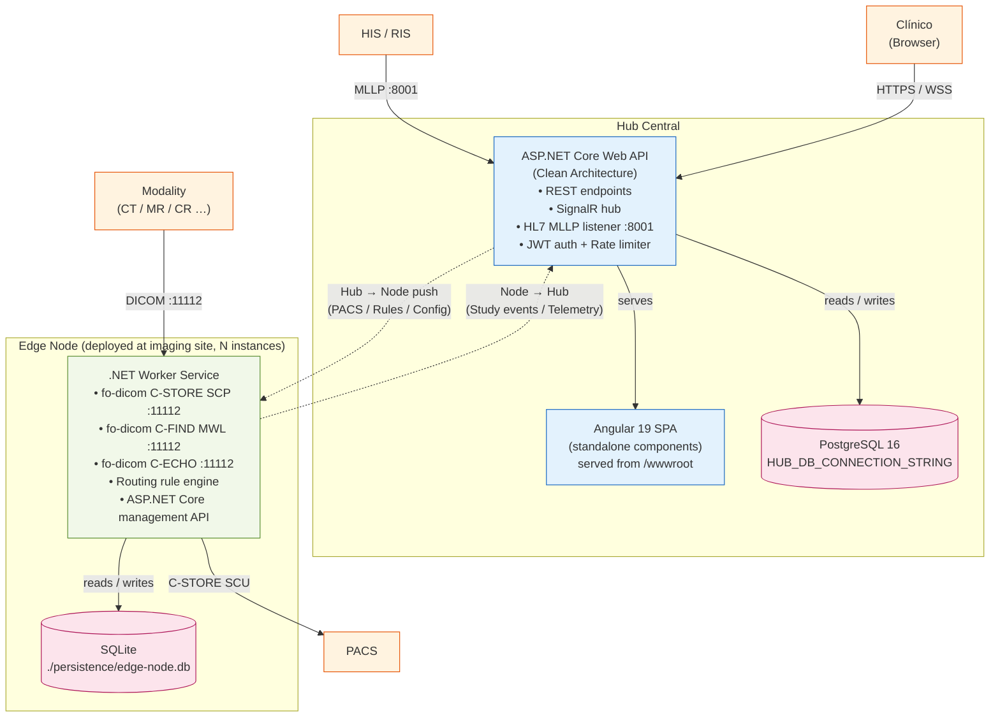
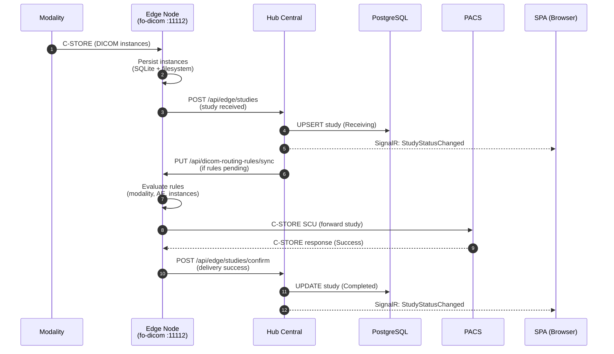
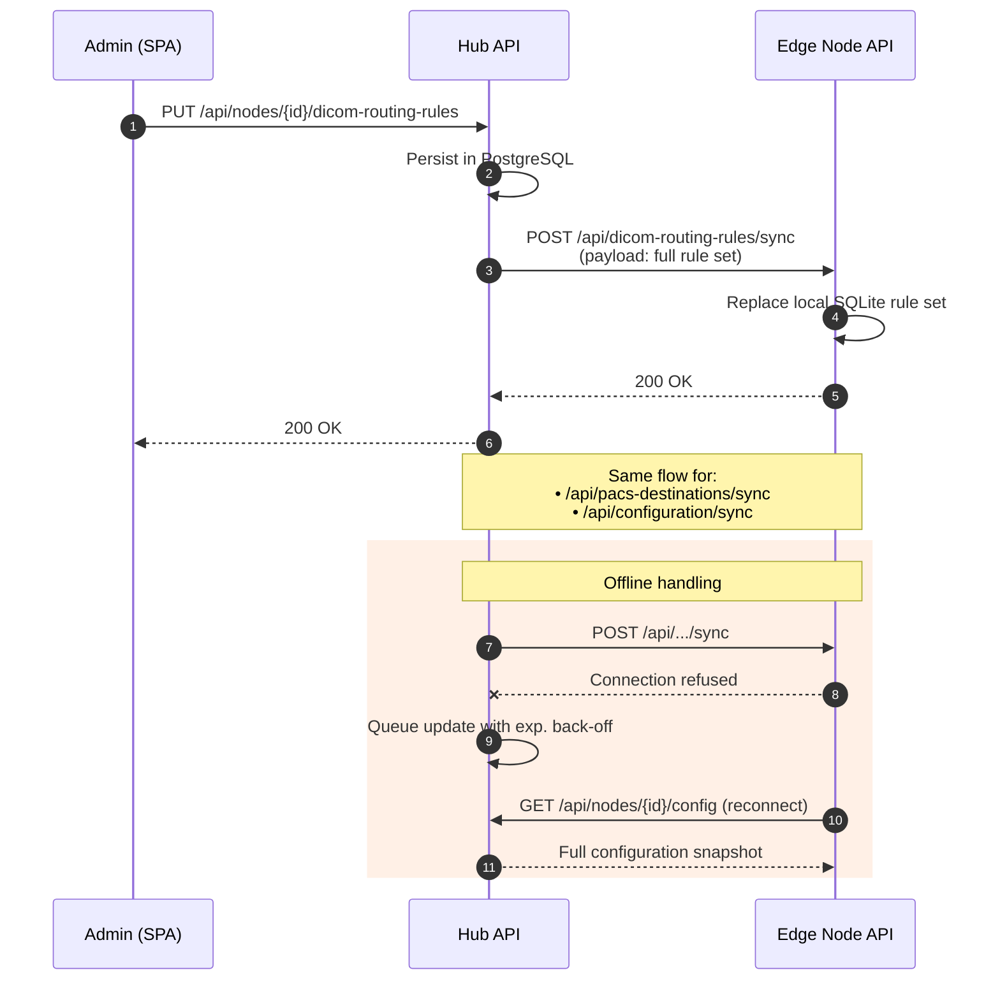
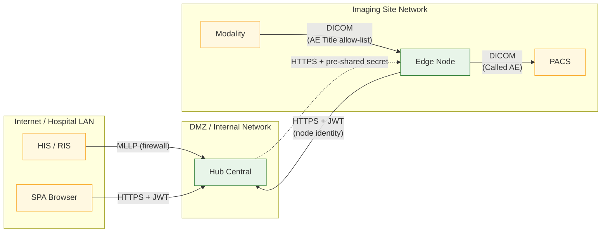

# Architecture

This document describes the EdgeGuard Platform architecture at the context and container levels, followed by key data-flow narratives and the hub-to-node synchronization pattern.

> **Important — DICOM routing model:**
> Imaging modalities **only connect to Edge Nodes** (DICOM C-STORE / C-FIND MWL on port `11112` by default).
> The Hub **never** receives DICOM associations from modalities. The Hub communicates with nodes via HTTPS REST and with HIS/RIS via HL7 MLLP.

---

## C4 Level 1 — System Context

**External actors:**

| Actor | Role | Protocol → EdgeGuard target |
|---|---|---|
| **HIS / RIS** | Hospital/Radiology Information System (HL7 producer) | MLLP over TCP → **Hub** (`:8001`) |
| **Modality** | Imaging equipment (CT, MR, CR, DX, US, …) | DICOM C-STORE / C-FIND → **Edge Node** (`:11112`) |
| **Clínicos** | Clinical users accessing the Angular SPA | HTTPS + WSS → **Hub** (`:5000` / `:5001`) |
| **PACS** | Picture Archiving and Communication System (study destination) | DICOM C-STORE SCU from **Edge Node** |

---

> **Production deployment target:** Hub runs on **Windows Server + IIS** (ASP.NET Core Hosting Bundle + AspNetCoreModuleV2). Each Edge Node runs as a **Windows Service** (`sc.exe` / `New-Service`). See [deployment-hub.md](../07-operations/deployment-hub.md) and [deployment-node.md](../07-operations/deployment-node.md). Linux/Docker deployments are supported as a secondary option.

## C4 Level 2 — Containers

### Container Responsibilities

| Container | Responsibility |
|-----------|----------------|
| **ASP.NET Core Web API (Hub)** | Business logic, HL7 message parsing, central routing rule storage, REST API, SignalR real-time events, JWT issuance and validation |
| **Angular SPA** | Clinical dashboard, node management, routing rule configuration, study browser, alert configuration |
| **PostgreSQL** | Persistent store for patients, studies, routing rules, PACS destinations, users, HL7 messages, and audit events |
| **Edge Node Worker** | DICOM C-STORE SCP (receives studies from modalities), MWL C-FIND SCP (serves worklist), local rule evaluation, study forwarding to PACS, Hub notification |
| **SQLite (per node)** | Local persistence for received instances, node configuration cache, and offline queue |

---

## Data Flow — Image Arrival to PACS Delivery

**Steps in detail:**

1. **Image arrival** — A modality opens a DICOM association with the Edge Node's C-STORE SCP on the configured port (default `11112`). Instances are written to SQLite + filesystem as they arrive; the association is closed after the final instance.
2. **Hub notification** — The Edge Node posts a study-received event to the Hub REST API. The Hub persists the study metadata in PostgreSQL and broadcasts a SignalR notification to connected SPA clients.
3. **Routing rule evaluation** — The Node's local rule engine evaluates the study against the rules previously pushed by the Hub (matching by modality, source AE Title, institution, instance count, etc.) and selects the destination PACS.
4. **PACS forwarding** — The Edge Node opens a C-STORE SCU association with the target PACS and sends all instances. Transfer syntax negotiation follows the standard DICOM association handshake.
5. **Delivery confirmation** — After a successful PACS C-STORE response, the Edge Node posts a delivery-confirmed event to the Hub. The Hub updates the study record to `Completed` and surfaces the status in the SPA in real time via SignalR.

---

## Hub → Node Push Pattern

The Hub is the authoritative source for routing rules, PACS destination configuration, and operational settings. Nodes **do not poll**; instead, the Hub pushes updates proactively over HTTPS to each node's management API.

> **Note:** If a node is temporarily offline when a push is attempted, the Hub queues the update and retries with exponential back-off. The node also fetches its full configuration on reconnect via `GET /api/nodes/{id}/config`.

---

## Security Boundaries

| Boundary | Protocol | Auth |
|----------|----------|------|
| HIS/RIS → Hub | MLLP over TCP | Network-level (firewall + IP allow-list) |
| Modality → Edge Node | DICOM association `:11112` | AE Title allow-list (Called AE + optional Calling AE) |
| Edge Node → Hub | HTTPS REST | JWT (node identity token) |
| SPA → Hub | HTTPS REST + WSS | JWT (user Bearer token) |
| Hub → Edge Node (push) | HTTPS REST | Pre-shared node secret |
| Edge Node → PACS | DICOM C-STORE SCU `:104` / `:11112` | AE Title + Called AE configuration |
