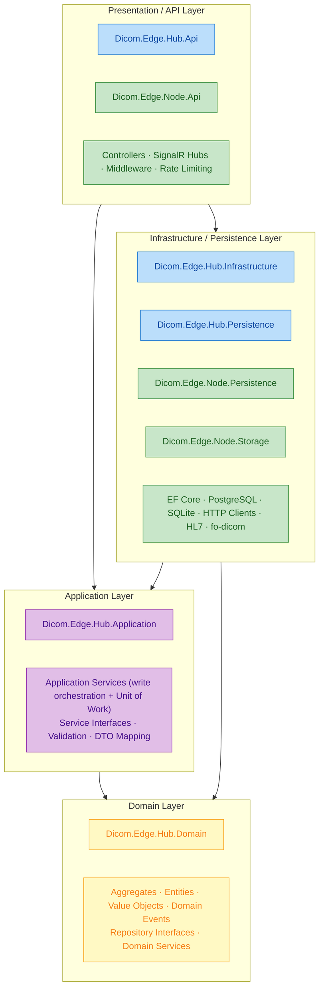
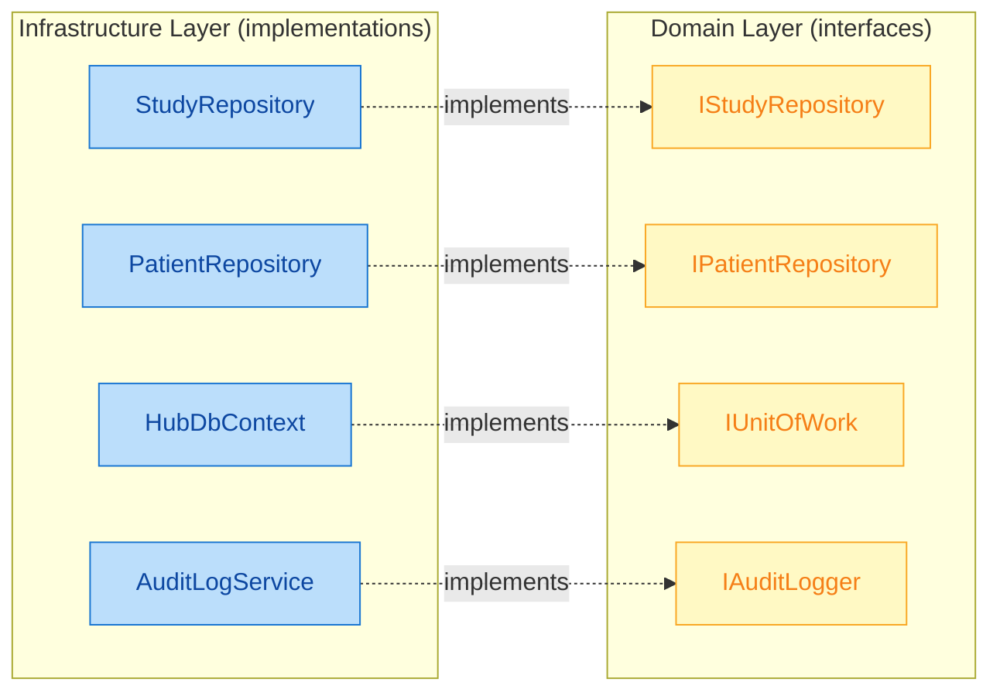

# Clean Architecture

EdgeGuard Platform is built on Clean Architecture principles, ensuring that business logic remains independent of frameworks, databases, and external concerns. This separation makes the codebase testable, maintainable, and resilient to technology changes.

---

## Layering Diagram



> **Dependencies flow INWARD only.** Outer layers depend on inner layers; inner layers NEVER reference outer layers.

---

## The Dependency Rule

> **The Dependency Rule**: Source code dependencies must point only inward — toward higher-level policies. Nothing in an inner circle can know anything at all about something in an outer circle.

In practice this means:

- **Domain** has zero references to EF Core, ASP.NET Core, or any framework.
- **Application** references Domain but not Infrastructure or API.
- **Infrastructure / Persistence** references Application (to implement interfaces) and Domain (to map entities).
- **API** references Application (to dispatch commands/queries) and Infrastructure (for DI registration).

### Interface Segregation Across Layers

Inner layers define the contracts; outer layers fulfil them:



The Domain layer defines `IStudyRepository` with methods such as `GetByIdAsync`, `AddAsync`, and `UpdateAsync`. The Persistence layer provides `StudyRepository`, which uses EF Core and a PostgreSQL `HubDbContext`. Application services receive `IStudyRepository` via constructor injection and are never aware of which database backs it.

---

## Layer Reference Table

| Layer | Projects | Responsibility | May Reference |
|---|---|---|---|
| **Domain** | `Dicom.Edge.Hub.Domain` | Aggregates, Entities, Value Objects, Domain Events, Repository & Service interfaces | Nothing outside the layer; only .NET BCL |
| **Application** | `Dicom.Edge.Hub.Application` | Application services that orchestrate writes through the Unit of Work, validation, DTO mapping | Domain |
| **Infrastructure** | `Dicom.Edge.Hub.Infrastructure` | External integrations: HL7 listener, fo-dicom, HTTP node client, email, file storage, **domain event handlers** | Application, Domain, Shared.Abstractions |
| **Persistence** | `Dicom.Edge.Hub.Persistence` | EF Core `HubDbContext`, repository implementations, migrations, **`DomainEventDispatchInterceptor`**, query tuning | Application, Domain, Shared.Abstractions |
| **API** | `Dicom.Edge.Hub.Api` | ASP.NET Core host, controllers, middleware, SignalR, rate limiting, Swagger | Application (services), Infrastructure (DI registration), Shared.Security |
| **Diagnostics** | `Dicom.Edge.Hub.Diagnostics` | Serilog bootstrap, OpenTelemetry, health check endpoints | Application, Infrastructure |

---

## Why Clean Architecture?

### Testability

Application logic can be unit-tested in isolation by substituting in-memory implementations of repository interfaces. No database, no HTTP server, no fo-dicom stack required.

```csharp
// Unit test — no real database needed
var repo = new InMemoryStudyRepository();
var service = new StudyService(repo, new FakeUnitOfWork());
var (study, error) = await service.UpdateStatusAsync(id, request, CancellationToken.None);
Assert.Null(error);
Assert.Equal(StudyStatus.Sent, study!.Status);
```

### Replaceability

- Swap PostgreSQL for a different RDBMS by replacing the Persistence project — Domain and Application are unchanged.
- Replace fo-dicom with another DICOM library by changing Infrastructure — no Application code changes.
- Add a gRPC transport alongside REST by adding a new API host project — business logic is untouched.

### Isolation of PHI and Business Rules

PHI redaction, audit logging, and data-access patterns are enforced at the boundary between Application and Infrastructure. Domain logic never performs logging or I/O directly.

---

## What NOT to Do

The following anti-patterns violate the dependency rule and must be avoided:

| Anti-pattern | Why It Is Harmful |
|---|---|
| Controller directly instantiating `HubDbContext` | Bypasses repository abstraction; kills testability; creates tight coupling to EF Core |
| Domain entity importing `Microsoft.EntityFrameworkCore` | Forces domain to depend on an infrastructure concern; breaks portability |
| Application handler calling `HttpClient` directly | Leaks infrastructure details into business logic; cannot be mocked cleanly |
| Value Object using `Newtonsoft.Json` attributes | Ties domain model to a serialisation library; violates domain purity |
| Migration classes referencing domain services | Migrations are schema artefacts; they must not run business logic |

```csharp
// BAD — controller tightly coupled to EF Core
public class StudiesController(HubDbContext db) : ControllerBase   // wrong
{
    [HttpGet("{id}")]
    public async Task<Study?> Get(string id, CancellationToken ct)
        => await db.Studies.FindAsync([id], ct);
}

// GOOD — reads go through a repository abstraction; writes through an application service
public class StudiesController(
    IStudyRepository studyRepository,   // queries
    IStudyService studyService          // write orchestration + Unit of Work
) : ControllerBase
{
    [HttpGet("{id}")]
    public async Task<IActionResult> Get(string id, CancellationToken ct)
        => Ok((await studyRepository.GetByIdAsync(id, ct))?.ToDto());
}
```

> **Pattern in use:** the Hub does **not** use a command/handler message bus. Controllers depend on
> repository interfaces for reads and on application service interfaces (`IStudyService`,
> `INodeService`, …) for writes. Services raise domain events on aggregates; those events are
> dispatched after `SaveChanges` by `DomainEventDispatchInterceptor`, which resolves every
> registered `IDomainEventHandler` (e.g. audit logging, study auto-delivery) — no in-process
> message bus is involved.

---

## Dependency Injection Registration Pattern

Each outer layer registers its own services in an extension method, keeping `Program.cs` clean:

```csharp
// Program.cs (Hub API) — actual registration calls
builder.Services.AddHubPersistence(builder.Configuration); // EF Core, repositories, DomainEventDispatchInterceptor
builder.Services.AddHubDomainServices();                   // Domain services
builder.Services.AddHubApplication(builder.Configuration); // Application services + Infrastructure integrations
builder.Services.AddWhatsAppServices();                    // WhatsApp messaging
builder.Services.AddHubHostedServices(builder.Configuration); // Background workers (node push dispatch, etc.)
builder.Services.AddEdgeSecurity(builder.Configuration);   // ITokenService, IAuthorizationService
builder.Services.AddEdgeAuthentication(builder.Configuration); // JWT Bearer + authorization policies
```

Each extension method is defined in its own project, so the API project references all layers for wiring but controllers only interact with Application service interfaces and Domain repository interfaces.

---

> **Note:** Violating the dependency rule is detectable at compile time if project references are kept strict. The solution is structured so that Domain and Application projects have no `<ProjectReference>` to Infrastructure, Persistence, or API projects. Any accidental reference will cause a build error.
