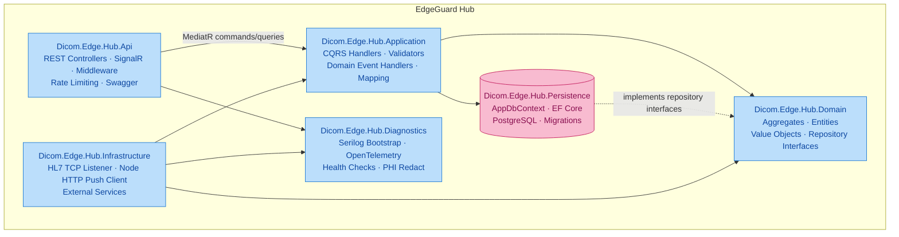
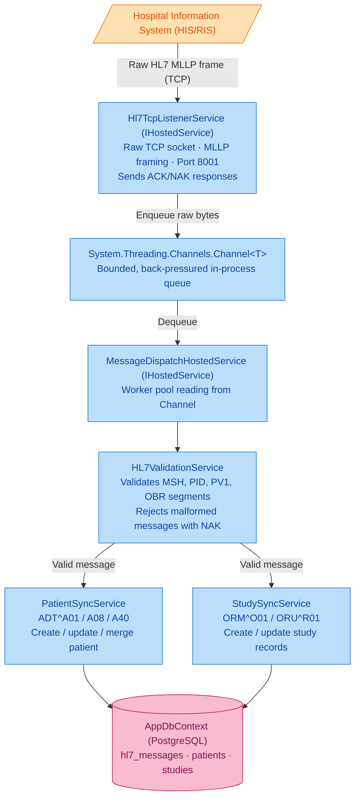
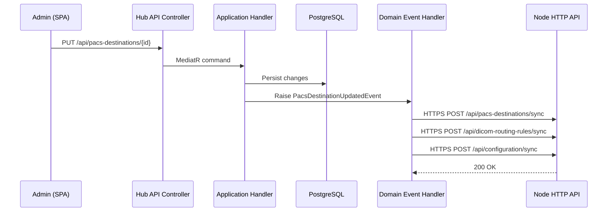
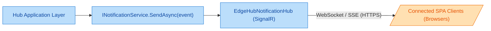

# Hub Central — Component Overview

The EdgeGuard Hub is the central coordination point for the platform. It receives HL7 messages from hospital information systems, manages studies and patients, pushes configuration to distributed Edge Nodes, and provides the API and real-time dashboard surface consumed by the web SPA.

---

## Project Relationship Diagram

---

## Project Reference Table

| Project | Responsibility | Key Classes / Concepts |
|---|---|---|
| `Dicom.Edge.Hub.Domain` | Core business rules, aggregates, domain events, repository contracts | `Study`, `Patient`, `NodeDicomRoutingRule`, `StudyStatus`, `IStudyRepository`, `IPatientRepository` |
| `Dicom.Edge.Hub.Application` | Orchestrates use cases via CQRS (MediatR), validates inputs, maps domain → DTO | `ReceiveStudyCommandHandler`, `SyncPatientCommandHandler`, `GetStudiesQueryHandler`, `StudyMappingProfile` |
| `Dicom.Edge.Hub.Infrastructure` | Integrates external systems: HL7 parsing, node HTTP push, background pipelines | `Hl7TcpListenerService`, `MessageDispatchHostedService`, `NodePushClient`, `HL7v2Parser` |
| `Dicom.Edge.Hub.Persistence` | EF Core data access, PostgreSQL migrations, repository implementations | `AppDbContext`, `StudyRepository`, `PatientRepository`, `Hl7MessageRepository`, EF migrations |
| `Dicom.Edge.Hub.Api` | ASP.NET Core host: REST API, SignalR, authentication middleware, rate limiting | `StudiesController`, `NodesController`, `EdgeHubNotificationHub`, `Program.cs` |
| `Dicom.Edge.Hub.Diagnostics` | Cross-cutting observability; consumed by Api and Infrastructure at startup | `SerilogBootstrap`, `PhiRedactionDestructuringPolicy`, `OpenTelemetryRegistration` |

---

## HL7 Inbound Pipeline

The Hub listens for HL7 v2 messages (ADT, ORM, ORU) over a raw TCP socket on port 8001 (MLLP). Messages flow through a staged pipeline before being committed to the database.

### Hosted Services

| Service | Interface | Role |
|---|---|---|
| `Hl7TcpListenerService` | `IHostedService` | Opens TCP socket; parses MLLP framing; sends HL7 ACK/NAK; enqueues raw messages to `Channel<RawHl7Message>` |
| `MessageDispatchHostedService` | `IHostedService` | Reads from the channel; dispatches to the appropriate sync service based on message type and trigger event |

---

## Hub → Node Push Pattern

When an administrator saves a PACS destination or routing rule through the Hub API, the change must be propagated to all relevant Edge Nodes without polling delays. The Hub uses a synchronous HTTP push via `NodePushClient`.

> **Note:** If a Node is offline at the time of the push, the delivery is retried using a Polly retry pipeline (exponential back-off, configurable max retries). The Node will also re-sync on reconnection via its health-check handshake.

---

## Rate Limiting Policies

The Hub API enforces two named rate-limiting policies using ASP.NET Core's built-in rate limiter:

| Policy Name | Applied To | Limit |
|---|---|---|
| `api` | All `/api/*` endpoints | 200 requests per minute per client IP |
| `edge` | All `/api/edge/*` endpoints (Node→Hub communication) | 100 requests per minute per Node identity |

Requests that exceed the limit receive `HTTP 429 Too Many Requests` with a `Retry-After` header.

---

## Real-Time Notifications — SignalR

`EdgeHubNotificationHub` is a SignalR hub mounted at `/hubs/notifications`. The web SPA connects on startup and subscribes to typed events.

### Published Events

| Event | Trigger | SPA Reaction |
|---|---|---|
| `StudyReceived` | New study arrives from a Node | Update study list, increment badge counter |
| `StudyStatusChanged` | Study transitions between states | Update status chip in study table |
| `NodeStatusChanged` | Node connects or disconnects | Update node health indicator |
| `Hl7MessageProcessed` | HL7 message successfully parsed and stored | HL7 activity feed |

---

## Hub Database — PostgreSQL

The Hub uses a single PostgreSQL database (`edgeguard_hub`) managed by EF Core migrations. Key tables:

| Table | Purpose |
|---|---|
| `studies` | DICOM study records received from Edge Nodes |
| `patients` | Patient demographics, supports HL7 A40 merge |
| `hl7_messages` | Raw and parsed inbound HL7 messages |
| `nodes` | Registered Edge Node registry |
| `pacs_servers` | PACS destination definitions |
| `node_dicom_routing_rules` | Per-node DICOM routing rules pushed to nodes |
| `routing_rules` | Hub-level routing rules |
| `audit_logs` | Immutable audit trail for all mutations |
| `system_settings` | Key-value store for Hub configuration |
| `users` | Operator accounts with role assignments |

See [database-schema.md](./database-schema.md) for full column-level detail.
