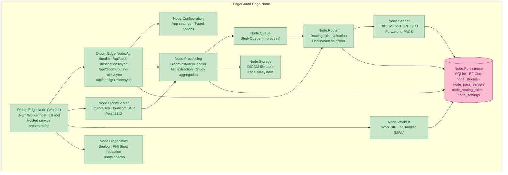
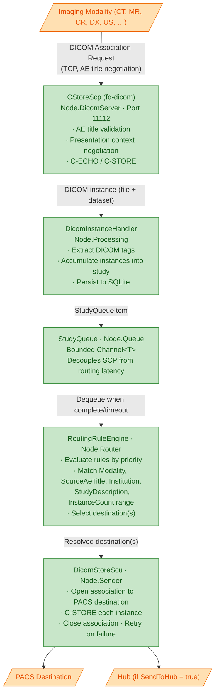
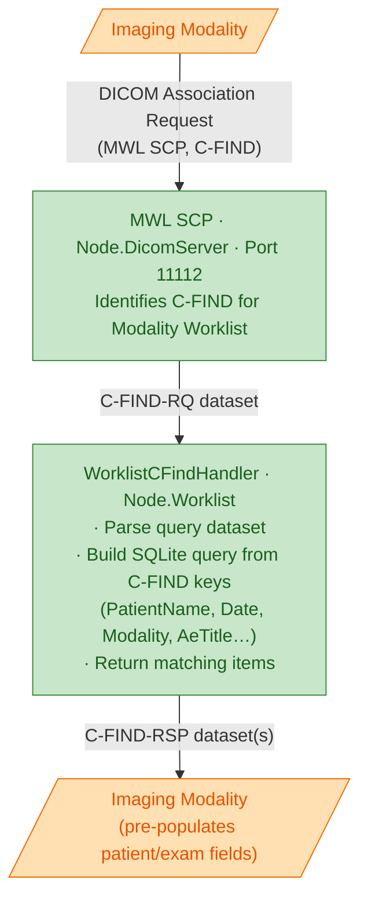
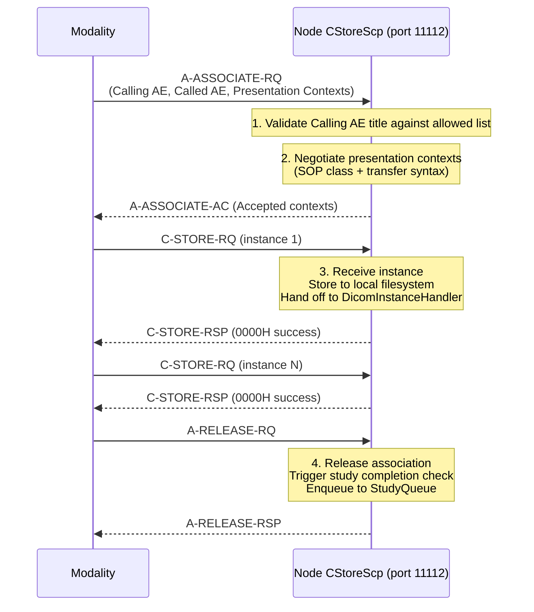

# Edge Node — Component Overview

An EdgeGuard Edge Node is a lightweight, autonomous service deployed on-premises at a clinical site. It receives DICOM studies directly from imaging modalities on port 11112, applies local routing rules, and forwards studies to PACS destinations. It operates in offline-first mode and synchronises state with the Hub when connectivity is available.

---

## Project Relationship Diagram

---

## Project Reference Table

| Project | Responsibility | Key Classes |
|---|---|---|
| `Dicom.Edge.Node` | .NET Worker host; DI composition root; hosts all other services | `Program.cs`, `WorkerHostExtensions` |
| `Dicom.Edge.Node.Api` | Lightweight ASP.NET Core API for Hub push synchronisation and health | `PacsDestinationsSyncController`, `DicomRoutingRulesSyncController`, `ConfigurationSyncController`, `HealthController` |
| `Dicom.Edge.Node.Configuration` | Reads and validates `appsettings.json`; typed options classes | `NodeOptions`, `DicomServerOptions`, `HubConnectionOptions` |
| `Dicom.Edge.Node.DicomServer` | fo-dicom SCP; accepts C-STORE and C-ECHO associations from modalities on port 11112 | `CStoreScp`, `DicomServer`, `AeTitleValidator`, `PresentationContextNegotiator` |
| `Dicom.Edge.Node.Processing` | Handles each received DICOM instance; builds study aggregation | `DicomInstanceHandler`, `StudyAggregator`, `DicomTagExtractor` |
| `Dicom.Edge.Node.Queue` | In-process queue bridging receive and routing; prevents back-pressure on SCP | `StudyQueue`, `StudyQueueItem`, `QueueMonitorService` |
| `Dicom.Edge.Node.Router` | Evaluates routing rules against study attributes; selects destinations | `RoutingRuleEngine`, `RoutingRuleEvaluator`, `DestinationResolver` |
| `Dicom.Edge.Node.Sender` | DICOM C-STORE SCU; forwards studies to PACS; handles retries | `DicomStoreScu`, `SendStudyJob`, `RetryPolicy` |
| `Dicom.Edge.Node.Storage` | Stores received DICOM files locally; garbage collection of sent files | `LocalDicomFileStore`, `StorageCleanupService` |
| `Dicom.Edge.Node.Worklist` | MWL SCP; responds to C-FIND requests from modalities | `WorklistCFindHandler`, `WorklistQueryBuilder` |
| `Dicom.Edge.Node.Persistence` | SQLite data access via EF Core; offline-first local state | `NodeDbContext`, `NodeStudyRepository`, `NodeRoutingRuleRepository` |
| `Dicom.Edge.Node.Diagnostics` | Serilog with PHI Strict mode; health check registrations | `NodeSerilogBootstrap`, `PhiStrictDestructuringPolicy` |

---

## DICOM Receive Flow (C-STORE)

Modalities (CT, MR, CR, DX, US, etc.) connect directly to the Edge Node on port 11112 via DICOM. They never connect to the Hub.

---

## Modality Worklist (MWL) Flow

> **Note:** Worklist data is populated by the HL7 ORM^O01 pipeline on the Hub. The Hub pushes scheduled procedure steps to the Node via `/api/configuration/sync` when worklist entries are created or modified.

---

## Hub Synchronisation — Node API Endpoints

The Node exposes a minimal HTTP API exclusively for Hub-initiated pushes. The Node does not poll the Hub; the Hub pushes changes as they occur.

| Endpoint | Method | Purpose | Payload |
|---|---|---|---|
| `/health` | GET | Liveness and readiness probe | `{ status, version, nodeId, connectedAt }` |
| `/api/pacs-destinations/sync` | POST | Receive updated PACS destination list from Hub | `PacsDestinationSyncRequest` |
| `/api/dicom-routing-rules/sync` | POST | Receive updated routing rules from Hub | `DicomRoutingRuleSyncRequest` |
| `/api/configuration/sync` | POST | Receive general node configuration and worklist entries | `ConfigurationSyncRequest` |

Requests from the Hub are authenticated using a shared node token (HMAC-signed, configured at node registration). The token is validated by the Node API middleware before any handler is invoked.

---

## SQLite Persistence — Offline-First Model

The Node persists all state to a local SQLite database so it can operate independently of Hub connectivity.

```mermaid
flowchart LR
    subgraph Online["Hub Connected"]
        O1["Push → Node updates config"]
        O2["Push → Node updates PACS destinations"]
        O3["Push → Node updates routing rules"]
        O4["Node sends study to PACS"]
        O5["Node reports study to Hub"]
    end

    subgraph Offline["Hub Offline"]
        F1["Node uses last-known config"]
        F2["Node routes to known destinations"]
        F3["Node applies cached rules"]
        F4["Node sends study to PACS"]
        F5["Node queues report for retry"]
    end

    Online -. "reconnect" .-> Offline
    Offline -. "reconnect" .-> Online

    classDef node fill:#c8e6c9,stroke:#388e3c,color:#1b5e20
    class O1,O2,O3,O4,O5,F1,F2,F3,F4,F5 node
```

When the Hub reconnects (detected via health-check handshake), the Node flushes its pending report queue and the Hub pushes any configuration changes that occurred during the offline period.

### Node SQLite Tables

| Table | Purpose |
|---|---|
| `node_studies` | Local record of received studies and their send status |
| `node_pacs_servers` | PACS destination definitions synced from Hub |
| `node_routing_rules` | Routing rules synced from Hub |
| `node_settings` | Key-value node configuration (AE title, port, Hub URL, token) |

---

## fo-dicom Association Lifecycle

Each DICOM association from a modality goes through a well-defined lifecycle managed by the `CStoreScp` in `Node.DicomServer`:

If the Calling AE title is not in the Node's allowed list, the SCP responds with `A-ASSOCIATE-RJ` (reason: Calling AE title not recognised). All association events are logged (with PHI redacted in Strict mode).

---

## Node Diagnostics and Health

`Dicom.Edge.Node.Diagnostics` wires up:

- **Serilog** with PHI Strict redaction (all patient identifiers replaced with `[REDACTED]` in log output)
- **OpenTelemetry** traces exported to Hub's collector endpoint
- **Health checks**: DICOM server reachability, SQLite connectivity, Hub connectivity, disk space for DICOM storage

Health check results are exposed at `/health` and also pushed to the Hub's `EdgeHubNotificationHub` SignalR channel so the dashboard reflects node status in real time.
