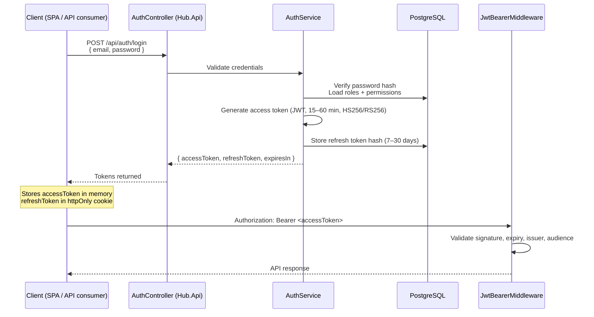
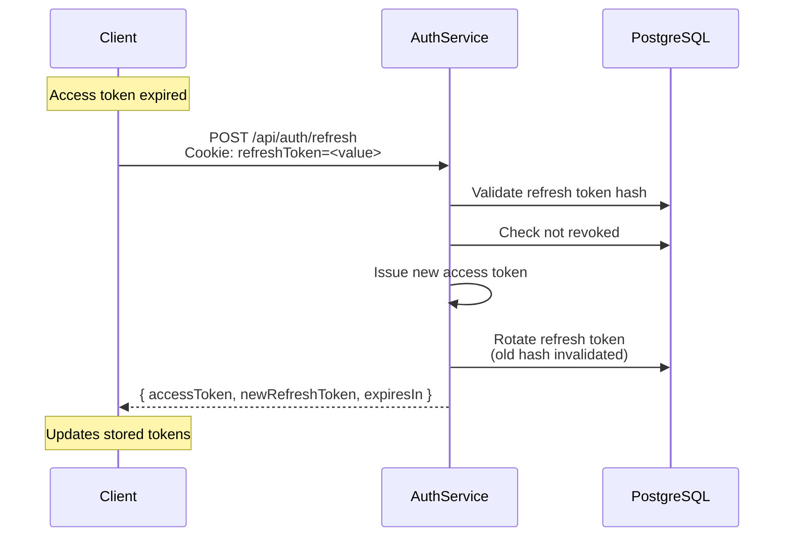
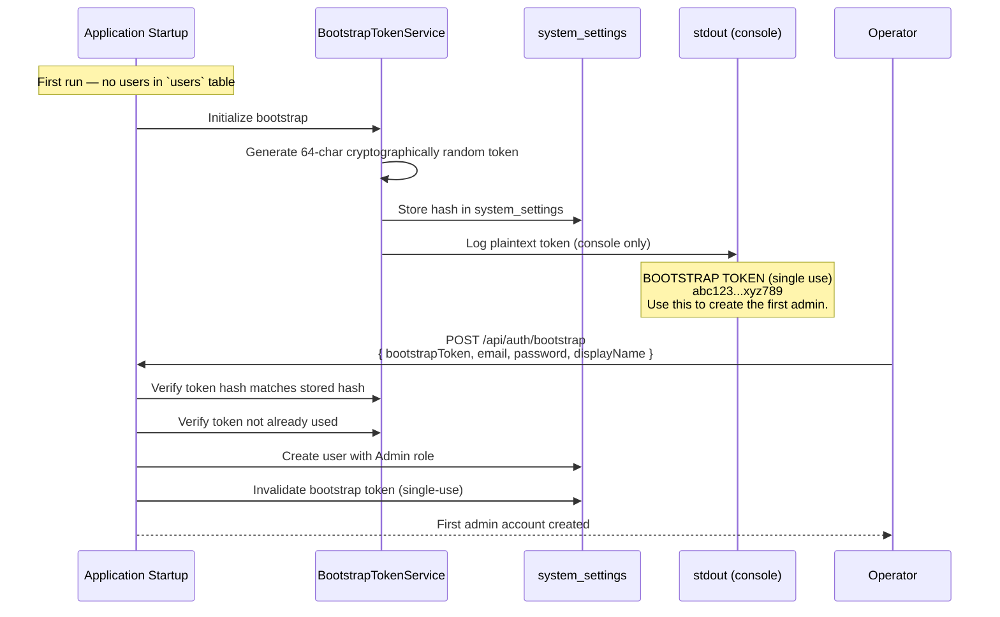
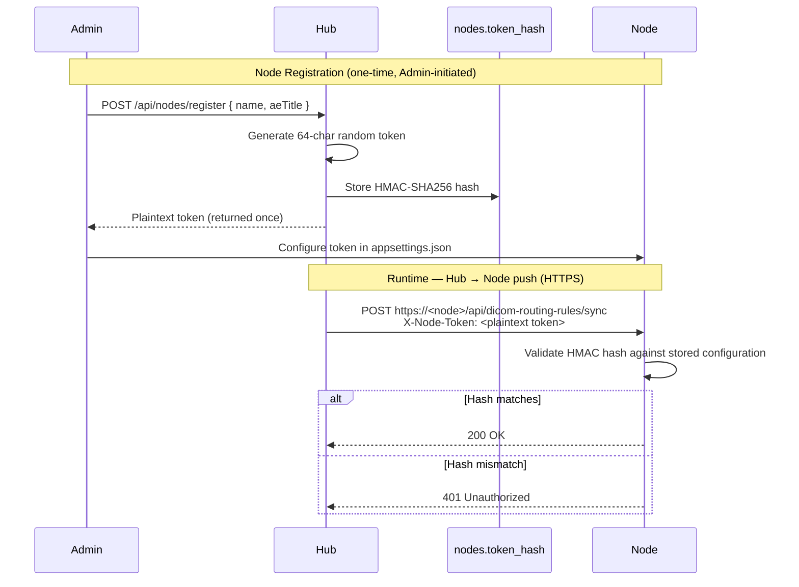

# Security Model

EdgeGuard Platform enforces a defence-in-depth security architecture covering authentication, authorisation, PHI protection, rate limiting, and network controls. This document covers each layer of the security model.

---

## Authentication Architecture

### Token-Based Authentication Flow



### Token Refresh Flow



> **Note:** Refresh tokens are single-use and rotated on each refresh. If a previously used refresh token is presented (token replay), the entire token family is invalidated and the user is logged out.

---

## Bootstrap Token — First-Run Setup

On initial deployment, no user accounts exist in the database. The Bootstrap Token mechanism allows the first administrator account to be created securely without any pre-existing credentials.



> **Note:** The bootstrap token is logged to stdout only — it is never written to log files, the database in plaintext, or any external sink. It is invalidated after a single successful use. If the token is lost before use, it can be regenerated by setting `BootstrapTokenUsed = false` in `system_settings` and restarting the Hub.

---

## JWT Payload Structure

```json
{
  "sub": "3fa85f64-5717-4562-b3fc-2c963f66afa6",
  "name": "Jane Smith",
  "email": "jane.smith@hospital.org",
  "roles": ["Admin"],
  "permissions": [
    "ViewStudies",
    "ManageNodes",
    "ManageSettings",
    "ManageUsers",
    "ViewAuditLogs"
  ],
  "iss": "https://edgeguard.hospital.org",
  "aud": "edgeguard-api",
  "exp": 1716912000,
  "iat": 1716908400,
  "jti": "a8c3f1e2-9b4d-4f8e-b2a1-7c5e8d3f9b6a"
}
```

| Claim | Type | Description |
|---|---|---|
| `sub` | `string` (UUID) | User ID (subject) |
| `name` | `string` | Display name |
| `email` | `string` | User email address |
| `roles` | `string[]` | Assigned role names |
| `permissions` | `string[]` | Effective permission set derived from roles |
| `iss` | `string` | Token issuer (Hub base URL) |
| `aud` | `string` | Token audience (`edgeguard-api`) |
| `exp` | `integer` | Expiry (Unix timestamp) |
| `iat` | `integer` | Issued at (Unix timestamp) |
| `jti` | `string` (UUID) | Unique token identifier for revocation |

---

## Roles and Permissions

### Role Definitions

| Role | Description | Typical User |
|---|---|---|
| `Admin` | Full access to all resources and administrative functions | IT administrator, system owner |
| `Operator` | Can manage studies and nodes; cannot manage users or system settings | Radiology technologist, PACS administrator |
| `Viewer` | Read-only access to studies and audit logs | Radiologist, clinical staff |

### Permission Policies

| Policy | Roles Granted | Protected Operations |
|---|---|---|
| `ViewStudies` | Admin, Operator, Viewer | GET studies, GET patients, view study details |
| `ManageNodes` | Admin, Operator | Register/edit/delete nodes, push config, view node status |
| `ManageSettings` | Admin | Edit PACS destinations, routing rules, system settings |
| `ManageUsers` | Admin | Create/edit/delete users, assign roles, reset passwords |
| `ViewAuditLogs` | Admin, Viewer | Read audit log entries |

### Permission Declaration in Controllers

```csharp
[Authorize(Policy = Policies.ManageEdgeNodes)]
[HttpPost("api/nodes/{id}/push-config")]
public async Task<IActionResult> PushConfiguration(string id, CancellationToken ct)
    => Ok(await _nodeConfigurationService.PushToNodeAsync(id, ct));
```

---

## PHI Redaction

EdgeGuard Platform handles Protected Health Information (PHI) — patient names, dates of birth, identifiers — and must ensure this data does not leak into log files, telemetry exports, or error messages.

### Redaction Modes

| Mode | Applied To | Behaviour |
|---|---|---|
| `Strict` | Edge Node | Every DICOM or HL7 log event has PHI fields replaced with `[REDACTED]` before writing to any sink. No patient identifiers appear in any log. |
| `Relaxed` | Hub | Structured log properties (e.g., `StudyId`, `NodeId`) are retained for operational monitoring. Free-text fields and DICOM dataset dumps are redacted. |

### Strict Mode — Redacted Fields

When `PhiRedactionMode = Strict`, the following fields are automatically redacted by `PhiStrictDestructuringPolicy` (a Serilog destructuring policy):

- Patient Name (`PatientName`, `patient_name`, DICOM tag `0010,0010`)
- Patient ID (`PatientId`, `patient_dicom_id`, DICOM tag `0010,0020`)
- Date of Birth (`BirthDate`, DICOM tag `0010,0030`)
- Accession Number (`AccessionNumber`, DICOM tag `0008,0050`)
- MRN / Issuer of Patient ID
- Phone number, email address

### Example — Log Output Comparison

```
# Strict mode (Node)
[INF] C-STORE received: Modality=CT, AeTitle=MODALITY01, StudyUid=[REDACTED],
      PatientName=[REDACTED], AccessionNumber=[REDACTED], Instances=24

# Relaxed mode (Hub)
[INF] Study received: StudyId=3fa85f64, NodeId=b2c4d6e8, Modality=CT,
      Instances=24, PatientName=[REDACTED], AccessionNumber=ACC-20240516-001
```

---

## Rate Limiting

All Hub API endpoints are protected by ASP.NET Core's built-in `RateLimiter` middleware using a fixed-window strategy.

| Policy | Endpoints | Limit | Window | Response on Exceed |
|---|---|---|---|---|
| `api` | All `/api/*` routes | 200 requests | 60 seconds per client IP | `HTTP 429` + `Retry-After` header |
| `edge` | All `/api/edge/*` routes | 100 requests | 60 seconds per Node identity | `HTTP 429` + `Retry-After` header |

The `edge` policy uses Node identity (extracted from the node token header) as the partition key rather than client IP, so multiple nodes behind a NAT gateway are not throttled as a group.

```csharp
// Registration in Hub.Api Program.cs
builder.Services.AddRateLimiter(options =>
{
    options.AddFixedWindowLimiter("api", o =>
    {
        o.PermitLimit = 200;
        o.Window = TimeSpan.FromMinutes(1);
        o.QueueProcessingOrder = QueueProcessingOrder.OldestFirst;
        o.QueueLimit = 10;
    });

    options.AddFixedWindowLimiter("edge", o =>
    {
        o.PermitLimit = 100;
        o.Window = TimeSpan.FromMinutes(1);
    });

    options.RejectionStatusCode = StatusCodes.Status429TooManyRequests;
});
```

---

## CORS Configuration

Cross-Origin Resource Sharing (CORS) is configured to allow the Angular SPA to communicate with the Hub API.

| Setting | Value |
|---|---|
| Allowed Origins | Configurable via `Cors:AllowedOrigins` in `appsettings.json` |
| Allowed Methods | `GET`, `POST`, `PUT`, `PATCH`, `DELETE`, `OPTIONS` |
| Allowed Headers | `Content-Type`, `Authorization` |
| Exposed Headers | `X-Pagination`, `Retry-After` |
| Credentials | `true` (required for `httpOnly` refresh token cookie) |

```json
// appsettings.json
{
  "Cors": {
    "AllowedOrigins": [
      "https://edgeguard.hospital.org",
      "https://localhost:4200"
    ]
  }
}
```

> **Note:** Wildcard origins (`*`) are not supported when `credentials: true` is set. The `AllowedOrigins` list must enumerate each permitted origin explicitly. Never add `*` to this list in production.

---

## Node-to-Hub Communication Security

Edge Nodes communicate with the Hub using a shared per-node HMAC token established at registration time.



---

## Security Checklist for Operators

| Item | Status |
|---|---|
| Change default JWT signing key before first production deployment | Required |
| Restrict `Cors:AllowedOrigins` to production SPA URL only | Required |
| Ensure Bootstrap Token is recorded and stored securely at first run | Required |
| Enable HTTPS on Hub and Node APIs; disable HTTP redirect in prod | Required |
| Review `Serilog:MinimumLevel` — avoid `Debug` or `Verbose` in production (PHI risk) | Required |
| Set `PhiRedactionMode = Strict` on all Node deployments | Required |
| Rotate node tokens periodically via the Node management API | Recommended |
| Enable database connection encryption (PostgreSQL `sslmode=require`) | Recommended |
| Review `RateLimiter:PermitLimit` values for expected traffic volume | Recommended |
