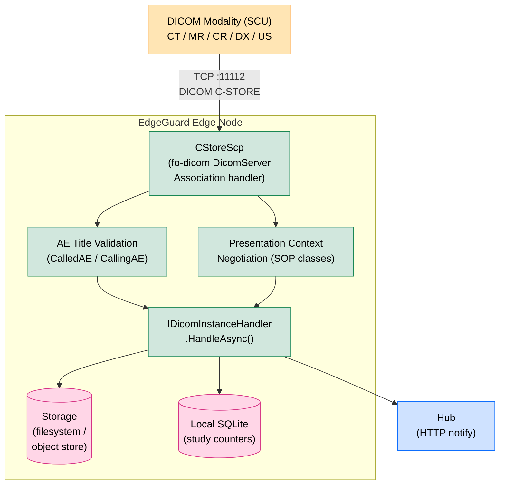
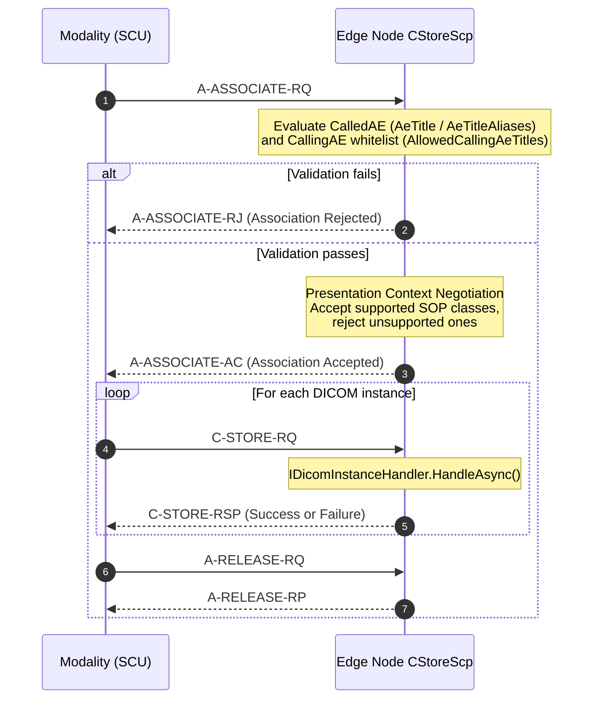
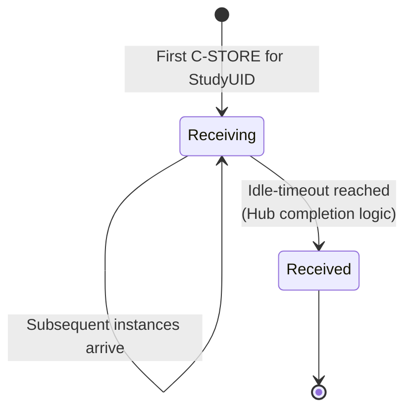

# DICOM Image Reception

## Overview

EdgeGuard Platform includes a full DICOM Storage Service Class Provider (SCP) implemented with the fo-dicom library. Modalities (CT scanners, MRI machines, CR/DR units, ultrasound, etc.) push images to the platform via the DICOM C-STORE service. The platform validates the association, accepts the instances, persists them to storage, updates study state in the local database, and notifies the Hub.

---

## Architecture



---

## Association Lifecycle



---

## AE Title Validation

### CalledAE (Called Application Entity)

The modality specifies which AE it is calling in the association request. The platform verifies this matches its configured identity.

| Configuration Key | Purpose |
|---|---|
| `DicomServer:AeTitle` | Primary AE title (case-insensitive comparison) |
| `DicomServer:AeTitleAliases` | Additional accepted AE titles (array) |

If `ValidateCalledAe` is set to `false`, CalledAE validation is bypassed and all inbound associations are accepted regardless of the called AE title.

```json
{
  "DicomServer": {
    "AeTitle": "EDGEGUARD",
    "AeTitleAliases": ["EDGEGUARD_BACKUP", "EG_ARCHIVE"],
    "ValidateCalledAe": true
  }
}
```

### CallingAE Whitelist

The modality identifies itself with its own AE title (CallingAE). The platform can restrict which modalities are permitted to send images.

| Configuration Key | Behaviour |
|---|---|
| `DicomServer:AllowedCallingAeTitles` | Array of permitted CallingAE titles |
| *(empty array or key absent)* | Accept all CallingAE titles |

```json
{
  "DicomServer": {
    "AllowedCallingAeTitles": ["CT_SCANNER_1", "MRI_UNIT_A", "CR_ROOM_2"]
  }
}
```

---

## Presentation Context Negotiation

During association negotiation the platform declares which DICOM SOP classes it accepts. Only contexts in the accepted list are negotiated successfully; the modality may not send instances for rejected contexts.

### Accepted SOP Classes

| Category | Examples |
|---|---|
| CT Image Storage | 1.2.840.10008.5.1.4.1.1.2 |
| MR Image Storage | 1.2.840.10008.5.1.4.1.1.4 |
| CR Image Storage | 1.2.840.10008.5.1.4.1.1.1 |
| Digital X-Ray (DX) | 1.2.840.10008.5.1.4.1.1.1.1 |
| Secondary Capture | 1.2.840.10008.5.1.4.1.1.7 |
| Ultrasound Image | 1.2.840.10008.5.1.4.1.1.6.1 |
| Nuclear Medicine | 1.2.840.10008.5.1.4.1.1.20 |
| Structured Report | 1.2.840.10008.5.1.4.1.1.88.* |
| *(all standard Storage SOP classes)* | Per DICOM PS3.4 Annex B |

### Service Classes

| Service | SOP Class UID | Purpose |
|---|---|---|
| C-STORE (image reception) | All Storage SOP Classes | Accept pushed DICOM instances |
| C-FIND MWL | 1.2.840.10008.5.1.4.31 | Modality Worklist queries |
| C-FIND Study Root | 1.2.840.10008.5.1.4.1.2.2.1 | Study-level queries |
| C-ECHO | 1.2.840.10008.1.1 | Connectivity verification |

---

## C-ECHO (Verification)

C-ECHO allows a modality to verify network connectivity and AE title reachability before sending images.

| Configuration Key | Default | Purpose |
|---|---|---|
| `DicomServer:CEchoEnabled` | `true` | Accept or reject C-ECHO requests |

When `CEchoEnabled = false`, C-ECHO presentation contexts are not negotiated and the modality receives a context rejection for SOP class 1.2.840.10008.1.1.

---

## Instance Handling

When a C-STORE request is received for an accepted SOP class, `IDicomInstanceHandler.HandleAsync()` is invoked synchronously within the association context.

### Steps

1. **Persist to storage** — Write the DICOM file (`.dcm`) to the configured storage backend (local filesystem or object storage).
2. **Update local database** — Increment the instance count on the associated Study record; update `LastInstanceReceivedAt` timestamp.
3. **Notify Hub** — Send an HTTP notification to the EdgeGuard Hub with the study UID and instance details so the Hub can update its real-time status display.

### Study State During Reception



> The transition from `Receiving` to `Received` is managed by the Hub, which applies a configurable idle-timeout after the last instance arrives.

---

## Configuration Reference

```json
{
  "DicomServer": {
    "AeTitle": "EDGEGUARD",
    "Port": 11112,
    "AeTitleAliases": [],
    "ValidateCalledAe": true,
    "AllowedCallingAeTitles": [],
    "MwlEnabled": true,
    "CEchoEnabled": true
  }
}
```

| Key | Type | Default | Description |
|---|---|---|---|
| `AeTitle` | string | `"EDGEGUARD"` | Primary AE title of this SCP |
| `Port` | integer | `11112` | TCP port to listen on |
| `AeTitleAliases` | string[] | `[]` | Additional accepted CalledAE titles |
| `ValidateCalledAe` | bool | `true` | Enforce CalledAE validation |
| `AllowedCallingAeTitles` | string[] | `[]` | CallingAE whitelist (empty = all allowed) |
| `MwlEnabled` | bool | `true` | Enable Modality Worklist (C-FIND MWL) |
| `CEchoEnabled` | bool | `true` | Accept C-ECHO verification requests |

---

## Error Scenarios

| Condition | DICOM Response |
|---|---|
| CalledAE does not match AeTitle or aliases | A-ASSOCIATE-RJ (Rejected — Called AE Title Not Recognized) |
| CallingAE not in whitelist | A-ASSOCIATE-RJ (Rejected — Calling AE Not Recognized) |
| SOP class not in accepted list | Presentation Context rejection (Abstract Syntax Not Supported) |
| Storage write failure | C-STORE-RSP with status 0xA700 (Out of Resources) |
| Database update failure | C-STORE-RSP with status 0xA900 (Data Set Does Not Match SOP Class) |
| C-ECHO disabled | Presentation context for 1.2.840.10008.1.1 rejected |

---

## Related Documentation

- [HL7 Pipeline Overview](hl7-pipeline.md)
- [HL7 ORM Message Handling](hl7-orm.md) — creates Scheduled studies visible in MWL
- [Modality Worklist](modality-worklist.md)
- [Equipment Catalog](equipment-catalog.md) — calling-AE association acceptance & per-equipment MWL filtering
