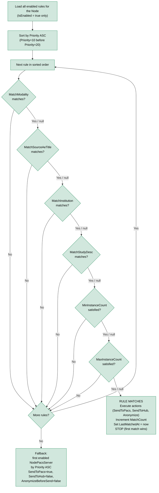
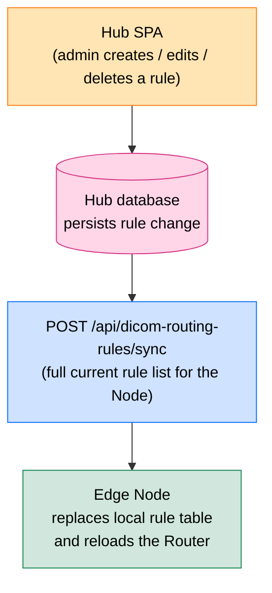

# DICOM Routing Rules

> **Section:** 04-Features  
> **Applies to:** EdgeGuard Node service, Hub service  
> **Last updated:** 2026-05-16

---

## Overview

DICOM Routing Rules allow operators to define policy-driven logic that determines how each study is processed and where it is sent after being received by a Node. Rules are evaluated against each incoming study; the first matching rule dictates the routing action. Rules are authored in the Hub and automatically synchronized to the Node.

---

## Rule Structure

Each rule is represented by a `NodeDicomRoutingRule` aggregate with the following fields:

| Field | Type | Description | Example |
|---|---|---|---|
| `NodeId` | GUID | Node this rule belongs to | `"a1b2c3d4-..."` |
| `Name` | string | Human-readable label | `"CT to Main PACS"` |
| `Priority` | int | Evaluation order (lower = evaluated first) | `10` |
| `IsEnabled` | bool | Whether the rule participates in evaluation | `true` |
| `MatchModality` | string? | DICOM modality code to match (null = any) | `"CT"` |
| `MatchSourceAeTitle` | string? | Calling AE title from the modality (null = any) | `"CTSCANNER1"` |
| `MatchInstitution` | string? | Institution name from DICOM tag (0008,0080) (null = any) | `"North Clinic"` |
| `MatchStudyDesc` | string? | Substring match on Study Description (0008,1030) (null = any) | `"CHEST"` |
| `MinInstanceCount` | int? | Minimum instance count threshold (null = no minimum) | `1` |
| `MaxInstanceCount` | int? | Maximum instance count threshold (null = no maximum) | `500` |
| `DestinationAeTitle` | string | AE title of the target PACS server | `"MAINSTORESCU"` |
| `SendToPacs` | bool | Execute C-STORE to `DestinationAeTitle` | `true` |
| `SendToHub` | bool | Report received images to the Hub | `false` |
| `AnonymizeBeforeSend` | bool | Strip PHI from DICOM tags before sending | `false` |
| `MatchCount` | long | Total number of studies matched by this rule (analytics) | `1428` |
| `LastMatchedAt` | DateTimeOffset? | Timestamp of most-recent match (analytics) | `"2026-05-16T..."` |

---

## Match Conditions

Conditions are evaluated independently. **A `null` value on any condition acts as a wildcard and matches any study value.** All non-null conditions must match for the rule to fire.

### Modality (`MatchModality`)

Matches the DICOM Modality tag (0008,0060). Comparison is **case-insensitive**.

Common values: `CT`, `MR`, `CR`, `DX`, `US`, `NM`, `PT`, `MG`, `XA`, `RF`, `OT`

```
MatchModality = "CT"  → matches CT studies only
MatchModality = null  → matches any modality
```

### Source AE Title (`MatchSourceAeTitle`)

Matches the DICOM Calling AE Title presented by the modality during C-STORE. Useful for routing different scanners to different PACS destinations. Comparison is **case-insensitive**.

```
MatchSourceAeTitle = "CTSCANNER1"  → only from that specific device
MatchSourceAeTitle = null          → any modality AE title
```

### Institution (`MatchInstitution`)

Matches the DICOM Institution Name tag (0008,0080). Useful in multi-site deployments where a single Node serves multiple departments. Comparison is **case-insensitive**.

```
MatchInstitution = "North Clinic"  → studies from that institution only
MatchInstitution = null            → any institution (including absent tag)
```

### Study Description (`MatchStudyDesc`)

Performs a **case-insensitive substring** match against the Study Description tag (0008,1030). A study matches if its description *contains* the configured string.

```
MatchStudyDesc = "CHEST"  → matches "CHEST PA", "Chest CT with contrast", "HRCT CHEST"
MatchStudyDesc = null     → any description (including absent tag)
```

### Instance Count Range (`MinInstanceCount` / `MaxInstanceCount`)

Restricts the rule to studies with a specific image count range. Applied after all images are received (study in `Received` state).

```
MinInstanceCount = 1,   MaxInstanceCount = null  → at least 1 image
MinInstanceCount = null, MaxInstanceCount = 50   → 50 images or fewer
MinInstanceCount = 100, MaxInstanceCount = 500   → between 100 and 500 images
```

---

## Actions

Each matched rule can trigger one or more actions simultaneously:

| Action | Field | Description |
|---|---|---|
| Send to PACS | `SendToPacs = true` | Executes C-STORE SCU to `DestinationAeTitle`. The PACS must be configured as a `NodePacsServer`. |
| Report to Hub | `SendToHub = true` | Notifies the Hub that this study has been received. Updates the study record in the central database. |
| Anonymize | `AnonymizeBeforeSend = true` | Strips protected health information (PHI) from DICOM tags before any outbound transmission. Applied before C-STORE and Hub reporting. |

> **Anonymization scope:** The anonymization step removes or blanks all tags listed in DICOM PS 3.15 Annex E (Basic Application Level Confidentiality Profile), including patient name, date of birth, address, and accession number. Study Instance UID is replaced with a derived pseudonymous UID to maintain internal consistency.

---

## Evaluation Algorithm

Rules are evaluated once per study, in the following sequence:



> **First match wins:** Only one rule fires per study. Lower `Priority` numbers are evaluated first. Once a rule matches, the remaining rules are skipped regardless of whether they would also match.

---

## Priority Management

Priority is a positive integer. Lower numbers sort first (higher evaluation priority).

**Best practice — use gaps between values:**

```
Priority  10 → Emergency / specific override rules
Priority  20 → Modality-specific rules (CT, MR, etc.)
Priority  30 → Department / institution rules
Priority  50 → Catch-all rules (null on all conditions)
Priority 999 → Default fallback rule (if used)
```

Using gaps avoids renumbering existing rules when inserting new ones. Rules can be reordered in the SPA by editing the `Priority` field.

---

## Example Rule Set

The following example demonstrates a typical configuration for a multi-modality Node:

### Rule 1 — Emergency CT (Priority 10)

| Field | Value |
|---|---|
| `Name` | `"Emergency CT"` |
| `Priority` | `10` |
| `MatchModality` | `"CT"` |
| `MatchStudyDesc` | `"EMERGENCY"` |
| `DestinationAeTitle` | `"EMERGPACS"` |
| `SendToPacs` | `true` |
| `SendToHub` | `true` |
| `AnonymizeBeforeSend` | `false` |

### Rule 2 — All CT Studies (Priority 20)

| Field | Value |
|---|---|
| `Name` | `"CT to Main PACS"` |
| `Priority` | `20` |
| `MatchModality` | `"CT"` |
| `DestinationAeTitle` | `"MAINSTORESCU"` |
| `SendToPacs` | `true` |
| `SendToHub` | `true` |
| `AnonymizeBeforeSend` | `false` |

### Rule 3 — All MR Studies (Priority 30)

| Field | Value |
|---|---|
| `Name` | `"MR to Main PACS"` |
| `Priority` | `30` |
| `MatchModality` | `"MR"` |
| `DestinationAeTitle` | `"MAINSTORESCU"` |
| `SendToPacs` | `true` |
| `SendToHub` | `true` |
| `AnonymizeBeforeSend` | `false` |

### Rule 4 — Research Catch-All with Anonymization (Priority 999)

| Field | Value |
|---|---|
| `Name` | `"Research Archive (Anonymized)"` |
| `Priority` | `999` |
| `MatchModality` | `null` (any) |
| `DestinationAeTitle` | `"RESEARCHPACS"` |
| `SendToPacs` | `true` |
| `SendToHub` | `false` |
| `AnonymizeBeforeSend` | `true` |

**Evaluation walkthrough for an Emergency CT study:**
```
Study: Modality=CT, Description="EMERGENCY CHEST"
→ Rule 1 (Priority 10): Modality=CT ✓, Desc contains "EMERGENCY" ✓ → MATCH
→ Actions: C-STORE to EMERGPACS, report to Hub, no anonymization
→ Rules 2, 3, 4 are NOT evaluated
```

**Evaluation walkthrough for a routine ultrasound:**
```
Study: Modality=US, Description="Abdominal US"
→ Rule 1 (Priority 10): Modality=CT ✗ → skip
→ Rule 2 (Priority 20): Modality=CT ✗ → skip
→ Rule 3 (Priority 30): Modality=MR ✗ → skip
→ Rule 4 (Priority 999): Modality=null ✓ (wildcard) → MATCH
→ Actions: C-STORE to RESEARCHPACS (anonymized), no Hub report
```

---

## Hub → Node Automatic Sync

Routing rules are mastered in the Hub. Any create, update, or delete operation on a rule triggers an automatic push to the Node:



If the Node is offline, the sync is replayed on the next successful Node check-in. The Node always applies the full rule set received from the Hub — partial updates are not used.

---

## Rule Analytics

Two fields are automatically maintained on each rule for operational monitoring:

| Field | Updated when | Purpose |
|---|---|---|
| `MatchCount` | Every time the rule fires | Identify heavily used or unused rules |
| `LastMatchedAt` | Every time the rule fires | Identify stale rules that haven't matched recently |

Rules with `MatchCount = 0` after several weeks of operation may be candidates for review or removal. Rules with a very high `MatchCount` are critical paths and should be tested before modification.

---

## SPA User Interface

### Rule List

Rules are displayed in the SPA per PACS destination (filtered by `DestinationAeTitle`). The list shows:

- Rule name, priority, and enabled/disabled status
- Match conditions summary
- Match count and last matched timestamp
- Quick-toggle to enable or disable a rule without opening the edit form

### Create / Edit Form

The form dialog exposes all rule fields described in the [Rule Structure](#rule-structure) table. Priority can be entered manually; the form warns if a priority value is already in use.

### Enable / Disable Toggle

Rules can be toggled without editing their configuration. Disabled rules (`IsEnabled = false`) are excluded from evaluation on the Node. The toggle immediately triggers a Hub → Node sync.

---

## Related Documentation

- [Multi-PACS Routing](multi-pacs-routing.md) — PACS destination configuration and send flow
- [Study Pipeline](study-pipeline.md) — when routing rules are evaluated in the study lifecycle
