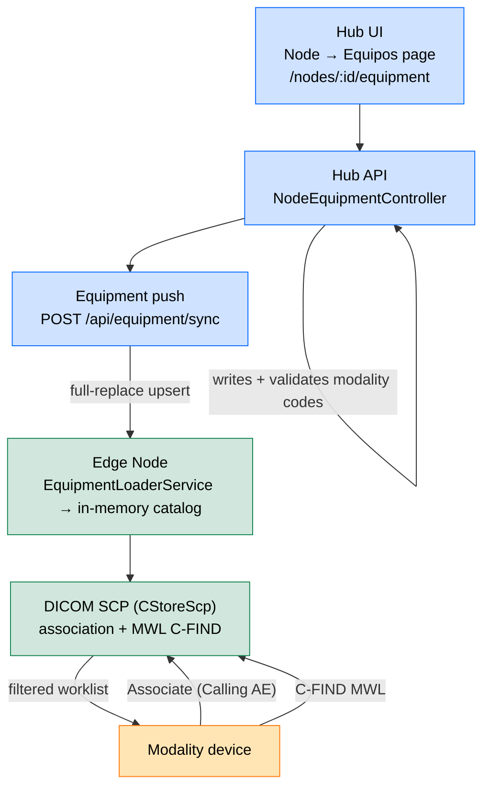

# Equipment Catalog & Per-Equipment MWL Filtering

> **Section:** 04-Features
> **Applies to:** EdgeGuard Hub (backend + UI), EdgeGuard Edge Node, Shared contracts
> **Last updated:** 2026-06-06

---

## Overview

The **Equipment Catalog** lets operators register, per Edge Node, exactly which modality
devices may connect and what each one is allowed to see in its Modality Worklist (MWL).
It replaces the flat `dicom.allowed_ae_titles` whitelist with a structured, per-node list of
**equipment** entries — each identified by its calling AE title and linked to a set of
**modalities** drawn from a seeded reference catalog.

The Edge Node (DICOMEdge) is the enforcement point. Using the catalog it:

1. **Accepts or rejects DICOM associations** by calling AE title, and
2. **Filters the MWL per equipment** so each device only sees worklist items for the
   modalities (and, optionally, the scheduled station AE) it is configured for — instead of
   returning the whole worklist and trusting the device to self-filter.

Equipment is authored in the Hub, managed from the Hub UI, and pushed to the node, reusing
the same synchronization pattern as DICOM routing rules.

---

## Concepts

### Modality reference catalog

A global, auto-seeded reference table of DICOM modality codes (Defined Terms). Each entry has:

| Field | Description |
|---|---|
| `Code` | DICOM Defined Term — PK (e.g. `MG`, `US`, `DX`, `MR`, `CT`, `CR`) |
| `DisplayName` | Spanish label (e.g. "Resonancia Magnética") |
| `IsSupported` | `true` for image-level modalities only; `false` for non-image objects (SR, KO, PR, AU, waveforms, most RT objects) |
| `IsActive` | Operator-controlled soft switch (preserved across re-seeds) |
| `SortOrder` | UI ordering |

Only modalities that are **both** `IsSupported` and `IsActive` may be assigned to equipment
or used for MWL filtering. The seed is idempotent (upsert by `Code`) and runs on startup on
both Hub and Edge from the **same shared source** (`ModalitySeed`), keeping codes consistent
across the fleet. The full proposed seed list (image vs non-image) lives in the
implementation plan, Appendix A:
[equipment-catalog-mwl-filtering-plan.md](../10-remediation/equipment-catalog-mwl-filtering-plan.md).

### Equipment

A modality device scoped to a single node:

| Field | Description |
|---|---|
| `AeTitle` | Calling AE of the device — unique per node, drives association acceptance |
| `DisplayName` | UI label |
| `ModalityCodes` | M:N set of allowed modality codes (the MWL filter) |
| `StationAeTitle` | Optional `ScheduledStationAETitle` (0040,0001) filter |
| `StationName` | Optional station name |
| `IpAddress` | Optional. When set, the node enforces **AE+IP** — the association source host must match |
| `IsEnabled` | Disable without deleting |
| `Location`, `Department`, `Manufacturer`, `Model`, `Notes` | Inventory metadata |

---

## Managing equipment (Hub UI)

Equipment is managed from a **dedicated page per node**, consistent with the node
Configuration page:

**Nodes → select a node (`/nodes/:id`) → "Equipos" button → `/nodes/:id/equipment`.**

The page lists the node's equipment (with their modalities, station AE, IP and status) and
provides full CRUD: create / edit (modal form with a supported-modality multi-select),
enable / disable, and delete. Every write triggers an equipment push to the node. Listing
requires `ViewConfiguration`; write actions require `ManageModalities`.

---

## How it works



### Association acceptance (Edge)

On each incoming association, the SCP validates the calling AE against the in-memory
equipment catalog:

- **Catalog populated** (strict mode): the association is **rejected**
  (`CallingAENotRecognized`) unless the calling AE matches an equipment entry that is
  **enabled**. Rejections are recorded for audit.
- **Catalog empty** (rollout fallback): the node falls back to the legacy
  `dicom.allowed_ae_titles` whitelist so a freshly provisioned node — before its first Hub
  push — is not locked out.
- **AE+IP enforcement**: when the matched equipment declares an `IpAddress`, the association
  source host must match it; otherwise the association is rejected. Equipment with no IP set
  is validated by AE title only.

Every association decision for equipment — accepted (with received-image counters) and
rejected (with a descriptive reason: not registered, disabled, or IP mismatch) — is persisted
to the node's `dicom_associations` audit table, providing an enterprise connection audit trail.

### MWL filtering (Edge)

On each MWL C-FIND, the SCP passes the calling AE to the worklist handler, which:

1. Resolves the equipment entry. (If the catalog is populated but the AE is unknown, it
   returns an empty worklist — defensive guard; the association layer normally rejects first.)
2. Constrains results to the **intersection** of:
   - the equipment's allowed modality set, and
   - its `StationAeTitle` (when configured).
3. Honours the device's own query keys on top of the equipment constraint. If the device
   requests a modality outside its allowed set, the result is empty. Items whose modality is
   not in the allowed set are dropped. Items with no scheduled station AE are treated
   leniently (HL7 ORM frequently omits OBR-21/22).

An equipment with **no** modalities assigned therefore sees an **empty** worklist.

---

## Synchronization

Equipment writes on the Hub enqueue an equipment push (`NodePushKind.Equipment`) which calls
`POST /api/equipment/sync` on the node with the full equipment set. The node applies a
**full replace** (upsert present, remove absent) and immediately reloads its in-memory
catalog (`EquipmentLoaderService.LoadNowAsync`) so association validation and MWL filtering
reflect the change without delay. A periodic reload (every 2 minutes) provides a safety net.

---

## Presence tracking (last-seen / online)

Equipment presence is **passive** — derived from the associations a device actually opens
against the node, never from active polling. (An active node→equipment C-ECHO would falsely
report SCU-only modalities as offline.)

Flow:

1. **Capture (Edge):** when the SCP accepts an association from a catalogued, enabled
   equipment, it records the time in an in-memory `IEquipmentActivityTracker`.
2. **Report (Edge → Hub):** `EquipmentStatusReportHostedService` runs every
   `EquipmentPresence:IntervalSeconds` (default 60s) and POSTs only the equipment whose
   last-seen advanced since the previous report to `POST /api/edge/equipment-status`.
3. **Persist (Hub):** `EdgeNodeService.ProcessEquipmentStatusReportAsync` advances
   `NodeEquipment.LastConnectionAt` (via `MarkConnected`) only when newer.
4. **Derive (Hub):** `IsOnline` is **computed at read time** in the API as
   `LastConnectionAt >= now - OnlineWindow` (never persisted, so no offline-flip job is
   needed). The window is configurable — `EquipmentPresence:OnlineWindowMinutes` (default 10).
5. **Display (UI):** the equipment page shows "En línea", "Visto hace X", or "Nunca conectado".

> **Semantics:** "online" means *recently associated*, not a live reachability probe. Keep
> `OnlineWindowMinutes` comfortably larger than the report interval so a single missed report
> does not flap the indicator.

**Configuration:**

```jsonc
// Hub appsettings.json
"EquipmentPresence": { "OnlineWindowMinutes": 10 }
// Edge appsettings (optional)
"EquipmentPresence": { "Enabled": true, "IntervalSeconds": 60 }
```

---

## Permissions

| Permission | Policy | Scope |
|---|---|---|
| `ViewConfiguration` (20) | `Policies.ViewConfiguration` | List equipment / modalities |
| `ManageModalities` (22) | `Policies.ManageModalities` | Create / update / enable / disable / delete equipment |

---

## Configuration & rollout

- The modality catalog seeds automatically; no configuration is required.
- `dicom.allowed_ae_titles` is retained as a **fallback** that only applies while a node's
  equipment catalog is empty. Once equipment is pushed, the catalog is authoritative.
- Recommended cutover: register equipment for a node (so strict rejection is safe) before
  relying on per-equipment MWL filtering.

---

## Related Documentation

- [Modality Worklist (MWL)](modality-worklist.md) — per-equipment filtering behaviour
- [DICOM Routing Rules](dicom-routing-rules.md) — the synchronization pattern this mirrors
- [Hub API Reference](../05-api/hub-api-reference.md) — Modalities & Node Equipment endpoints
- [Node API Reference](../05-api/node-api-reference.md) — `POST /api/equipment/sync`
- [Implementation plan](../10-remediation/equipment-catalog-mwl-filtering-plan.md) — design, phases, seed list (Appendix A)
