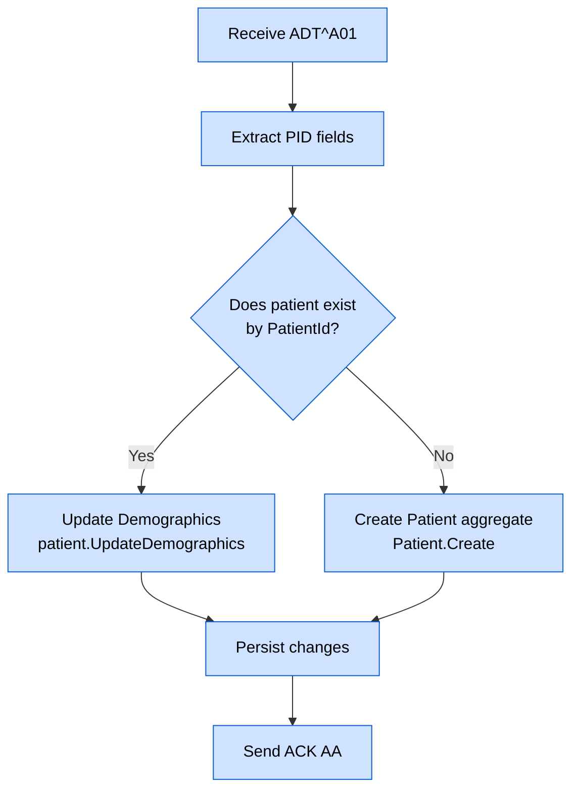
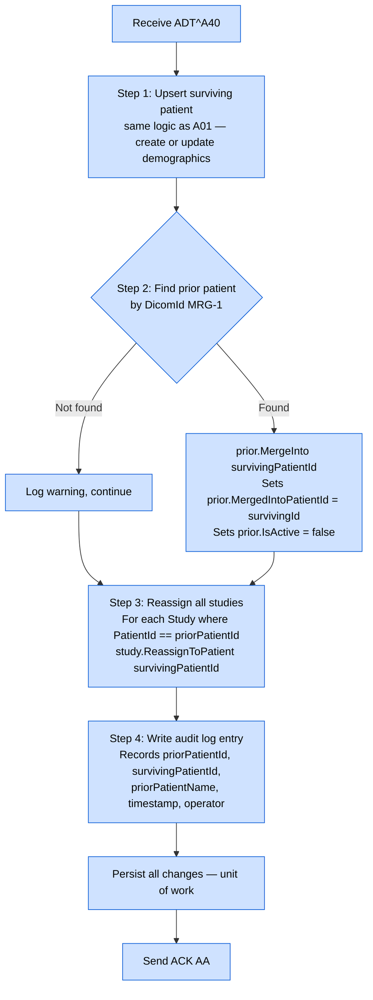

# HL7 ADT Message Handling

## Overview

ADT (Admit/Discharge/Transfer) messages carry patient demographic events from the HIS/RIS into the EdgeGuard Platform. The platform uses ADT messages to create and maintain patient records and to handle patient identity merges.

---

## Supported Trigger Events

| Trigger Event | Name | Action |
|---|---|---|
| `A01` | Admit / Visit Notification | Upsert patient demographics |
| `A40` | Merge Patient — Patient Identifier List | Merge prior patient identity into surviving patient |

> **All other ADT trigger events are rejected.** An `AE` (Application Error) acknowledgement is returned and a warning is logged. No data is written.

---

## Validation Rules

All ADT messages must pass the following checks before processing:

| Rule | Field | Behaviour on Failure |
|---|---|---|
| PID-3 present and non-empty | Patient ID | Reject (`AE`) |
| Trigger event is A01 or A40 | MSH-9.2 | Reject (`AE`) |
| MRG segment present (A40 only) | MRG | Reject (`AE`) |
| MRG-1 non-empty (A40 only) | Prior Patient ID | Reject (`AE`) |

---

## ADT^A01 — Patient Admission

### Purpose

Creates or updates a patient record with the demographic information provided by the HIS/RIS at the time of admission or registration.

### Field Extraction

| HL7 Field | Component | Domain Field |
|---|---|---|
| PID-3 | Component 0 (CX) | `PatientId` |
| PID-5 | Full field | `PatientName` |
| PID-7 | Full field (`yyyyMMdd`) | `BirthDate` |
| PID-8 | Full field | `Sex` |
| PID-13 | Full field | `Phone` |

### Processing Flow



### Domain Aggregate Operations

- **New patient**: `Patient.Create(patientId, patientName, birthDate, sex, phone)`
- **Existing patient**: `patient.UpdateDemographics(patientName, birthDate, sex, phone)`

Demographic updates do not overwrite the `PatientId` or any DICOM-linked identifiers.

### Example Message

```hl7
MSH|^~\&|HIS|HOSPITAL|EDGEGUARD|DICOMEDGE|20240315120000||ADT^A01|MSG001|P|2.5
EVN|A01|20240315120000
PID|1||PAT001^^^HOSPITAL^MR||Smith^John^A||19800515|M|||123 Main St^^Springfield^IL^62701||555-867-5309
PV1|1|I|RAD^001^A|||||||RAD|||||||V01
```

**Extracted values:**

| Field | Value |
|---|---|
| PatientId | `PAT001` |
| PatientName | `Smith^John^A` |
| BirthDate | `1980-05-15` |
| Sex | `M` |
| Phone | `555-867-5309` |

---

## ADT^A40 — Patient Merge

### Purpose

Consolidates two patient identities when the HIS/RIS determines they represent the same person. The prior (duplicate) patient record is deactivated, and all associated studies are reassigned to the surviving patient.

### Field Extraction

| HL7 Field | Component | Domain Field |
|---|---|---|
| PID-3 | Component 0 (CX) | Surviving `PatientId` |
| MRG-1 | Full field | Prior `PatientId` (to be merged away) |
| MRG-7 | Full field | Prior patient name (for audit logging) |

### Processing Flow — 4 Steps



### Domain Aggregate Operations

| Step | Method | Effect |
|---|---|---|
| 1 | `Patient.Create()` or `patient.UpdateDemographics()` | Surviving patient record ready |
| 2 | `prior.MergeInto(survivingId)` | Sets `MergedIntoPatientId`; sets `IsActive = false` |
| 3 | `study.ReassignToPatient(survivingId)` | Moves study association to surviving patient |
| 4 | Audit repository | Persists merge event for compliance reporting |

### Example Message

```hl7
MSH|^~\&|HIS|HOSPITAL|EDGEGUARD|DICOMEDGE|20240315130000||ADT^A40|MSG002|P|2.5
EVN|A40|20240315130000
PID|1||PAT002^^^HOSPITAL^MR||Johnson^Mary^B||19750322|F
MRG|PAT001^^^HOSPITAL^MR||||||Johnson^Mary
```

**Extracted values:**

| Field | Value |
|---|---|
| Surviving PatientId | `PAT002` |
| Prior PatientId (MRG-1) | `PAT001` |
| Prior Patient Name (MRG-7) | `Johnson^Mary` |

**Database state after merge:**

| Record | Field | Before | After |
|---|---|---|---|
| Patient `PAT001` | `IsActive` | `true` | `false` |
| Patient `PAT001` | `MergedIntoPatientId` | `null` | `PAT002` |
| Study `ACC-001` (was PAT001) | `PatientId` | `PAT001` | `PAT002` |

---

## Error Scenarios

### Missing MRG Segment (A40)

```
Validation failure: ADT^A40 requires MRG segment.
ACK: AE — Application Error
No data written.
```

### Empty MRG-1 (Prior Patient ID)

```
Validation failure: MRG-1 (prior patient ID) must not be empty.
ACK: AE — Application Error
No data written.
```

### Prior Patient Not Found in Database

```
Warning logged: Prior patient PAT001 not found; skipping merge step.
Surviving patient is still upserted.
Studies cannot be reassigned.
ACK: AA — Application Accept (merge is best-effort)
```

### Duplicate A40 (Already Merged)

When `prior.IsActive == false` and `prior.MergedIntoPatientId` is already set:

```
Warning logged: Patient PAT001 already merged into PAT002; ignoring duplicate A40.
ACK: AA — Application Accept (idempotent)
```

---

## Database Schema Impact

```sql
-- Patient table fields affected by ADT processing
ALTER TABLE Patients ADD COLUMN MergedIntoPatientId VARCHAR(64);
ALTER TABLE Patients ADD COLUMN IsActive           BOOLEAN NOT NULL DEFAULT TRUE;

-- Studies reassigned during A40
UPDATE Studies
   SET PatientId = @survivingPatientId
 WHERE PatientId = @priorPatientId;
```

---

## Related Documentation

- [HL7 Pipeline Overview](hl7-pipeline.md)
- [HL7 ORM Message Handling](hl7-orm.md)
- [HL7 ORU Message Handling](hl7-oru.md)
