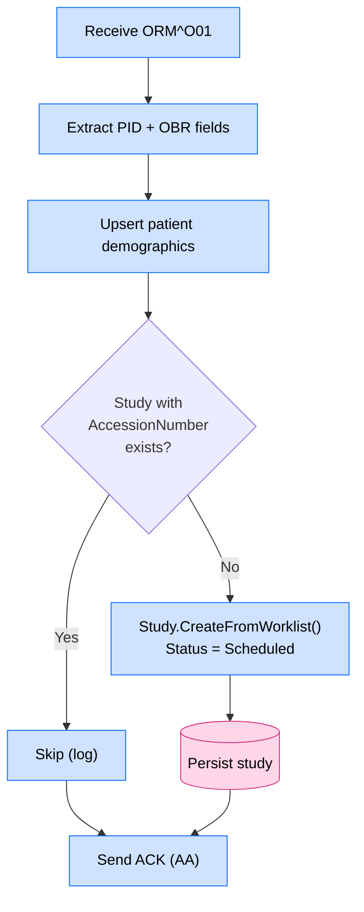
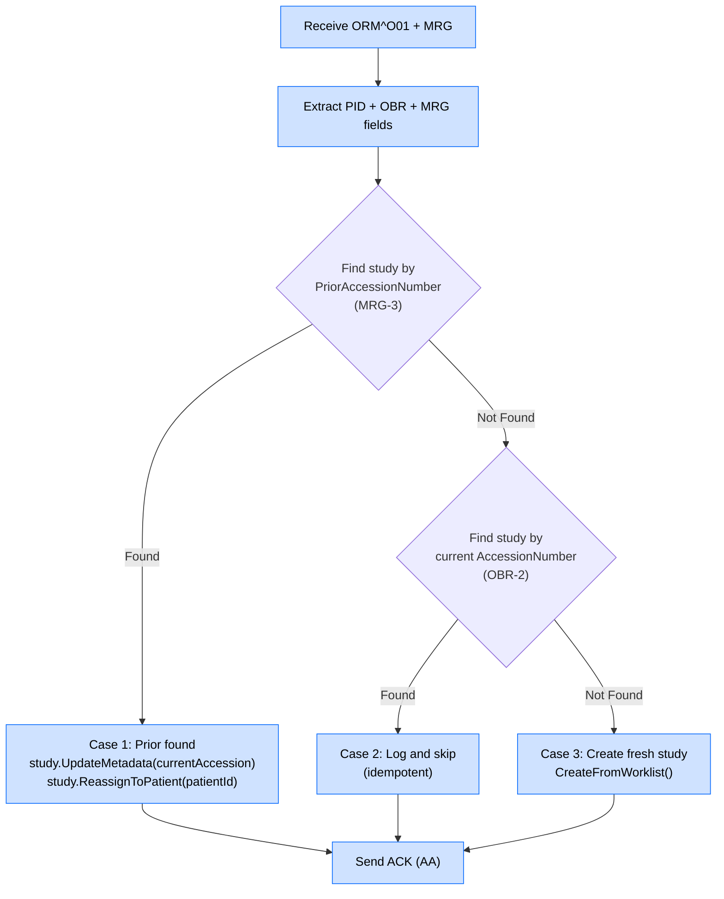
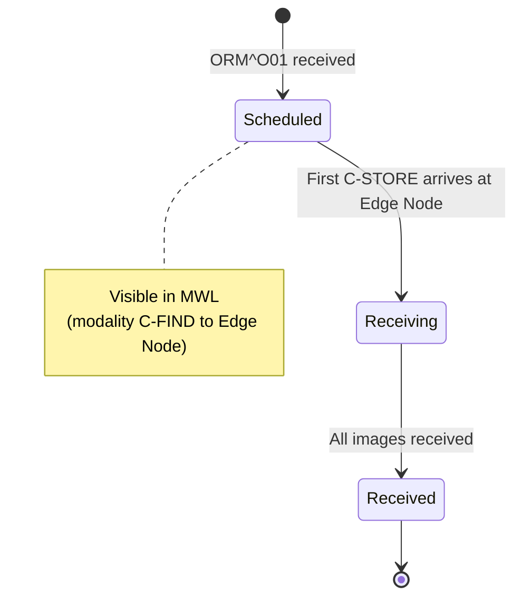

# HL7 ORM Message Handling

## Overview

ORM^O01 (Order) messages carry radiology order information from the HIS/RIS into the EdgeGuard Platform. The platform uses these messages to create Modality Worklist entries — scheduled study records that DICOM-capable modalities (CT, MRI, CR, etc.) query before beginning a scan.

A variant of ORM^O01 that includes an `MRG` segment is used for study identity merges, where a prior accession number is consolidated into a new one.

---

## Validation Rules

All ORM messages must contain the following segments before processing begins:

| Required Segment | Purpose |
|---|---|
| MSH | Message header |
| PID | Patient identification |
| ORC | Order common segment |
| OBR | Observation request (carries accession, study date, procedure) |

Additionally:

| Rule | Field | Behaviour on Failure |
|---|---|---|
| PID-3 present and non-empty | Patient ID | Reject (`AE`) |
| AccessionNumber present | OBR-2 component 0 | Accept (`AA`) with warning logged |

---

## Field Extraction Table

| HL7 Field | Component | Domain / DICOM Field |
|---|---|---|
| PID-3 | Component 0 (CX) | `PatientId` (DICOM tag 0010,0020) |
| PID-5 | Full field | `PatientName` (DICOM tag 0010,0010) |
| OBR-2 | Component 0 | `AccessionNumber` (DICOM tag 0008,0050) |
| OBR-7 | Full field | `StudyDate` (DICOM tag 0008,0020) |
| MSH-4 | Full field | `SendingFacility` / `InstitutionName` |
| OBR-4 | Full field | `ProcedureDescription` (DICOM tag 0032,1070) |
| MRG-3 | Full field | Prior `AccessionNumber` (study merge only) |

---

## ORM^O01 — Standard Order (No MRG)

### Purpose

Creates a new scheduled study record that represents a radiology order. This record immediately becomes available in the Modality Worklist for C-FIND queries.

### Processing Flow



### Idempotency

If a study with the same `AccessionNumber` already exists in the database, the ORM is silently accepted and no write is performed. This prevents duplicate Worklist entries when the RIS retransmits orders.

### Domain Operation

```csharp
Study.CreateFromWorklist(
    accessionNumber:       "ACC-20240315-001",
    patientId:             "PAT001",
    patientName:           "Smith^John^A",
    studyDate:             new DateOnly(2024, 3, 15),
    sendingFacility:       "HOSPITAL",
    procedureDescription:  "CHEST CT W/O CONTRAST",
    status:                StudyStatus.Scheduled
);
```

### Example Message

```hl7
MSH|^~\&|RIS|HOSPITAL|EDGEGUARD|DICOMEDGE|20240315090000||ORM^O01|ORD001|P|2.5
PID|1||PAT001^^^HOSPITAL^MR||Smith^John^A||19800515|M
ORC|NW|ORD-20240315-001|||||||||RAD
OBR|1|ORD-20240315-001||CT CHEST W/O^CT Chest without Contrast|||20240315090000|||||||||||||||||||
```

**Extracted values:**

| Field | Value |
|---|---|
| PatientId | `PAT001` |
| PatientName | `Smith^John^A` |
| AccessionNumber | `ORD-20240315-001` |
| StudyDate | `2024-03-15` |
| SendingFacility | `HOSPITAL` |
| ProcedureDescription | `CT CHEST W/O` |

---

## ORM^O01 + MRG — Study Merge

### Purpose

Reassigns a prior accession number to a new accession number. This occurs when the RIS corrects a duplicate or incorrect order entry. The platform must migrate any existing study data (images, links) to the corrected identity.

### Field Extraction (Additional)

| HL7 Field | Domain Field |
|---|---|
| MRG-3 | `PriorAccessionNumber` |

### Processing Flow — 3-Case Logic



### Case Descriptions

| Case | Condition | Action |
|---|---|---|
| **Case 1** — Prior found | Study exists with PriorAccessionNumber | Update metadata to current accession; reassign patient |
| **Case 2** — Current found | No prior study; current accession already exists | Log informational message; no write (idempotent) |
| **Case 3** — Neither found | Neither prior nor current accession exists | Create new study via `CreateFromWorklist()` with `Status=Scheduled` |

### Domain Operations (Case 1)

```csharp
study.UpdateMetadata(currentAccessionNumber);
study.ReassignToPatient(patientId);
```

### Example Message (with MRG)

```hl7
MSH|^~\&|RIS|HOSPITAL|EDGEGUARD|DICOMEDGE|20240315093000||ORM^O01|ORD002|P|2.5
PID|1||PAT001^^^HOSPITAL^MR||Smith^John^A||19800515|M
ORC|NW|ORD-20240315-002|||||||||RAD
OBR|1|ORD-20240315-002||CT CHEST W/O^CT Chest without Contrast|||20240315093000|||||||||||||||||||
MRG|PAT001^^^HOSPITAL^MR|ORD-20240315-001-OLD||ORD-20240315-001-OLD
```

**Extracted values:**

| Field | Value |
|---|---|
| New AccessionNumber | `ORD-20240315-002` |
| Prior AccessionNumber (MRG-3) | `ORD-20240315-001-OLD` |

---

## Integration with Modality Worklist

A study created with `Status=Scheduled` is immediately queryable via DICOM C-FIND MWL. The DICOM tags returned to the modality are sourced directly from the ORM fields:

| ORM Field | DICOM Tag | Tag Name |
|---|---|---|
| PID-5 | (0010,0010) | PatientName |
| PID-3 | (0010,0020) | PatientID |
| OBR-2 | (0008,0050) | AccessionNumber |
| OBR-7 | (0008,0020) | StudyDate |
| OBR-4 | (0032,1070) | RequestedProcedureDescription |

See [Modality Worklist](modality-worklist.md) for full details on C-FIND MWL behaviour.

---

## Study Lifecycle



---

## Error Scenarios

| Scenario | Platform Behaviour |
|---|---|
| Missing ORC segment | Reject (`AE`); no write |
| Missing OBR segment | Reject (`AE`); no write |
| Missing PID-3 | Reject (`AE`); no write |
| Missing AccessionNumber (OBR-2) | Accept (`AA`) with warning; study created without accession |
| Duplicate ORM — same AccessionNumber | Accept (`AA`); silently skipped (idempotent) |
| MRG-3 matches an already-merged study | Accept (`AA`); Case 2 logic applied |

---

## Related Documentation

- [HL7 Pipeline Overview](hl7-pipeline.md)
- [HL7 ADT Message Handling](hl7-adt.md)
- [HL7 ORU Message Handling](hl7-oru.md)
- [Modality Worklist](modality-worklist.md)
