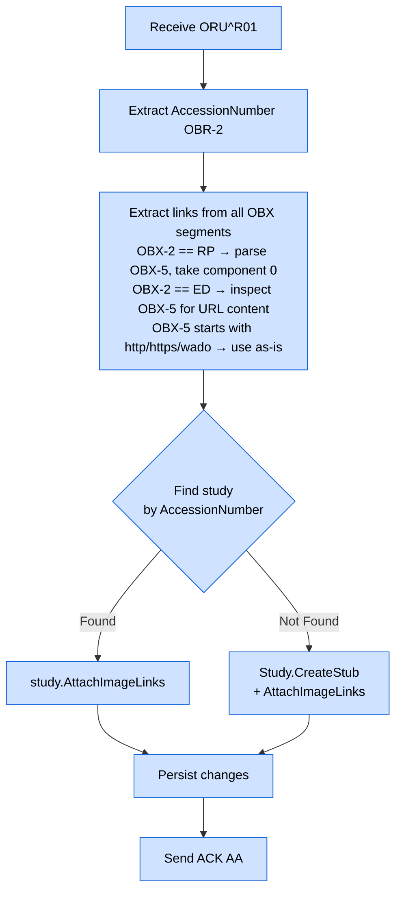

# HL7 ORU Message Handling

## Overview

ORU^R01 (Observation Result) messages are sent by RIS systems, diagnostic viewers, and report distribution platforms to attach image viewer URLs, report links, or other reference pointers to a radiology study. The EdgeGuard Platform extracts these links from OBX segments and stores them against the matching study record.

---

## Purpose

When a radiologist completes a study or a viewer system generates a shareable link, the RIS transmits an ORU^R01 message. The platform:

1. Locates the study by `AccessionNumber`.
2. Extracts all image/report links from the OBX segments.
3. Merges the new links with any previously stored links (deduplication via `HashSet`).
4. Persists the updated link list to the `ExternalImageLinks` column.

If the study does not yet exist (e.g., the ORU arrives before DICOM images), the platform creates a stub study record so that links are not lost.

---

## Validation Rules

| Rule | Field | Behaviour on Failure |
|---|---|---|
| PID-3 present and non-empty | Patient ID | Reject (`AE`) |
| OBR segment present | — | Reject (`AE`) |
| OBX segment present | — | Accept (`AA`) with warning; no links attached |
| AccessionNumber present | OBR-2 | Accept (`AA`) with warning |

---

## OBX Segment Types

The platform recognises three OBX value types that carry link data:

| OBX-2 Value | Name | Interpretation |
|---|---|---|
| `RP` | Reference Pointer | A URL pointing to an external resource |
| `ED` | Encapsulated Data | Encoded data that may contain a URL |
| *(any)* | URL heuristic | OBX-5 value starts with `http://` or `https://` or `wado:` |

### Reference Pointer (RP) Format

When `OBX-2 = RP`, the value in `OBX-5` may use the HL7 CWE/HD component separator (`^`) to embed a human-readable description after the URL:

```
OBX-5:  https://viewer.example.com/study/ACC-001^CT Chest Study
         └──────────────────────────────────────┘ └────────────┘
                       URL (component 0)            description (component 1)
```

The platform extracts **component 0 only** (everything before the first `^`).

---

## Multi-OBX Extraction

A single ORU^R01 message may contain multiple OBX segments, each representing a different link (e.g., one for the viewer, one for the PDF report, one for a secondary viewer). All qualifying OBX segments are processed in sequence.

```
OBX|1|RP|VIEWER^^URL||https://viewer.example.com/study/ACC-001^Viewer|...
OBX|2|RP|REPORT^^URL||https://reports.example.com/ACC-001.pdf^Report|...
OBX|3|TX|NOTE^^ST||See prior study for comparison|...   ← no URL, skipped
```

Only OBX segments that match one of the recognised types **or** contain a URL-shaped OBX-5 value are included.

---

## AttachImageLinks — Deduplication

```csharp
// Study aggregate method (simplified)
public void AttachImageLinks(IEnumerable<string> newLinks)
{
    var existing = (ExternalImageLinks ?? string.Empty)
                       .Split('\n', StringSplitOptions.RemoveEmptyEntries)
                       .ToHashSet(StringComparer.OrdinalIgnoreCase);

    foreach (var link in newLinks)
        existing.Add(link.Trim());

    ExternalImageLinks = string.Join('\n', existing);
}
```

- Uses a case-insensitive `HashSet` to prevent duplicate URLs.
- Merges with the existing stored links, not replacing them.
- Result is stored as a newline-separated string in the `ExternalImageLinks` TEXT column.

---

## Stub Study Creation

If no study with the given `AccessionNumber` is found in the database, the platform creates a stub record:

```csharp
Study.CreateStub(
    accessionNumber: "ACC-20240315-001",
    patientId:       "PAT001",
    status:          StudyStatus.Receiving
);
```

The stub has `Status = Receiving` to indicate that data is expected but DICOM images have not yet arrived. When DICOM C-STORE instances subsequently arrive, the instance handler updates the same study record.

---

## ExternalImageLinks Storage

| Column | Type | Format |
|---|---|---|
| `ExternalImageLinks` | TEXT | Newline-separated list of URLs |

**Example stored value:**

```
https://viewer.example.com/study/ACC-001
https://reports.example.com/ACC-001.pdf
https://archive.hospital.org/wado?studyUID=1.2.840.10008.5.1.4.1.1.2
```

---

## Processing Flow



---

## Example Message

```hl7
MSH|^~\&|RIS|HOSPITAL|EDGEGUARD|DICOMEDGE|20240315160000||ORU^R01|RPT001|P|2.5
PID|1||PAT001^^^HOSPITAL^MR||Smith^John^A||19800515|M
OBR|1|ORD-20240315-001||CT CHEST W/O^CT Chest without Contrast|||20240315150000
OBX|1|RP|VIEWER^^URL||https://viewer.example.com/study/ACC-001^CT Chest Viewer||||||F
OBX|2|RP|REPORT^^URL||https://reports.hospital.org/ACC-001.pdf^Radiology Report||||||F
OBX|3|RP|WADO^^URL||wado:https://pacs.hospital.org/wado?requestType=WADO&studyUID=1.2.3.4^WADO Link||||||F
OBX|4|TX|NOTE^^ST||Images available in PACS. Correlation with prior study recommended.||||||F
```

**Extracted links:**

| OBX Segment | OBX-2 | Extracted URL |
|---|---|---|
| OBX\|1 | `RP` | `https://viewer.example.com/study/ACC-001` |
| OBX\|2 | `RP` | `https://reports.hospital.org/ACC-001.pdf` |
| OBX\|3 | `RP` | `wado:https://pacs.hospital.org/wado?requestType=WADO&studyUID=1.2.3.4` |
| OBX\|4 | `TX` | *(skipped — no URL content)* |

---

## Error Scenarios

| Scenario | Platform Behaviour |
|---|---|
| Missing PID-3 | Reject (`AE`) |
| Missing OBR segment | Reject (`AE`) |
| No OBX segments | Accept (`AA`) with warning; no links stored |
| All OBX segments are non-URL types | Accept (`AA`) with warning; no links stored |
| Study not found | Create stub with `Status=Receiving`; attach links |
| Duplicate ORU (same links) | Accept (`AA`); HashSet deduplication prevents duplicates |
| RP value missing component 0 | Skip that OBX segment; log warning |

---

## Related Documentation

- [HL7 Pipeline Overview](hl7-pipeline.md)
- [HL7 ORM Message Handling](hl7-orm.md)
- [DICOM Reception](dicom-reception.md)
