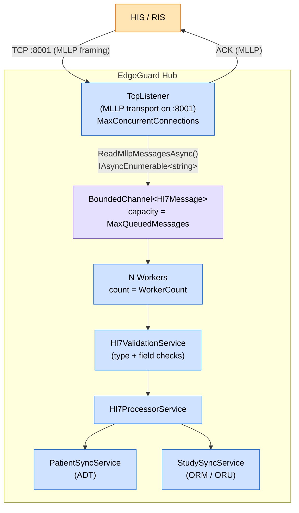
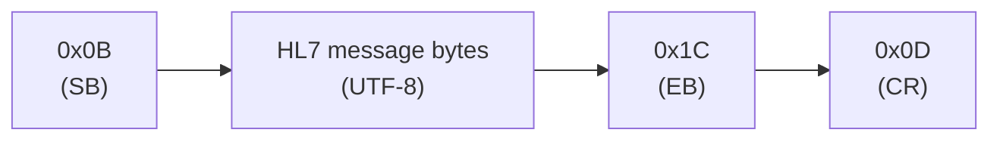
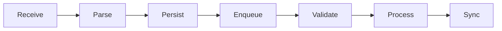
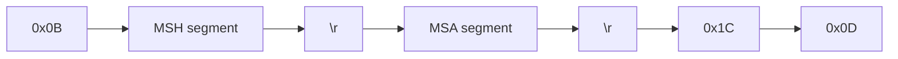

# HL7 Pipeline

## Overview

The EdgeGuard Platform HL7 pipeline receives clinical messages from Hospital Information Systems (HIS) and Radiology Information Systems (RIS) over a persistent TCP connection using the MLLP framing protocol. Messages are validated, processed, and used to synchronize patient demographics and radiology study data within the platform.

---

## Architecture



### Component Responsibilities

| Component | Responsibility |
|---|---|
| `TcpListener` | Accepts inbound TCP connections on port 8001 |
| `ReadMllpMessagesAsync` | Extracts framed HL7 messages from the TCP byte stream |
| `BoundedChannel<Hl7Message>` | Decouples reception from processing; provides backpressure |
| `N Workers` | Concurrent message processors, each reading from the shared channel |
| `Hl7ValidationService` | Validates message type, trigger event, and required segments/fields |
| `Hl7ProcessorService` | Routes validated messages to the appropriate handler |
| `PatientSync` | Creates or updates patient records (ADT messages) |
| `StudySync` | Creates, merges, or updates study records (ORM/ORU messages) |

---

## MLLP Framing

MLLP (Minimum Lower Layer Protocol) wraps each HL7 message in a pair of control characters so that the receiver can identify exact message boundaries within the raw TCP stream.

### Byte Values

| Symbol | Hex | Decimal | Description |
|---|---|---|---|
| Start Block (VT) | `0x0B` | 11 | Marks the beginning of an HL7 message |
| End Block (FS) | `0x1C` | 28 | First byte of the message terminator |
| Carriage Return | `0x0D` | 13 | Second byte of the message terminator |

### Frame Structure



### Partial Read Handling

TCP is a stream protocol; a single `ReadAsync` call may return fewer bytes than a complete MLLP frame. `ReadMllpMessagesAsync` handles this transparently:

1. Reads bytes from the `NetworkStream` in a loop, appending to an internal buffer.
2. Scans the buffer for the `0x1C 0x0D` terminator sequence.
3. When found, extracts the payload between `0x0B` and `0x1C` and yields it.
4. Any bytes after the terminator are retained in the buffer for the next frame.
5. Yielding occurs outside the `try/catch` block (using a `Queue<string>` accumulator) so that exceptions in downstream code do not suppress subsequent messages.

```csharp
// Simplified pseudocode
private async IAsyncEnumerable<string> ReadMllpMessagesAsync(NetworkStream stream)
{
    var buffer = new List<byte>();
    var pending = new Queue<string>();

    while (true)
    {
        // ... ReadAsync into temp, append to buffer ...

        while (TryExtractFrame(buffer, out var message))
            pending.Enqueue(message);

        // Yield outside try/catch
        while (pending.TryDequeue(out var msg))
            yield return msg;
    }
}
```

---

## Channel and Concurrency

### BoundedChannel Configuration

```json
{
  "Hl7Listener": {
    "Port": 8001,
    "MaxConcurrentConnections": 10,
    "MaxQueuedMessages": 500,
    "WorkerCount": 4
  }
}
```

| Setting | Purpose |
|---|---|
| `MaxConcurrentConnections` | Maximum simultaneous TCP senders accepted |
| `MaxQueuedMessages` | Channel capacity; excess messages apply backpressure on the sender |
| `WorkerCount` | Number of parallel message processing workers |

### Backpressure

When the channel is full (`MaxQueuedMessages` reached), the writer blocks until a worker dequeues a message. This prevents unbounded memory growth under burst load and signals the upstream sender to slow down at the TCP level.

---

## Pipeline Stages



| Stage | Actor | Detail |
|---|---|---|
| **Receive** | `TcpListener` + `ReadMllpMessagesAsync` | Accept TCP connection; extract framed strings |
| **Parse** | `Hl7Parser` | Split raw string into segments and fields |
| **Persist** | `Hl7MessageRepository` | Store raw message for audit/replay before processing |
| **Enqueue** | `Channel<Hl7Message>.Writer` | Hand off to the bounded channel |
| **Validate** | `Hl7ValidationService` | Check message type, trigger event, required fields |
| **Process** | `Hl7ProcessorService` | Route to ADT, ORM, or ORU handler |
| **Sync** | `PatientSyncService` / `StudySyncService` | Upsert domain aggregates; publish domain events |

---

## ACK Response Format

After every received message the platform sends an HL7 acknowledgement. The ACK is built from the inbound `MSH` segment and wrapped in MLLP framing.

### ACK Byte Layout



### MSH Fields Mirrored in ACK

| ACK Field | Source |
|---|---|
| Sending Application | MSH-5 (Receiving Application from inbound) |
| Sending Facility | MSH-6 (Receiving Facility from inbound) |
| Receiving Application | MSH-3 (Sending Application from inbound) |
| Receiving Facility | MSH-4 (Sending Facility from inbound) |
| Message Control ID | Same as inbound MSH-10 |
| Processing ID | Same as inbound MSH-11 |

### MSA Segment

```
MSA|AA|<MessageControlId>
```

`AA` = Application Accept. On validation failure the platform returns `AE` (Application Error) with an error description in MSA-3.

---

## Supported Message Types

| Message Type | Trigger Event | Description |
|---|---|---|
| ADT | A01 | Patient Admission — upsert patient demographics |
| ADT | A40 | Patient Merge — merge prior patient into surviving patient |
| ORM | O01 | Order — create scheduled study (Modality Worklist entry) |
| ORM | O01 + MRG | Study Merge — reassign prior accession to new accession |
| ORU | R01 | Observation Result — attach image/report links to study |

All other message types and trigger events are rejected with an `AE` acknowledgement.

---

## Error Handling

| Condition | Platform Behaviour |
|---|---|
| Unknown message type | Reject with `AE`; log warning |
| Unknown trigger event | Reject with `AE`; log warning |
| Missing required segment | Reject with `AE`; log validation error |
| Missing required field (PID-3) | Reject with `AE`; log validation error |
| Missing recommended field (AccessionNumber) | Accept with `AA`; log warning |
| Domain exception during processing | Accept at MLLP layer; log error; message marked as failed |
| TCP connection dropped mid-message | Partial buffer discarded; no ACK sent |

---

## Related Documentation

- [HL7 ADT Message Handling](hl7-adt.md)
- [HL7 ORM Message Handling](hl7-orm.md)
- [HL7 ORU Message Handling](hl7-oru.md)
- [DICOM Reception](dicom-reception.md)
- [Modality Worklist](modality-worklist.md)
