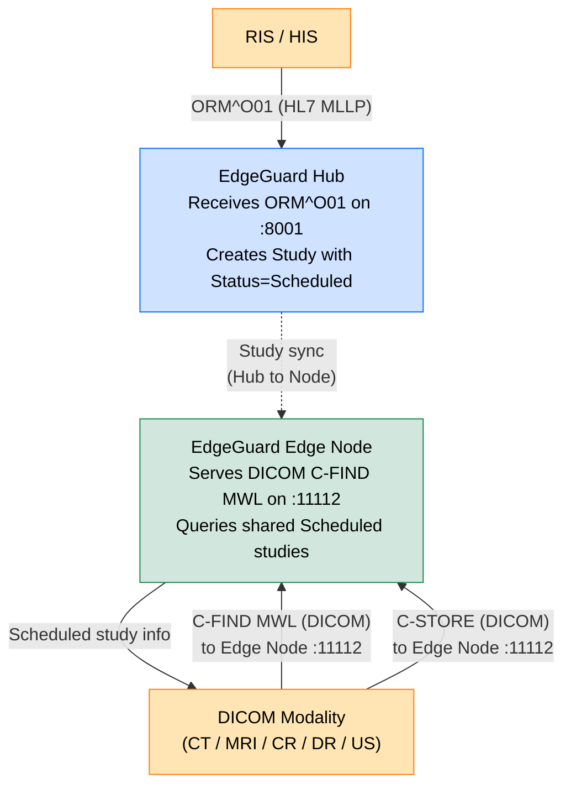
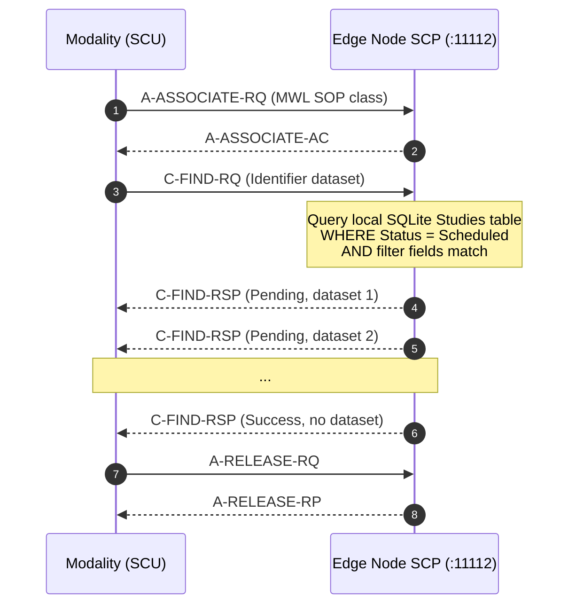

# Modality Worklist (MWL)

## Overview

The Modality Worklist (MWL) service enables DICOM modalities — CT scanners, MRI machines, CR/DR systems, ultrasound units — to query the EdgeGuard Platform for scheduled radiology procedures before beginning a scan. By pulling patient and order information automatically, technologists avoid manual data entry at the scanner console, reducing transcription errors and ensuring that DICOM header data matches the RIS order exactly.

---

## How It Works



---

## Data Source

The MWL service queries the `Studies` table for records meeting the following criteria:

| Criterion | Value |
|---|---|
| `Status` | `Scheduled` |
| `DeletedAt` | `null` (not soft-deleted) |

Studies enter `Scheduled` status when an ORM^O01 HL7 message is successfully processed. See [HL7 ORM Message Handling](hl7-orm.md) for details.

---

## C-FIND MWL — Request/Response Flow



Each C-FIND-RSP `Pending` response contains a DICOM dataset for one scheduled study. The modality selects the appropriate study from the list and uses the returned data to auto-populate its console.

---

## DICOM Tags Returned

### Patient-Level Tags

| DICOM Tag | Attribute Name | Source Field |
|---|---|---|
| (0010,0010) | PatientName | `PID-5` from ORM HL7 |
| (0010,0020) | PatientID | `PID-3` from ORM HL7 |
| (0010,0030) | PatientBirthDate | `PID-7` from ADT HL7 (if available) |
| (0010,0040) | PatientSex | `PID-8` from ADT HL7 (if available) |

### Study-Level Tags

| DICOM Tag | Attribute Name | Source Field |
|---|---|---|
| (0008,0050) | AccessionNumber | `OBR-2` from ORM HL7 |
| (0008,0020) | StudyDate | `OBR-7` from ORM HL7 |
| (0032,1070) | RequestedProcedureDescription | `OBR-4` from ORM HL7 |

### Scheduled Procedure Step Sequence — (0040,0100)

This sequence item carries modality-specific scheduling data:

| DICOM Tag | Attribute Name | Source Field |
|---|---|---|
| (0008,0060) | Modality | Derived from OBR-4 / facility configuration |
| (0040,0001) | ScheduledStationAETitle | `DicomServer:AeTitle` (configured) |
| (0040,0002) | ScheduledProcedureStepStartDate | `OBR-7` from ORM HL7 |
| (0040,0007) | ScheduledProcedureStepDescription | `OBR-4` from ORM HL7 |

---

## Supported Query Filters

The modality may include any combination of these attributes in the C-FIND Identifier dataset. The platform applies them as database-level filters.

| DICOM Tag | Attribute Name | Filter Behaviour |
|---|---|---|
| (0010,0020) | PatientID | Exact match |
| (0008,0050) | AccessionNumber | Exact match |
| (0040,0002) | ScheduledProcedureStepStartDate | Date range (`YYYYMMDD` or `YYYYMMDD-YYYYMMDD`) |
| (0008,0060) | Modality | Exact match (case-insensitive) |

Attributes present in the Identifier dataset but not listed above are accepted without error and ignored for filtering purposes (universal matching).

---

## Configuration

```json
{
  "DicomServer": {
    "AeTitle": "EDGEGUARD",
    "Port": 11112,
    "MwlEnabled": true
  }
}
```

| Key | Type | Default | Description |
|---|---|---|---|
| `MwlEnabled` | bool | `true` | Enable or disable the C-FIND MWL service |
| `AeTitle` | string | `"EDGEGUARD"` | AE title returned in ScheduledStationAETitle |
| `Port` | integer | `11112` | TCP port for all DICOM services |

When `MwlEnabled = false`, the Modality Worklist SOP class (1.2.840.10008.5.1.4.31) is not offered during presentation context negotiation, and modalities receive a rejection for that context.

---

## Example C-FIND Query

A modality querying for all procedures scheduled for 15 March 2024 on a CT scanner would send an Identifier dataset with:

```
(0008,0050) AccessionNumber        = ""          (match all)
(0010,0020) PatientID              = ""          (match all)
(0040,0002) ScheduledStartDate     = "20240315"
(0008,0060) Modality               = "CT"
```

The platform returns one response dataset per matching Study record:

```
(0010,0010) PatientName            = "Smith^John^A"
(0010,0020) PatientID              = "PAT001"
(0008,0050) AccessionNumber        = "ORD-20240315-001"
(0008,0020) StudyDate              = "20240315"
(0032,1070) RequestedProcedureDescription = "CT CHEST W/O CONTRAST"
(0040,0100) ScheduledProcedureStepSequence:
  (0008,0060) Modality             = "CT"
  (0040,0001) ScheduledStationAET  = "EDGEGUARD"
  (0040,0002) ScheduledStartDate   = "20240315"
  (0040,0007) ScheduledStepDescription = "CT CHEST W/O CONTRAST"
```

---

## MWL Lifecycle Integration

| Event | Effect on MWL |
|---|---|
| ORM^O01 received | Study created; `Status=Scheduled`; appears in MWL results |
| Modality selects study from MWL | Study remains `Scheduled` until images arrive |
| First C-STORE instance arrives | `Status` transitions to `Receiving`; study disappears from MWL |
| ORM^O01 + MRG received | Prior accession merged; MWL reflects new AccessionNumber |
| Study soft-deleted | Removed from MWL results immediately |

---

## Troubleshooting

| Symptom | Likely Cause | Check |
|---|---|---|
| No studies returned by MWL query | `MwlEnabled = false` | Verify configuration |
| Expected study missing from results | Study status not `Scheduled` | Check if ORM HL7 was processed |
| Wrong AccessionNumber on modality | Study merge (ORM+MRG) not applied | Check `MRG-3` in ORM message |
| MWL SOP class rejected during association | `MwlEnabled = false` or SOP class not negotiated | Verify `MwlEnabled = true` |
| Date filter returns no results | Date format mismatch | Confirm modality sends `YYYYMMDD` format |

---

## Related Documentation

- [HL7 ORM Message Handling](hl7-orm.md) — source of Scheduled study records
- [DICOM Reception](dicom-reception.md) — C-STORE and AE title configuration
- [HL7 Pipeline Overview](hl7-pipeline.md)
