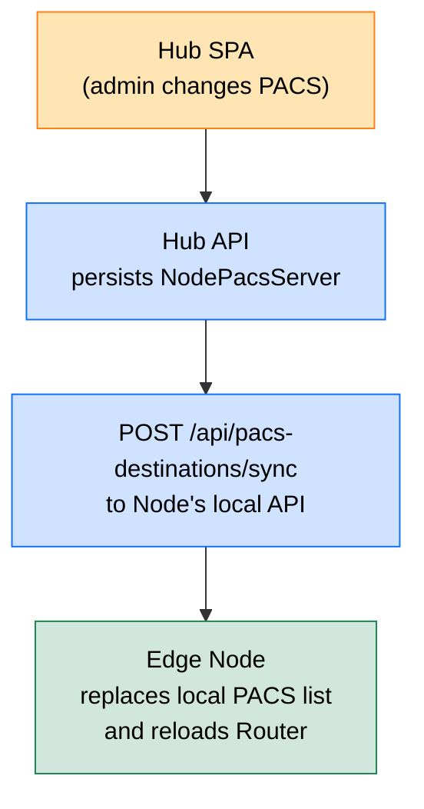
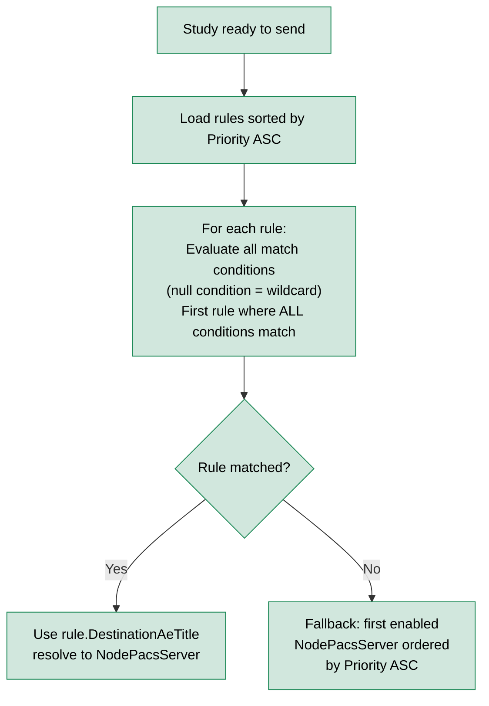
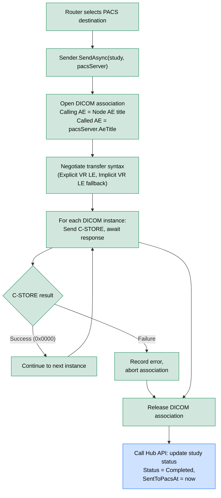
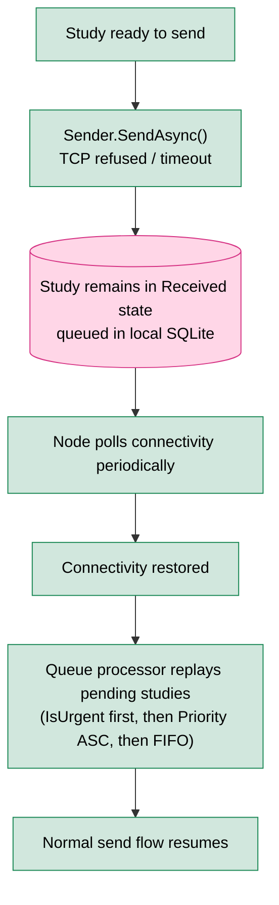

# Multi-PACS Routing

> **Section:** 04-Features  
> **Applies to:** EdgeGuard Node service, Hub service  
> **Last updated:** 2026-05-16

---

## Overview

An EdgeGuard Node can deliver DICOM studies to multiple PACS destinations. The multi-PACS routing subsystem comprises three layers: **destination configuration** (which PACS servers exist), **routing rules** (which PACS to use for a given study), and the **Sender** (the C-STORE SCU that executes delivery with retry and offline queue support).

---

## PACS Destination Configuration

Each PACS destination is represented by a `NodePacsServer` record containing:

| Field | Type | Description | Example |
|---|---|---|---|
| `Id` | GUID | Internal identifier | `3fa85f64-...` |
| `Name` | string | Human-readable label | `"Main PACS"` |
| `AeTitle` | string | DICOM Application Entity title | `"MAINSTORESCU"` |
| `Host` | string | PACS hostname or IP address | `"192.168.1.50"` |
| `Port` | int | DICOM listen port | `11112` |
| `Priority` | int | Fallback ordering (lower = preferred) | `1` |
| `IsEnabled` | bool | Whether this destination is active | `true` |

> **Multiple destinations:** A node may have any number of PACS entries. Routing rules reference destinations by `DestinationAeTitle`. The Router falls back to the first enabled destination by ascending `Priority` when no rule matches.

---

## Hub → Node Sync for PACS Destinations

PACS destination records are mastered in the Hub and pushed down to each Node:



1. The admin adds, edits, or removes a PACS destination in the Hub SPA.
2. The Hub persists the change in its own database.
3. The Hub immediately calls `POST /api/pacs-destinations/sync` on the target Node, sending the full current list of PACS destinations for that Node.
4. The Node replaces its local PACS destination table and triggers a Router reload.
5. If the Node is offline at sync time, the pending sync is replayed on the next successful Node check-in.

---

## Routing Rule Evaluation and PACS Selection

The Router evaluates [DICOM Routing Rules](dicom-routing-rules.md) against the incoming study and selects a destination:



> **Fallback guarantee:** If no rule matches and at least one `IsEnabled` PACS destination exists, the study is always delivered. A study will only fail to route if all PACS destinations are disabled.

---

## C-ECHO Connectivity Test

C-ECHO is a DICOM verification service class (equivalent to a DICOM-level "ping"). It can be triggered manually from the SPA to test connectivity before relying on a PACS destination for actual delivery.

**What C-ECHO verifies:**

| Check | Details |
|---|---|
| Network reachability | TCP connection to `Host:Port` |
| DICOM association | SCU successfully opens an association with the PACS AE |
| AE title recognition | PACS accepts the Node's calling AE title |
| Service class support | PACS responds to Verification SOP Class (1.2.840.10008.1.1) |

**When to use C-ECHO:**

- After adding or modifying a PACS destination
- Before going live with a new Node
- When troubleshooting delivery failures
- Periodically as a health check in operational monitoring

> **Note:** A successful C-ECHO does not guarantee that Storage SOP classes are accepted. A C-STORE failure with `Dataset Does Not Match SOP Class` after a successful C-ECHO indicates a storage configuration issue on the PACS side.

---

## Sender Implementation

The Sender is the C-STORE SCU component responsible for physically delivering DICOM instances to the destination PACS.

### Send Flow



### Transfer Syntax Negotiation

The Sender proposes the following transfer syntaxes in order of preference:

1. Explicit VR Little Endian (`1.2.840.10008.1.2.1`)
2. JPEG 2000 Lossless (`1.2.840.10008.1.2.4.90`) — if the original file uses it
3. Implicit VR Little Endian (`1.2.840.10008.1.2`) — baseline fallback

If the PACS rejects all proposed syntaxes for a given SOP class, that SOP class is skipped and the error is logged in `PacsSendLastError`.

---

## Retry Behavior

When a C-STORE operation fails, the Sender applies exponential backoff before the next attempt:

| Attempt | `RetryCount` after attempt | Wait before next try |
|---|---|---|
| 1st | 1 | 30 seconds |
| 2nd | 2 | 2 minutes |
| 3rd | 3 | → `Failed` state |

At each failure:
- `PacsSendAttempts` is incremented
- `PacsSendLastError` is overwritten with the latest DICOM status code and description
- `RetryCount` is incremented
- Hub API is called to record the updated status

When `RetryCount >= MaxRetries` (default 3), the study transitions to `Failed`. `PacsSendLastError` contains the definitive failure reason visible in the SPA.

> **`MaxRetries` is configurable** per deployment via Hub settings. For high-availability environments where transient network errors are common, increasing to 5–7 retries is recommended.

---

## Offline Queue

When a PACS destination is unreachable (network outage, PACS maintenance), studies are persisted in the Node's local SQLite queue rather than dropped.



**Queue guarantees:**

| Property | Behavior |
|---|---|
| Durability | SQLite is on-disk; studies survive Node restarts |
| Ordering | Urgent studies always sent first; then by Priority (1=highest) |
| Deduplication | Each study appears at most once in the queue |
| Capacity | Bounded by available disk space on the Node host |

> **Monitoring:** The SPA Node detail page shows the current queue depth and the oldest queued study timestamp. Alert thresholds can be configured in the operational monitoring section.

---

## Hub Status Confirmation

After each successful delivery, the Node calls the Hub API to update the study record in the central database:

```http
PATCH /api/studies/{studyId}/status
{
  "status": "Completed",
  "sentToPacsAt": "2026-05-16T14:32:00Z",
  "pacsSendAttempts": 1,
  "destinationAeTitle": "MAINSTORESCU"
}
```

On failure:

```http
PATCH /api/studies/{studyId}/status
{
  "status": "Failed",
  "pacsSendAttempts": 3,
  "pacsSendLastError": "C-STORE failed: 0xA700 Refused: Out of Resources",
  "retryCount": 3
}
```

If the Hub is unreachable when the Node tries to confirm, the confirmation is queued locally and replayed on next Hub check-in.

---

## Related Documentation

- [DICOM Routing Rules](dicom-routing-rules.md) — rule evaluation details and match conditions
- [Study Pipeline](study-pipeline.md) — full state machine and audit trail
- [Real-Time Notifications](real-time-notifications.md) — SignalR events emitted on delivery
