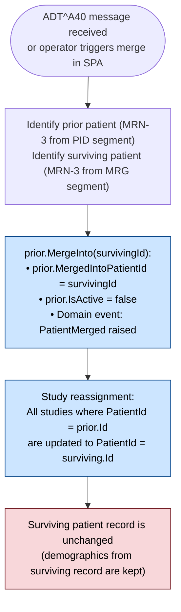
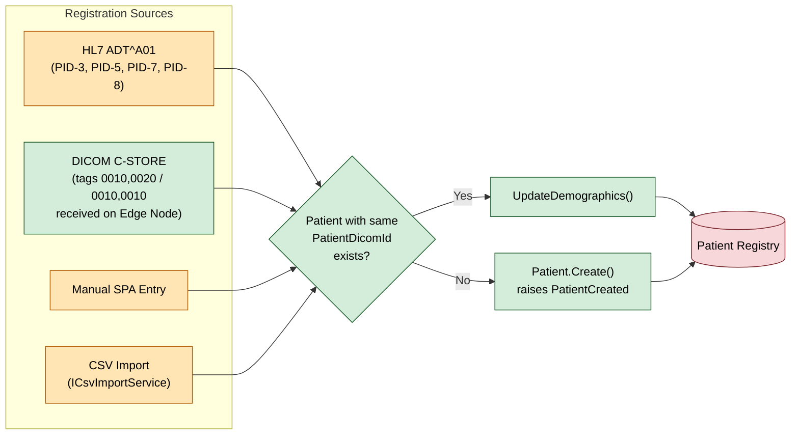

# Patient Management

> **Section:** 04-Features  
> **Applies to:** EdgeGuard Hub service, SPA  
> **Last updated:** 2026-05-16

---

## Overview

The patient management module maintains the authoritative patient registry within the EdgeGuard Hub. Patient records are created from multiple sources (HL7 messages, DICOM reception, manual entry, CSV import) and support demographic updates, patient merge (ADT^A40), soft delete, and full-text search.

---

## Patient Data Model

| Field | Type | Max Length | Description |
|---|---|---|---|
| `Id` | GUID | — | Internal surrogate key |
| `PatientDicomId` | string | 64 | Patient ID from DICOM tag (0010,0020) / HL7 PID-3 |
| `PatientName` | string | 256 | Full name in DICOM format (Family^Given^Middle^Prefix^Suffix) |
| `DateOfBirth` | DateOnly? | — | Patient date of birth |
| `Sex` | string? | 1 | Administrative sex: `M`, `F`, `O`, `U` |
| `IssuerId` | string? | 64 | Assigning authority / issuer of patient ID |
| `PhoneNumber` | string? | 32 | Contact phone number (used for WhatsApp dispatch) |
| `Email` | string? | 256 | Contact email address |
| `IsActive` | bool | — | `false` when patient has been merged into another |
| `IsDeleted` | bool | — | `true` after soft delete; excluded from default queries |
| `DeletedAt` | DateTimeOffset? | — | Timestamp of soft delete |
| `MergedIntoPatientId` | GUID? | — | Points to surviving patient after ADT^A40 merge |
| `CreatedAt` | DateTimeOffset | — | Record creation timestamp |
| `UpdatedAt` | DateTimeOffset | — | Last modification timestamp |

### Computed Properties

| Property | Derived From | Description |
|---|---|---|
| `IsMerged` | `MergedIntoPatientId != null` | `true` when this patient has been merged into another |

---

## Registration Sources

Patient records are created from four sources. Duplicate detection is performed by `PatientDicomId` before creating a new record.

### HL7 ADT^A01 (Admit / Register Patient)

When an HL7 ADT^A01 message is processed by the HL7 listener:

1. PID-3 is extracted as `PatientDicomId`.
2. PID-5 (patient name) is mapped to `PatientName`.
3. PID-7 (date of birth), PID-8 (sex), and PID-3 assigning authority (`IssuerId`) are populated.
4. If a patient with the same `PatientDicomId` already exists, demographics are updated via `UpdateDemographics()` rather than creating a duplicate.

### DICOM C-STORE (PID from DICOM Tags)

When a modality sends a C-STORE and no existing patient matches the DICOM Patient ID:

1. Patient ID tag (0010,0020) is used as `PatientDicomId`.
2. Patient Name tag (0010,0010) populates `PatientName`.
3. Patient Birth Date (0010,0030) and Patient Sex (0010,0040) are extracted.
4. `Patient.Create()` is called to register the patient inline with image reception.

### Manual SPA Entry

Operators can create or update patient records directly from the Patients section of the SPA. All fields in the data model are editable through the patient form.

### CSV Import

Bulk patient creation and update via `ICsvImportService`. See [CSV Import](#csv-import) below.

---

## Domain Methods

### `Patient.Create()`

Creates a new patient record with the provided DICOM ID, name, and demographics. Raises a domain event `PatientCreated` consumed by the notification and audit subsystems.

**Required fields:** `PatientDicomId`, `PatientName`  
**Optional fields:** `DateOfBirth`, `Sex`, `IssuerId`, `PhoneNumber`, `Email`

### `Patient.UpdateDemographics()`

Updates demographic information on an existing patient record. The following fields can be changed:

| Field | Notes |
|---|---|
| `PatientName` | Full DICOM-format name |
| `DateOfBirth` | Override existing value |
| `Sex` | Override existing value |
| `IssuerId` | Override assigning authority |
| `PhoneNumber` | Used for WhatsApp recipient resolution |
| `Email` | Contact email |

`PatientDicomId` is immutable after creation. To change a patient ID, use merge.

Raises a domain event `PatientDemographicsUpdated`.

---

## Patient Merge (ADT^A40)

Patient merge handles the case where two records represent the same physical patient (e.g., created under different IDs by different systems). The merge operation follows the HL7 ADT^A40 "Merge Patient" pattern.

### Terminology

| Term | Definition |
|---|---|
| **Prior patient** | The record being merged away (duplicate / incorrect) |
| **Surviving patient** | The record that is retained and continues to be active |

### Merge Flow

### Registration Source Flow

### After Merge

- The prior patient record is **not deleted**; it remains in the database with `IsActive=false` and `MergedIntoPatientId` set.
- Queries filtering `IsActive=true` will exclude the prior patient automatically.
- All historical studies are visible under the surviving patient.
- The prior patient's record can be viewed (read-only) by navigating directly to it in the SPA.
- `IsMerged` returns `true` for the prior patient.

> **Irreversibility:** Merge is not automatically reversible through the SPA. To undo a merge, an administrator must manually clear `MergedIntoPatientId` and `IsActive`, and reassign studies back to the prior patient ID.

---

## Search and Filtering

The patient search API supports the following filter parameters:

| Filter | Match Type | Description |
|---|---|---|
| `PatientName` | LIKE (contains, case-insensitive) | Partial name match |
| `PatientDicomId` | Exact match (case-insensitive) | DICOM / MRN identifier |
| `PhoneNumber` | Exact or starts-with | Contact phone |
| `Email` | LIKE (contains, case-insensitive) | Contact email |
| `IsActive` | Boolean | `true` = active only, `false` = inactive (merged) only, omit = all |
| `IsMerged` | Boolean | Filter by whether `MergedIntoPatientId` is set |
| `IsDeleted` | Boolean | Default `false`; set `true` to include soft-deleted records |

Results are paginated. Default page size is 25. Maximum page size is 200.

---

## Soft Delete vs. Merge

These are distinct operations with different use cases:

| Aspect | Soft Delete | Patient Merge |
|---|---|---|
| **Use when** | Patient was created in error; no clinical history | Two records represent the same real patient |
| **Record state** | `IsDeleted=true`, `DeletedAt` set | `IsActive=false`, `MergedIntoPatientId` set |
| **Visibility** | Hidden from all default queries | Visible as a merged/inactive record |
| **Studies** | Studies remain associated to the deleted patient (orphaned) | Studies reassigned to surviving patient |
| **Reversibility** | Restore by clearing `IsDeleted` (admin only) | Not easily reversible |
| **Compliance** | Audit log entry created | HL7 ADT^A40 audit trail maintained |

> **Warning:** Soft-deleting a patient with associated studies leaves those studies without an active patient record. Use soft delete only for records with no study history. If a patient has studies, use merge instead.

---

## CSV Import

The `ICsvImportService` accepts a CSV file for bulk patient creation or update.

### Expected Columns

| Column Name | Required | Description |
|---|---|---|
| `PatientDicomId` | Yes | Patient ID (used as lookup key) |
| `PatientName` | Yes | Full name (DICOM format preferred; plain text accepted) |
| `DateOfBirth` | No | ISO 8601 date: `YYYY-MM-DD` |
| `Sex` | No | `M`, `F`, `O`, or `U` |
| `IssuerId` | No | Assigning authority string |
| `PhoneNumber` | No | International format recommended: `+521234567890` |
| `Email` | No | Valid email address |

### Validation Rules

| Rule | Behavior on Violation |
|---|---|
| `PatientDicomId` must not be blank | Row rejected with error |
| `PatientName` must not be blank | Row rejected with error |
| `DateOfBirth` must parse as ISO 8601 | Row rejected with error |
| `Sex` must be one of `M`, `F`, `O`, `U` (case-insensitive) | Row rejected with error |
| `Email` must be a syntactically valid address | Warning; field imported as-is |
| Duplicate `PatientDicomId` within the file | Last row in file wins |

### Import Behavior

- **Create or update:** If a patient with the given `PatientDicomId` already exists, `UpdateDemographics()` is called. If not, `Patient.Create()` is called.
- **Transactional:** The import is processed in batches. A row-level error skips that row; it does not roll back successfully imported rows.
- **Result report:** The import returns a summary: total rows processed, created, updated, skipped (errors). Error details include row number and field-level validation message.

---

## CSV Export

The `ICsvExportService` produces a CSV file from the patient registry.

### Export Scope

- **All patients:** No filter applied; exports the full active registry.
- **Filtered set:** Applies the same filter parameters as the search API (name, ID, active status, etc.).
- **Soft-deleted records** are excluded by default; include them by setting `IsDeleted=true` in the export filter.

### Export Columns

Exported columns match the import format above, with the addition of read-only audit fields:

| Additional Column | Description |
|---|---|
| `CreatedAt` | ISO 8601 UTC timestamp of record creation |
| `UpdatedAt` | ISO 8601 UTC timestamp of last update |
| `IsActive` | `true` / `false` |
| `MergedIntoPatientId` | GUID of surviving patient, or empty |

---

## Related Documentation

- [HL7 Pipeline](hl7-pipeline.md) — ADT^A01 and ADT^A40 message processing
- [WhatsApp Integration](whatsapp-integration.md) — patient phone number used as recipient
- [Study Pipeline](study-pipeline.md) — studies linked to patient records
