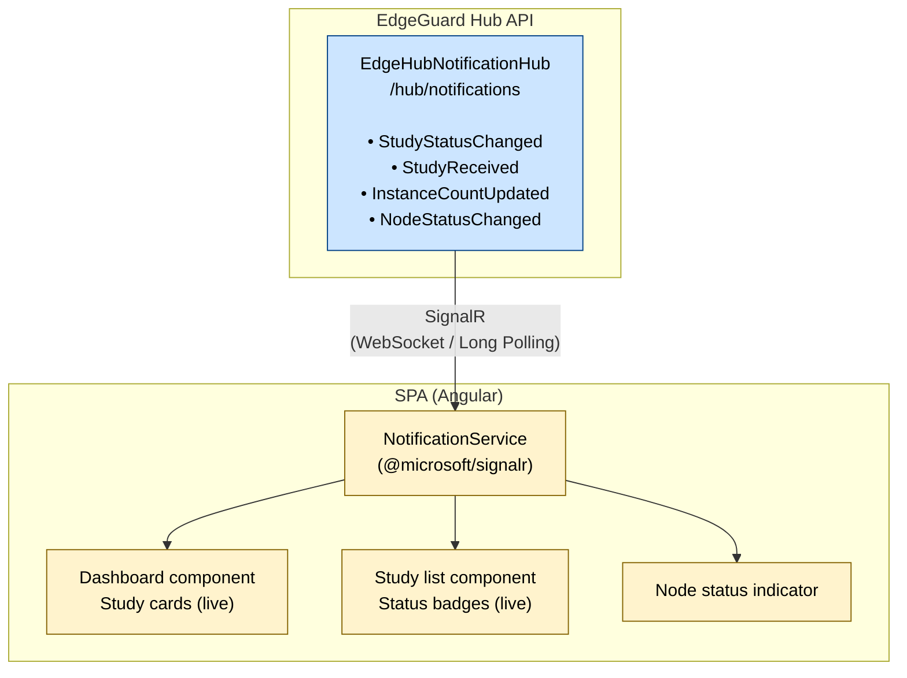

# Real-Time Notifications

> **Section:** 04-Features  
> **Applies to:** EdgeGuard Hub API, SPA (Angular)  
> **Last updated:** 2026-05-16

---

## Overview

EdgeGuard Hub exposes a SignalR hub at `/hub/notifications` that pushes real-time events to connected SPA clients. Operators see study state changes, instance count progress, and Node online/offline transitions immediately — without polling. The SPA maintains a persistent, automatically-reconnecting WebSocket connection and updates the UI reactively as events arrive.

---

## Architecture



The Hub emits events in response to domain events raised by the study pipeline and Node status monitor. The SPA `NotificationService` maintains a single shared connection per browser session and exposes typed RxJS observables that Angular components subscribe to.

---

## SignalR Hub

**Endpoint:** `https://{hub-host}/hub/notifications`  
**Class:** `EdgeHubNotificationHub`  
**Transport:** WebSocket (with Server-Sent Events and Long Polling as automatic fallbacks)

The Hub does not expose any client-callable methods (it is a push-only hub). All messages flow from the server to connected clients.

---

## Events

### `StudyStatusChanged`

Emitted when a study transitions to a new pipeline state.

**Payload:**

```json
{
  "studyId": "3fa85f64-5717-4562-b3fc-2c963f66afa6",
  "status": "Completed",
  "timestamp": "2026-05-16T14:32:00.000Z",
  "patientName": "Garcia^Maria",
  "modality": "CT",
  "nodeId": "a1b2c3d4-1234-5678-abcd-ef0123456789"
}
```

| Field | Type | Description |
|---|---|---|
| `studyId` | GUID string | Study that changed state |
| `status` | string | New status value (`Scheduled`, `Receiving`, `Received`, `Sending`, `Completed`, `Failed`) |
| `timestamp` | ISO 8601 UTC | When the transition occurred |
| `patientName` | string | DICOM-format patient name for display |
| `modality` | string | Study modality code |
| `nodeId` | GUID string | Node that processed the study |

---

### `StudyReceived`

Emitted when a study transitions from `Receiving` to `Received` (all images received). This is a convenience event for the dashboard to trigger a final refresh of the study card.

**Payload:**

```json
{
  "studyId": "3fa85f64-5717-4562-b3fc-2c963f66afa6",
  "instanceCount": 128,
  "seriesCount": 4,
  "totalSizeBytes": 268435456,
  "lastImageReceivedAt": "2026-05-16T14:31:58.000Z"
}
```

| Field | Type | Description |
|---|---|---|
| `studyId` | GUID string | Study that finished receiving |
| `instanceCount` | int | Final total instance count |
| `seriesCount` | int | Final series count |
| `totalSizeBytes` | long | Total received file size in bytes |
| `lastImageReceivedAt` | ISO 8601 UTC | Timestamp of the last received image |

---

### `InstanceCountUpdated`

Emitted on each successfully received DICOM instance while the study is in the `Receiving` state. Enables real-time progress animation on study cards.

**Payload:**

```json
{
  "studyId": "3fa85f64-5717-4562-b3fc-2c963f66afa6",
  "instanceCount": 47,
  "seriesCount": 2,
  "totalSizeBytes": 98566144
}
```

| Field | Type | Description |
|---|---|---|
| `studyId` | GUID string | Study receiving images |
| `instanceCount` | int | Current running instance count |
| `seriesCount` | int | Current series count |
| `totalSizeBytes` | long | Cumulative bytes received so far |

> **Throttling:** On high-volume acquisitions (e.g., CT with 512+ slices), `InstanceCountUpdated` may be throttled server-side to avoid flooding connected clients. The default throttle is 1 event per second per study; the final count is always emitted.

---

### `NodeStatusChanged`

Emitted when a Node transitions between online and offline states, as detected by the Hub's heartbeat monitor.

**Payload:**

```json
{
  "nodeId": "a1b2c3d4-1234-5678-abcd-ef0123456789",
  "nodeName": "Radiology Node 1",
  "isOnline": false,
  "timestamp": "2026-05-16T14:35:00.000Z"
}
```

| Field | Type | Description |
|---|---|---|
| `nodeId` | GUID string | Node that changed connectivity state |
| `nodeName` | string | Human-readable Node name |
| `isOnline` | bool | `true` = Node is responding to heartbeats; `false` = Node is unreachable |
| `timestamp` | ISO 8601 UTC | When the state change was detected |

---

## SPA Subscription

### Angular Service (`NotificationService`)

The SPA uses the `@microsoft/signalr` package to manage the SignalR connection. The `NotificationService` is provided at the root level and creates a single `HubConnection` instance per browser session.

```typescript
// Connection initialization (simplified)
const connection = new HubConnectionBuilder()
  .withUrl('/hub/notifications', {
    accessTokenFactory: () => authService.getToken()
  })
  .withAutomaticReconnect([0, 2000, 10000, 30000])
  .configureLogging(LogLevel.Warning)
  .build();
```

**Reconnect policy** (`withAutomaticReconnect` delays in milliseconds):

| Attempt | Wait |
|---|---|
| 1st reconnect | 0 ms (immediate) |
| 2nd reconnect | 2 seconds |
| 3rd reconnect | 10 seconds |
| 4th+ reconnect | 30 seconds |

After the 4th attempt, SignalR continues retrying at 30-second intervals indefinitely.

### Typed Observables

The `NotificationService` exposes RxJS `Observable` streams for each event type:

```typescript
studyStatusChanged$:    Observable<StudyStatusChangedEvent>
studyReceived$:         Observable<StudyReceivedEvent>
instanceCountUpdated$:  Observable<InstanceCountUpdatedEvent>
nodeStatusChanged$:     Observable<NodeStatusChangedEvent>
connectionState$:       Observable<HubConnectionState>
```

Angular components subscribe to these observables in `ngOnInit` and unsubscribe in `ngOnDestroy` to prevent memory leaks.

---

## Dashboard Integration

### Study Cards

Study cards on the Dashboard subscribe to `studyStatusChanged$` and `instanceCountUpdated$`. When an event arrives for a study currently displayed in the list:

1. The status badge updates immediately (no HTTP request needed).
2. The instance counter animates to the new value.
3. If the new status is `Completed` or `Failed`, a toast notification appears.

### Instance Counter Animation

While a study is in the `Receiving` state, the instance counter increments live as `InstanceCountUpdated` events arrive. The counter uses a CSS transition to animate the number change, giving operators visual feedback of acquisition progress.

### Node Status Indicator

The top navigation bar displays a per-Node status icon (green dot = online, red dot = offline). The icon state is driven by `nodeStatusChanged$` events. No page refresh is required when a Node reconnects or goes offline.

---

## Connection Management

### Connection State Indicator

The SPA displays a connection state chip in the UI (typically in the top navigation bar):

| SignalR State | UI Indicator |
|---|---|
| `Connected` | No indicator shown (normal operation) |
| `Reconnecting` | Yellow badge: "Reconnecting..." |
| `Disconnected` | Red badge: "Disconnected — real-time updates paused" |

When the state is `Disconnected` or `Reconnecting`, the SPA continues to function with REST API polling as a fallback to ensure the user still sees current data.

### Fallback Polling

If the SignalR connection cannot be established or is lost for more than 60 seconds, the SPA activates a 10-second polling interval on the active dashboard queries until the real-time connection is restored.

---

## Security

SignalR connections to `/hub/notifications` are authenticated using the same JWT bearer token issued by the EdgeGuard Hub identity service:

- The token is passed via the `accessTokenFactory` callback (injected as a query parameter for WebSocket transports, as per SignalR protocol).
- Token expiry is handled by the Angular auth interceptor; when the token is refreshed, the SignalR connection is restarted with the new token.
- Authorization policy: any authenticated Hub user (any role) may connect and receive events.
- Events are **not** filtered by user role at the SignalR layer. Role-based filtering of displayed information is enforced in the SPA component layer.

> **No client-to-server messages:** The `EdgeHubNotificationHub` does not expose any hub methods callable from the client. Clients can only subscribe to receive events; they cannot push data through the SignalR connection.

---

## Related Documentation

- [Study Pipeline](study-pipeline.md) — domain events that trigger SignalR emissions
- [Multi-PACS Routing](multi-pacs-routing.md) — delivery events that change study status
- [WhatsApp Integration](whatsapp-integration.md) — complementary async notification channel
