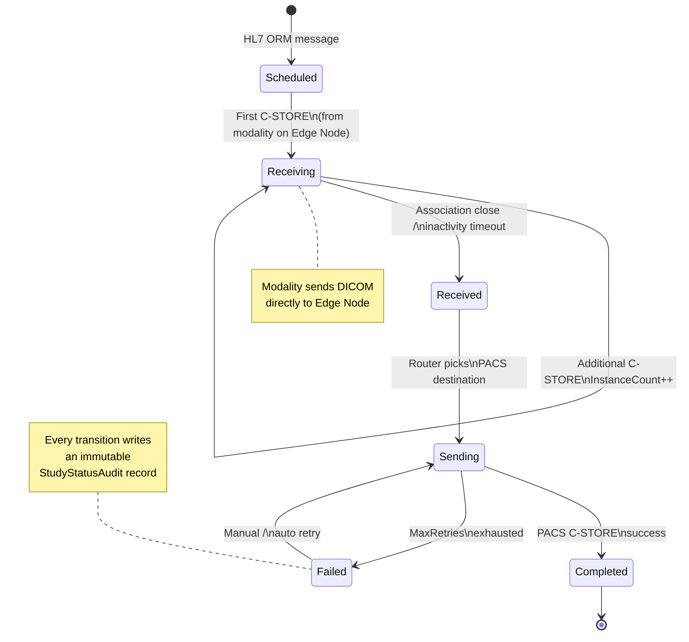

# Study Pipeline

> **Section:** 04-Features  
> **Applies to:** EdgeGuard Hub and Node services  
> **Last updated:** 2026-05-16

---

## Overview

The study pipeline governs the complete lifecycle of a DICOM study from the moment a modality worklist entry is created until the study is confirmed as received by the destination PACS. Every state transition is persisted and audited, enabling full traceability across disconnected edge deployments.

---

## State Machine



---

## State Definitions

### States

| State | Description |
|---|---|
| `Scheduled` | Study has been created from an HL7 ORM message (worklist entry). No DICOM images have arrived yet. |
| `Receiving` | At least one DICOM image has arrived via C-STORE. The modality is actively sending. |
| `Received` | The modality has closed the DICOM association or a no-new-instances timeout has elapsed. All expected images are on disk. |
| `Sending` | The Router has selected a PACS destination and the Sender is executing C-STORE SCU operations. |
| `Completed` | The destination PACS returned a successful C-STORE response. The study is fully delivered. |
| `Failed` | Sending has been attempted `MaxRetries` times without success. The last PACS error is recorded. |

---

## State Transition Table

| From State | To State | Entry Trigger | Key Fields Set |
|---|---|---|---|
| — | `Scheduled` | HL7 ORM message processed | `Status=Scheduled`, `CurrentStatusSince`, `Priority`, `IsUrgent` |
| `Scheduled` | `Receiving` | First DICOM C-STORE received from modality | `FirstImageReceivedAt`, `InstanceCount=1`, `SeriesCount` |
| `Receiving` | `Receiving` | Additional C-STORE associations received | `InstanceCount++`, `LastImageReceivedAt`, `TotalSizeBytes` |
| `Receiving` | `Received` | DICOM association closed or inactivity timeout | `LastImageReceivedAt`, `CurrentStatusSince` |
| `Received` | `Sending` | Router selects PACS destination; Sender starts | `PacsSendAttempts++`, `CurrentStatusSince` |
| `Sending` | `Completed` | PACS returns C-STORE success response | `SentToPacsAt`, `CurrentStatusSince` |
| `Sending` | `Failed` | `RetryCount >= MaxRetries` after last attempt fails | `PacsSendLastError`, `RetryCount`, `CurrentStatusSince` |
| `Failed` | `Sending` | Manual retry triggered in SPA or automatic backoff retry fires | `PacsSendAttempts++`, `PacsSendLastError` cleared |

---

## Study Aggregate Fields

The following fields are carried on the study aggregate and drive pipeline logic:

| Field | Type | Description |
|---|---|---|
| `Status` | Enum | Current pipeline state (see above) |
| `CurrentStatusSince` | DateTimeOffset | Timestamp of last status change |
| `InstanceCount` | int | Total DICOM instances received so far |
| `SeriesCount` | int | Number of distinct series received |
| `TotalSizeBytes` | long | Cumulative byte count of all DICOM files |
| `FirstImageReceivedAt` | DateTimeOffset? | Timestamp of first C-STORE for this study |
| `LastImageReceivedAt` | DateTimeOffset? | Timestamp of most-recent C-STORE |
| `SentToPacsAt` | DateTimeOffset? | Timestamp when PACS confirmed delivery |
| `PacsSendAttempts` | int | Total number of send attempts (including retries) |
| `PacsSendLastError` | string? | Error message or DICOM status code from last failed attempt |
| `RetryCount` | int | Number of consecutive failures since last success |
| `MaxRetries` | int | Maximum retries before transitioning to `Failed` (default: 3) |
| `Priority` | int | Routing queue priority, 1 (highest) – 10 (lowest) |
| `IsUrgent` | bool | When `true`, overrides normal priority ordering in the send queue |

---

## Priority and Urgency

Studies are queued for sending in priority order. The `Priority` field is an integer from **1 (highest priority) to 10 (lowest)**. When multiple studies share the same priority, `IsUrgent=true` studies are promoted ahead of non-urgent studies at the same level.

> **Recommendation:** Use priority bands such as 1, 3, 5, 7, 10 to leave room for future intermediate values without renumbering existing studies.

| Scenario | Suggested Priority | `IsUrgent` |
|---|---|---|
| Emergency / trauma | 1 | `true` |
| Outpatient urgent referral | 2 | `false` |
| Routine inpatient | 5 | `false` |
| Scheduled outpatient | 7 | `false` |
| Batch/archive studies | 10 | `false` |

---

## Receiving Phase — Instance Accumulation

While a study is in the `Receiving` state, the pipeline accumulates DICOM instances incrementally:

1. Each successful C-STORE SCP triggers `InstanceCount++` and `LastImageReceivedAt` update.
2. `SeriesCount` is maintained by tracking distinct Series Instance UIDs.
3. `TotalSizeBytes` is updated on each received file.

The `Receiving → Received` transition occurs when:

- The modality releases the DICOM association (normal completion), **or**
- A configurable inactivity timeout elapses with no new instances.

> **Note:** Some modalities send multiple associations for the same study (e.g., one per series). The pipeline handles this correctly — each association is processed independently and all count toward the same study aggregate.

---

## Sending Phase — Retry Behavior

When the Sender fails to deliver to a PACS destination:

```
Attempt 1: fail → RetryCount=1, PacsSendLastError set
Attempt 2: fail → RetryCount=2, exponential backoff applied
Attempt 3: fail → RetryCount=3 == MaxRetries → Status = Failed
```

The backoff schedule (approximate):

| Attempt | Wait before retry |
|---|---|
| 1 → 2 | 30 seconds |
| 2 → 3 | 2 minutes |
| 3+ | Transition to `Failed` |

Retry attempts are also triggered on Node reconnect when intermittent connectivity was the root cause. See [Multi-PACS Routing](multi-pacs-routing.md) for offline queue behavior.

---

## Audit Trail

Every state transition produces a **`StudyStatusAudit`** record containing:

| Field | Description |
|---|---|
| `StudyId` | Study that transitioned |
| `FromStatus` | Previous state |
| `ToStatus` | New state |
| `OccurredAt` | UTC timestamp of the transition |
| `Reason` | Human-readable reason (e.g., `"PACS C-STORE success"`, `"Max retries exhausted"`) |
| `ActorType` | System (`Pipeline`), User (`Manual retry`), or HL7 (`ORM message`) |

Audit records are immutable and retained for the full data retention period configured on the Hub. They power the study timeline view in the SPA and serve as the authoritative source for compliance reporting.

---

## Related Documentation

- [DICOM Routing Rules](dicom-routing-rules.md) — how the Router selects a destination PACS
- [Multi-PACS Routing](multi-pacs-routing.md) — PACS configuration, retry, and offline queue
- [Real-Time Notifications](real-time-notifications.md) — SignalR events emitted on each state change
- [HL7 Pipeline](hl7-pipeline.md) — how ORM messages create `Scheduled` studies
