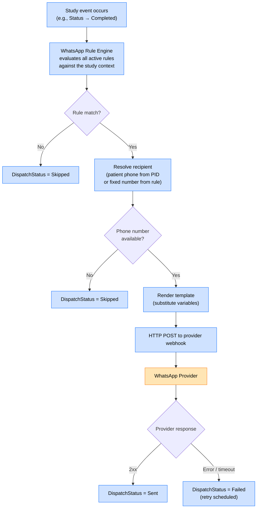

# WhatsApp Integration

> **Section:** 04-Features  
> **Applies to:** EdgeGuard Hub service, SPA  
> **Last updated:** 2026-05-16

---

## Overview

The WhatsApp integration enables automated patient and clinical notifications via WhatsApp messages triggered by study lifecycle events. The system is built around a rule engine that evaluates configurable trigger conditions, selects a pre-approved message template, resolves the recipient, and dispatches the message to an external WhatsApp provider via HTTP webhook.

---

## Architecture



The `DispatchStatus` is stored on the associated `Hl7Message` record (or study event record) and is visible in the HL7 queue view within the SPA.

---

## Template Structure

Templates are pre-approved message formats registered in the configuration. Each template is identified by a name and contains fixed text with optional variable placeholders.

### Supported Variables

| Variable | Resolved From | Example Output |
|---|---|---|
| `{{patientName}}` | Patient.PatientName (given name extracted) | `"Maria Garcia"` |
| `{{studyDate}}` | Study date (DICOM tag 0008,0020) | `"2026-05-16"` |
| `{{modality}}` | Study Modality | `"CT"` |
| `{{institutionName}}` | Institution from DICOM tag or Node config | `"North Clinic"` |
| `{{reportUrl}}` | Configurable base URL + study ID | `"https://viewer.example.com/study/abc123"` |
| `{{accessionNumber}}` | Study Accession Number (0008,0050) | `"ACC-20260516-001"` |

### Supported Event Types

| Event Type | Description | Typical Use Case |
|---|---|---|
| `StudyCompleted` | Study has transitioned to `Completed` status | Notify patient that images were received |
| `UrgentStudy` | Study has `IsUrgent = true` at any status | Alert radiologist or referring physician |
| `ReportReady` | Report availability signal (external trigger or HL7 ORU) | Notify patient that results are available |

### Example Template

**Template name:** `study_completed_es`  
**Event:** `StudyCompleted`  
**Body:**
```
Estimado/a {{patientName}},

Sus imágenes de {{modality}} del {{studyDate}} han sido recibidas correctamente
en {{institutionName}}.

Si tiene preguntas, comuníquese con su médico.
```

---

## Rule Configuration

Each WhatsApp rule defines the conditions under which a message is sent and how it is dispatched.

### Rule Fields

| Field | Type | Description | Example |
|---|---|---|---|
| `Name` | string | Rule label | `"CT Completed — Patient SMS"` |
| `IsEnabled` | bool | Whether the rule participates in evaluation | `true` |
| `EventType` | enum | Trigger event (`StudyCompleted`, `UrgentStudy`, `ReportReady`) | `StudyCompleted` |
| `MatchModality` | string? | Modality filter (null = any) | `"CT"` |
| `MatchUrgentOnly` | bool | Only fire for studies with `IsUrgent=true` | `false` |
| `TemplateName` | string | Name of the template to render | `"study_completed_es"` |
| `RecipientSource` | enum | `PatientPhone` or `FixedNumber` | `PatientPhone` |
| `FixedPhoneNumber` | string? | Used when `RecipientSource = FixedNumber` | `"+525512345678"` |
| `Priority` | int | Evaluation order when multiple rules exist for the same event | `10` |

### Recipient Resolution

| `RecipientSource` | Behavior |
|---|---|
| `PatientPhone` | Reads `Patient.PhoneNumber` from the study's linked patient record. If the phone number is absent or empty, dispatch is skipped (`DispatchStatus = Skipped`). |
| `FixedNumber` | Uses the `FixedPhoneNumber` value from the rule. Used for staff notifications (e.g., always alert radiology coordinator). |

> **Country code:** If `Patient.PhoneNumber` does not include a country code prefix, the `DefaultCountryCode` configuration value is prepended before dispatch. Example: `"5512345678"` + default `"+52"` → `"+525512345678"`.

---

## Dispatch Flow

The full dispatch sequence for a single rule match:

```
1. Event fires (e.g., study transitions to Completed)

2. Rule engine loads all enabled WhatsApp rules with matching EventType
   sorted by Priority ASC

3. For each rule:
   a. Evaluate MatchModality (null = any)
   b. Evaluate MatchUrgentOnly (if true, study must have IsUrgent=true)
   c. Resolve recipient (PatientPhone or FixedNumber)
   d. If recipient unavailable → DispatchStatus = Skipped, continue to next rule
   e. Render template with study and patient variables
   f. Build HTTP request payload

4. HTTP POST to provider webhook:
   POST {ProviderWebhookUrl}
   Authorization: Bearer {ApiKey}
   Content-Type: application/json

   {
     "to": "+525512345678",
     "template": "study_completed_es",
     "body": "Estimado/a Maria Garcia, Sus imágenes de CT..."
   }

5. On 2xx response: DispatchStatus = Sent
   On non-2xx or timeout: DispatchStatus = Failed, schedule retry
```

---

## DispatchStatus Values

`DispatchStatus` is stored on the `Hl7Message` (or WhatsApp dispatch log record) for each dispatch attempt:

| Status | Meaning |
|---|---|
| `Pending` | Dispatch has been queued but not yet attempted |
| `Sent` | Provider webhook returned a 2xx response |
| `Failed` | Provider returned a non-2xx response or the request timed out; will be retried |
| `Skipped` | No applicable rule matched, or recipient phone number was unavailable |

---

## Retry Behavior

Failed dispatches are retried with exponential backoff:

| Attempt | Wait before retry |
|---|---|
| 1st | 1 minute |
| 2nd | 5 minutes |
| 3rd | 15 minutes |

After 3 consecutive failures, the status remains `Failed` and no further automatic retries are scheduled. Operators can trigger a manual retry from the HL7 queue view in the SPA.

---

## Provider Configuration

WhatsApp dispatch is provider-agnostic. Any provider that accepts an HTTP webhook POST can be integrated. The following settings are required:

| Setting | Description | Example |
|---|---|---|
| `ProviderWebhookUrl` | Full URL of the provider's message dispatch endpoint | `"https://api.whatsapp-provider.com/v1/messages"` |
| `ApiKey` | Bearer token or API key for authentication | `"sk-..."` |
| `DefaultCountryCode` | Prepended to phone numbers that lack a country prefix | `"+52"` |
| `RequestTimeoutSeconds` | HTTP request timeout | `10` |

Settings are stored in the Hub's encrypted configuration store and are not exposed through the SPA in plain text.

---

## Monitoring

WhatsApp message dispatch status is visible in the **HL7 Queue** view within the SPA:

| Column | Description |
|---|---|
| Message type | The event type that triggered the dispatch |
| Patient | Linked patient name and DICOM ID |
| Recipient | Phone number (masked: `+52•••••5678`) |
| Template | Template name used |
| Status | Current `DispatchStatus` |
| Last attempt | Timestamp of most-recent dispatch attempt |
| Attempts | Number of dispatch attempts made |

Operators can filter the queue by `DispatchStatus` to quickly identify failed or pending messages requiring attention.

---

## Related Documentation

- [Patient Management](patient-management.md) — patient phone number (`PhoneNumber` field) used as recipient
- [Study Pipeline](study-pipeline.md) — `StudyCompleted` and `IsUrgent` events that trigger dispatch
- [HL7 Pipeline](hl7-pipeline.md) — `DispatchStatus` field on `Hl7Message` records
