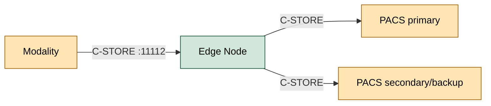

# PACS Integration Guide

This guide covers integrating EdgeGuard Platform with PACS (Picture Archiving and Communication System) servers for DICOM study forwarding.

---

## Table of Contents

1. [Overview](#overview)
2. [Adding a PACS Server in the Hub UI](#adding-a-pacs-server-in-the-hub-ui)
3. [Node AE Title Configuration](#node-ae-title-configuration)
4. [Assigning a PACS to a Node](#assigning-a-pacs-to-a-node)
5. [C-ECHO Verification](#c-echo-verification)
6. [DICOM Send Configuration](#dicom-send-configuration)
7. [Transfer Syntax Negotiation](#transfer-syntax-negotiation)
8. [Secure DICOM (TLS)](#secure-dicom-tls)
9. [Tested PACS Systems](#tested-pacs-systems)
10. [Troubleshooting](#troubleshooting)

---

## Overview

EdgeGuard Edge Nodes receive DICOM studies from imaging modalities via C-STORE SCP and forward them to one or more PACS servers using C-STORE SCU. Each node can be configured to send to multiple PACS servers, with priority ordering and routing rules.



PACS server configuration is centrally managed in the Hub and automatically synchronized to all assigned nodes. You do not need to edit node configuration files to add or change PACS destinations.

---

## Adding a PACS Server in the Hub UI

### Step-by-step

1. Log in to the Hub at `https://your-hub-domain.example.com`.
2. Navigate to **Settings → PACS Servers**.
3. Click **Add PACS Server**.
4. Fill in the following fields:

| Field | Description | Example |
|-------|-------------|---------|
| **Name** | Human-readable display name | `Main PACS - Orthanc Prod` |
| **AE Title** | PACS DICOM Application Entity Title | `ORTHANC_PROD` |
| **Host / IP** | PACS server hostname or IP address | `pacs.internal.example.com` |
| **Port** | PACS DICOM port | `11112` |
| **Priority** | Send order when multiple PACS configured (lower = first) | `1` |

5. Click **Save**.

The PACS server appears in the list with status **Not tested**. Run a C-ECHO test before assigning to nodes.

---

## Node AE Title Configuration

The node's own AE Title must be registered as a trusted caller in the PACS system before association will be accepted.

### View or change the node AE Title

The node AE Title is set in `appsettings.json` on the node server:

```json
{
  "Dicom": {
    "AeTitle": "EDGEGUARD_SITE_A"
  }
}
```

This value is also visible in the Hub UI under **Settings → Nodes → [Node] → DICOM Settings**.

### Register node AE Title in your PACS

Each PACS system has its own process for registering trusted AE Titles. General steps:

1. Log in to your PACS administration console.
2. Navigate to the DICOM configuration or known AE Titles section.
3. Add a new entry:
   - **AE Title:** `EDGEGUARD_SITE_A` (must match exactly, case-sensitive)
   - **Host:** IP address of the Edge Node
   - **Port:** `11112` (the node's DICOM port)

For PACS-specific configuration steps, see [Tested PACS Systems](#tested-pacs-systems).

---

## Assigning a PACS to a Node

After adding and testing a PACS server:

1. Navigate to **Settings → PACS Servers**.
2. Find the PACS server and click **Assign to Node**.
3. Select the node(s) from the list.
4. Click **Confirm Assignment**.

The Hub pushes the updated PACS configuration to the selected node(s) within 60 seconds. No node restart is required.

To verify the node received the update:
- Navigate to **Settings → Nodes → [Node] → PACS Assignments**.
- The assigned PACS server should appear with status **Synced**.

---

## C-ECHO Verification

C-ECHO (DICOM Verification SOP) tests basic DICOM connectivity and AE Title recognition before sending real studies.

### Via Hub UI (recommended)

1. Navigate to **Settings → PACS Servers**.
2. Click the **C-ECHO Test** button next to the PACS server.
3. The Hub performs a C-ECHO SCU to the PACS and reports:
   - **Success:** Association established and C-ECHO response received.
   - **Failed:** Connection refused, timeout, or association rejection (see error details).

### Via command line (dcmtk)

```bash
# Install dcmtk (Linux)
sudo apt-get install dcmtk

# Run C-ECHO from Hub server to PACS
echoscu \
  pacs.internal.example.com \    # PACS host
  11112 \                        # PACS port
  -aec ORTHANC_PROD \            # Called AE Title (PACS)
  -aet EDGEGUARD_HUB             # Calling AE Title (EdgeGuard)
```

Expected output for success:
```
D: DIMSE receiveCommand
I: Received Echo Response (MsgID 1, Status: Success)
```

### Via command line (Windows, with dcmtk)

```powershell
echoscu.exe pacs.internal.example.com 11112 -aec ORTHANC_PROD -aet EDGEGUARD_HUB
```

---

## DICOM Send Configuration

### Priority-based routing

When a node has multiple PACS servers assigned, studies are sent in priority order. If a primary PACS send fails, the node retries on the secondary.

| Priority | PACS Name | Behavior |
|----------|-----------|---------|
| 1 | Main PACS | Attempted first |
| 2 | Backup PACS | Attempted if Priority 1 fails after retries |

### Retry configuration

Default retry behavior (configurable per PACS assignment):

```json
{
  "Dicom": {
    "PacsSend": {
      "MaxRetryAttempts": 3,
      "RetryDelaySeconds": 60,
      "AssociationTimeoutSeconds": 30
    }
  }
}
```

### Routing rules

For advanced scenarios where different study types route to different PACS servers, use the routing rules engine in the Hub UI:

1. Navigate to **Settings → Nodes → [Node] → Routing Rules**.
2. Click **Add Rule**.
3. Configure criteria (Modality, AE Title source, Study Description, etc.) and target PACS.

See the routing rules documentation for full details.

---

## Transfer Syntax Negotiation

EdgeGuard negotiates transfer syntaxes in the following preference order during C-STORE SCU:

| Priority | Transfer Syntax | UID |
|----------|----------------|-----|
| 1 | Explicit VR Little Endian | 1.2.840.10008.1.2.1 |
| 2 | Implicit VR Little Endian | 1.2.840.10008.1.2 |
| 3 | JPEG 2000 Lossless | 1.2.840.10008.1.2.4.90 |
| 4 | JPEG 2000 Lossy | 1.2.840.10008.1.2.4.91 |
| 5 | JPEG Baseline (Process 1) | 1.2.840.10008.1.2.4.50 |
| 6 | JPEG-LS Lossless | 1.2.840.10008.1.2.4.80 |

If the PACS does not accept the preferred syntax, EdgeGuard transcodes to Explicit VR Little Endian (lossless) before sending.

> **Note:** Lossy transcoding is never performed automatically. If the study was received in a lossy format (e.g., JPEG Baseline), it is forwarded in that format as-is.

---

## Secure DICOM (TLS)

EdgeGuard supports DICOM over TLS (DICOM TLS as specified in PS3.15).

### Configuration

Enable TLS for a specific PACS connection:

```json
{
  "Dicom": {
    "PacsServers": [
      {
        "Name": "Secure PACS",
        "AeTitle": "SECPACS",
        "Host": "pacs.internal.example.com",
        "Port": 2762,
        "Tls": {
          "Enabled": true,
          "CertificatePath": "/etc/edgeguard/dicom-tls.pfx",
          "CertificatePassword": "${DICOM_TLS_CERT_PASSWORD}",
          "ValidatePeerCertificate": true
        }
      }
    ]
  }
}
```

> **Note:** DICOM TLS port is typically 2762 (IANA assigned) rather than the standard DICOM port 11112.

---

## Tested PACS Systems

EdgeGuard has been validated against the following PACS systems:

### Orthanc (open source)

| Parameter | Notes |
|-----------|-------|
| Version tested | 1.12.x |
| Configuration | Add EdgeGuard AE Title to `OrthancPeers` in `orthanc.json` |
| Default port | 4242 (Orthanc default) or 11112 |
| Notes | Fully supported; DICOM TLS requires Orthanc Plus |

```json
// orthanc.json — add EdgeGuard as known caller
{
  "DicomModalities": {
    "EDGEGUARD_SITE_A": {
      "AET": "EDGEGUARD_SITE_A",
      "Host": "<node-ip>",
      "Port": 11112
    }
  }
}
```

### DCM4CHEE (open source)

| Parameter | Notes |
|-----------|-------|
| Version tested | 5.x (dcm4chee-arc-light) |
| Configuration | Add EdgeGuard as a Network AE in DCM4CHEE admin UI |
| Default port | 11112 |
| Notes | Fully supported; configure `Accept` rules to allow EdgeGuard AE Title |

### Synapse (Fujifilm)

| Parameter | Notes |
|-----------|-------|
| Version tested | 5.x |
| Configuration | Add EdgeGuard AE Title via Synapse Administration Console |
| Notes | Tested with CT, MR, CR modalities; contact Fujifilm for AE configuration details |

### Sectra IDS7 (Sectra)

| Parameter | Notes |
|-----------|-------|
| Version tested | IDS7 21.x |
| Configuration | Requires DICOM configuration by Sectra administrator |
| Notes | Explicit VR Little Endian preferred; verify SOP class acceptance in Sectra config |

---

## Troubleshooting

### Association rejected: Called AE Title not recognized

**Problem:** PACS returns Association Reject with reason `Called AE Title Not Recognized`.

**Resolution:**
1. Verify the AE Title in Hub UI matches exactly what is configured in the PACS (case-sensitive).
2. Ensure the PACS has EdgeGuard's calling AE Title (`Dicom.AeTitle` from node config) in its permitted callers list.
3. Run a C-ECHO test from the Hub UI to confirm the rejection is AE-related.

### Association rejected: Calling AE Title not recognized

**Problem:** PACS rejects association because it does not recognize the node's AE Title.

**Resolution:** Register the node's AE Title in the PACS trusted AE list (see [Node AE Title Configuration](#node-ae-title-configuration)).

### C-STORE failed: No acceptable presentation contexts

**Problem:** Association is established but no SOP Classes are accepted.

**Resolution:** Verify the PACS is configured to accept the SOP Classes of the study being sent. For example, if sending CT studies, the PACS must accept `CT Image Storage (1.2.840.10008.5.1.4.1.1.2)`.

### Studies sent but not visible in PACS

**Problem:** C-STORE returns Success status but studies do not appear in PACS.

**Resolution:**
1. Check PACS import/processing queue — some systems process asynchronously.
2. Verify the Study Instance UID is correct — check PACS audit logs for the inbound store.
3. Check PACS storage quota — a full PACS silently discards new studies on some configurations.

### Connection timeout

**Problem:** C-STORE SCU times out connecting to PACS.

**Resolution:**
1. Verify PACS host and port in Hub configuration.
2. Test TCP connectivity from the node/hub server: `nc -zv <pacs-host> <port>`.
3. Check firewall allows outbound from Hub/Node IP to PACS IP on the configured port.
