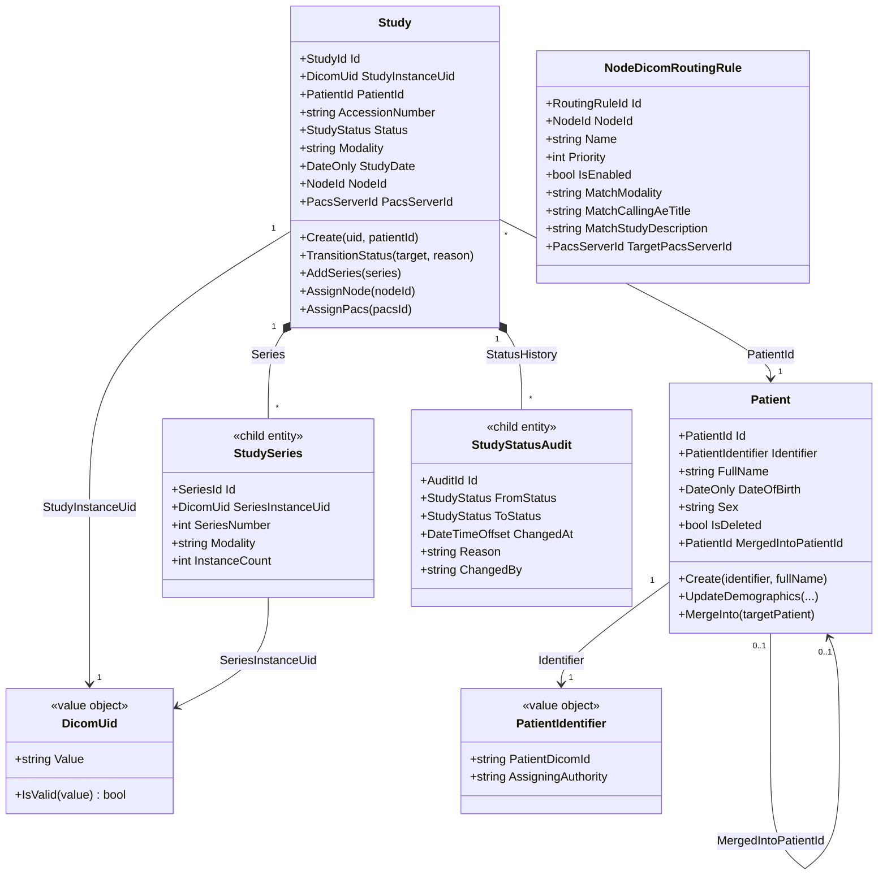
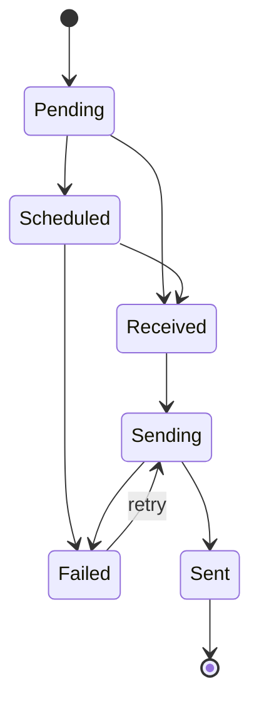

# Domain Model Documentation

EdgeGuard Platform uses Domain-Driven Design (DDD) patterns. This document describes the domain model structure, including aggregate roots, value objects, child entities, domain events, and repository interfaces.

---

## Table of Contents

1. [Overview](#overview)
2. [Aggregate Roots](#aggregate-roots)
   - [Study](#study)
   - [Patient](#patient)
   - [NodeDicomRoutingRule](#nodedicomroutingrule)
3. [Value Objects](#value-objects)
   - [DicomUid](#dicomuid)
   - [PatientIdentifier](#patientidentifier)
4. [Child Entities](#child-entities)
   - [StudySeries](#studyseries)
   - [StudyStatusAudit](#studystatusaudit)
5. [Domain Events](#domain-events)
6. [Repository Interfaces](#repository-interfaces)
7. [Domain Rules and Invariants](#domain-rules-and-invariants)

---

## Overview

### Base classes

All aggregates extend `AggregateRoot<TId>`:

```csharp
public abstract class AggregateRoot<TId>
{
    public TId Id { get; protected set; }
    public DateTimeOffset CreatedAt { get; protected set; }
    public DateTimeOffset UpdatedAt { get; protected set; }

    private readonly List<IDomainEvent> _domainEvents = [];
    public IReadOnlyList<IDomainEvent> DomainEvents => _domainEvents.AsReadOnly();

    protected void AddDomainEvent(IDomainEvent domainEvent) =>
        _domainEvents.Add(domainEvent);

    public void ClearDomainEvents() =>
        _domainEvents.Clear();
}
```

Soft-deletable aggregates implement `ISoftDeletable`:

```csharp
public interface ISoftDeletable
{
    bool IsDeleted { get; }
    DateTimeOffset? DeletedAt { get; }
}
```

---

## Aggregate Roots

### Aggregate Overview



### Study

The primary aggregate for DICOM imaging studies. Coordinates all state transitions and series/audit tracking.

#### Fields

| Property | Type | Nullable | Description |
|----------|------|----------|-------------|
| `Id` | `StudyId` | No | Surrogate primary key |
| `StudyInstanceUid` | `DicomUid` | No | Globally unique DICOM Study Instance UID (unique index) |
| `PatientId` | `PatientId` | No | FK to Patient aggregate |
| `AccessionNumber` | `string?` | Yes | RIS accession number |
| `Status` | `StudyStatus` | No | Current status (enum) |
| `Modality` | `string?` | Yes | DICOM modality code (CT, MR, etc.) |
| `StudyDate` | `DateOnly?` | Yes | Date of the study |
| `StudyDescription` | `string?` | Yes | DICOM study description |
| `NodeId` | `NodeId?` | Yes | Node that received the study |
| `PacsServerId` | `PacsServerId?` | Yes | PACS server the study was sent to |
| `CreatedAt` | `DateTimeOffset` | No | From AggregateRoot |
| `UpdatedAt` | `DateTimeOffset` | No | From AggregateRoot |
| `Series` | `IReadOnlyList<StudySeries>` | No | Child series entities |
| `StatusHistory` | `IReadOnlyList<StudyStatusAudit>` | No | Status change audit trail |

#### Study Status enum

```csharp
public enum StudyStatus
{
    Pending = 0,     // Order received (ORM), waiting for DICOM
    Scheduled = 1,   // On Modality Worklist, not yet received
    Received = 2,    // All DICOM instances received on node
    Sending = 3,     // Currently transmitting to PACS
    Sent = 4,        // Successfully sent to PACS
    Failed = 5       // Send failed (after all retries)
}
```

#### Invariants

- `StudyInstanceUid` must be unique across all studies.
- Status transitions follow the state machine (see [Domain Rules](#domain-rules-and-invariants)).
- Every status transition creates a `StudyStatusAudit` record.
- `TransitionStatus()` raises `StudyStatusChangedEvent`.

#### Key domain methods

```csharp
public static Study Create(DicomUid uid, PatientId patientId);
public void TransitionStatus(StudyStatus target, string? reason = null);
public void AddSeries(StudySeries series);
public void AssignNode(NodeId nodeId);
public void AssignPacs(PacsServerId pacsId);
```

---

### Patient

Represents a clinical patient. Owns the patient identity and is the parent of studies.

#### Fields

| Property | Type | Nullable | Description |
|----------|------|----------|-------------|
| `Id` | `PatientId` | No | Surrogate primary key |
| `Identifier` | `PatientIdentifier` | No | Value object wrapping the patient MRN |
| `FullName` | `string` | No | Patient full name |
| `DateOfBirth` | `DateOnly?` | Yes | Date of birth |
| `Sex` | `string?` | Yes | HL7 sex code (M/F/U/A/N/O) |
| `IsDeleted` | `bool` | No | ISoftDeletable — merged patients are soft-deleted |
| `DeletedAt` | `DateTimeOffset?` | Yes | Timestamp of soft deletion |
| `MergedIntoPatientId` | `PatientId?` | Yes | Target patient ID after merge |

#### Invariants

- `Identifier` is unique across non-deleted patients.
- A merged (soft-deleted) patient cannot be updated.
- A patient cannot be un-merged — merges are permanent.

#### Key domain methods

```csharp
public static Patient Create(PatientIdentifier identifier, string fullName);
public void UpdateDemographics(string fullName, DateOnly? dob, string? sex);
public void MergeInto(Patient targetPatient);
```

---

### NodeDicomRoutingRule

Defines how incoming DICOM studies on a node should be routed to PACS destinations.

#### Fields

| Property | Type | Nullable | Description |
|----------|------|----------|-------------|
| `Id` | `RoutingRuleId` | No | Surrogate primary key |
| `NodeId` | `NodeId` | No | The node this rule applies to |
| `Name` | `string` | No | Display name for the rule |
| `Priority` | `int` | No | Evaluation order (lower = higher priority) |
| `IsEnabled` | `bool` | No | Whether the rule is active |
| `MatchModality` | `string?` | Yes | If set, only matches this DICOM modality |
| `MatchCallingAeTitle` | `string?` | Yes | If set, only matches this calling AE Title |
| `MatchStudyDescription` | `string?` | Yes | Wildcard pattern match on study description |
| `TargetPacsServerId` | `PacsServerId` | No | PACS destination when rule matches |

#### Invariants

- A rule must have at least one match criterion (`MatchModality`, `MatchCallingAeTitle`, or `MatchStudyDescription`).
- `Priority` values must be unique per node.

---

## Value Objects

Value objects are immutable, identity-less, compared by structural equality.

### DicomUid

Wraps a DICOM UID string (Study Instance UID, Series Instance UID, etc.) and enforces format validity.

```csharp
public sealed record DicomUid
{
    public string Value { get; }

    public DicomUid(string value)
    {
        if (!IsValid(value))
            throw new ArgumentException($"'{value}' is not a valid DICOM UID.", nameof(value));
        Value = value;
    }

    /// <summary>
    /// Validates that the UID matches DICOM UID format:
    /// digits and dots only, max 64 chars, no leading zeros in components.
    /// </summary>
    public static bool IsValid(string value) =>
        !string.IsNullOrWhiteSpace(value) &&
        value.Length <= 64 &&
        DicomUidRegex().IsMatch(value);

    [GeneratedRegex(@"^\d+(\.\d+)+$")]
    private static partial Regex DicomUidRegex();

    public override string ToString() => Value;

    public static implicit operator string(DicomUid uid) => uid.Value;
}
```

**Why a value object?** DICOM UIDs have strict format constraints and unique index semantics. Wrapping in a value object ensures format is validated at construction, not scattered across service code. The unique database index is defined on `DicomUid.Value`.

### PatientIdentifier

Wraps the patient MRN (Medical Record Number) from the HIS/RIS system.

```csharp
public sealed record PatientIdentifier
{
    public string PatientDicomId { get; }
    public string? AssigningAuthority { get; }

    public PatientIdentifier(string patientDicomId, string? assigningAuthority = null)
    {
        ArgumentException.ThrowIfNullOrWhiteSpace(patientDicomId);
        PatientDicomId = patientDicomId.Trim();
        AssigningAuthority = assigningAuthority?.Trim();
    }

    public override string ToString() =>
        AssigningAuthority is not null
            ? $"{PatientDicomId}^^^{AssigningAuthority}^MR"
            : PatientDicomId;
}
```

**Why a value object?** The patient identifier often comes with an assigning authority (facility code) that must be tracked alongside the ID. Grouping them as a value object prevents them from being separated and enforces that the ID is never empty.

---

## Child Entities

Child entities are owned by an aggregate root and have no identity outside of that aggregate.

### StudySeries

One record per DICOM series within a study.

| Property | Type | Description |
|----------|------|-------------|
| `Id` | `SeriesId` | Surrogate key (within aggregate context) |
| `StudyId` | `StudyId` | Parent study |
| `SeriesInstanceUid` | `DicomUid` | DICOM Series Instance UID |
| `SeriesNumber` | `int?` | DICOM series number (0020,0011) |
| `Modality` | `string?` | Series modality |
| `InstanceCount` | `int` | Number of SOP Instances received |
| `SeriesDescription` | `string?` | DICOM series description |
| `ReceivedAt` | `DateTimeOffset` | When the last instance was received |

Created via `Study.AddSeries()`. Not directly accessible via repository.

### StudyStatusAudit

Records every status transition on a study for full audit trail.

| Property | Type | Description |
|----------|------|-------------|
| `Id` | `AuditId` | Surrogate key |
| `StudyId` | `StudyId` | Parent study |
| `FromStatus` | `StudyStatus` | Previous status |
| `ToStatus` | `StudyStatus` | New status |
| `ChangedAt` | `DateTimeOffset` | When the transition occurred |
| `Reason` | `string?` | Optional reason (e.g., PACS error message on failure) |
| `ChangedBy` | `string?` | System or user that triggered the transition |

Created automatically by `Study.TransitionStatus()`. Append-only — never deleted.

---

## Domain Events

Domain events are raised by aggregate methods and dispatched after the database transaction commits.

### PatientRegisteredEvent

**Raised by:** `Patient.Create()`  
**When:** A new patient record is created from an ADT^A01 HL7 message.  
**Payload:** `PatientId`, `PatientIdentifier`  
**Handled by:**
- `PatientRegisteredEventHandler` — logs the registration and optionally triggers downstream notifications.

```csharp
public sealed record PatientRegisteredEvent(
    PatientId PatientId,
    PatientIdentifier Identifier
) : IDomainEvent;
```

### StudyStatusChangedEvent

**Raised by:** `Study.TransitionStatus()`  
**When:** The study moves from one status to another (e.g., Received → Sending, Sending → Sent).  
**Payload:** `StudyId`, `StudyInstanceUid`, `FromStatus`, `ToStatus`  
**Handled by:**
- `StudyStatusChangedEventHandler` — pushes real-time update to Hub SPA via SignalR hub.
- `StudySendingEventHandler` (when `ToStatus == Sending`) — initiates PACS send via the outbound DICOM queue.

```csharp
public sealed record StudyStatusChangedEvent(
    StudyId StudyId,
    DicomUid StudyInstanceUid,
    StudyStatus FromStatus,
    StudyStatus ToStatus
) : IDomainEvent;
```

### StudyReceivedEvent

**Raised by:** `Study.TransitionStatus()` when transitioning to `Received`  
**When:** All DICOM instances for a study are received on the node.  
**Payload:** `StudyId`, `StudyInstanceUid`, `NodeId`, `SeriesCount`, `InstanceCount`  
**Handled by:**
- `StudyReceivedEventHandler` — triggers routing rule evaluation and enqueues PACS send.

```csharp
public sealed record StudyReceivedEvent(
    StudyId StudyId,
    DicomUid StudyInstanceUid,
    NodeId NodeId,
    int SeriesCount,
    int InstanceCount
) : IDomainEvent;
```

---

## Repository Interfaces

Repositories are defined in the Domain layer and implemented in the Persistence layer. All methods are async and accept `CancellationToken`.

### IStudyRepository

```csharp
public interface IStudyRepository
{
    Task<Study?> GetByIdAsync(StudyId id, CancellationToken ct = default);
    Task<Study?> GetByUidAsync(DicomUid studyInstanceUid, CancellationToken ct = default);
    Task<IReadOnlyList<Study>> GetByPatientIdAsync(PatientId patientId, CancellationToken ct = default);
    Task<IReadOnlyList<Study>> GetByStatusAsync(StudyStatus status, CancellationToken ct = default);
    Task<IReadOnlyList<Study>> GetScheduledForDateAsync(DateOnly date, CancellationToken ct = default);
    Task AddAsync(Study study, CancellationToken ct = default);
    Task UpdateAsync(Study study, CancellationToken ct = default);
}
```

### IPatientRepository

```csharp
public interface IPatientRepository
{
    Task<Patient?> GetByIdAsync(PatientId id, CancellationToken ct = default);
    Task<Patient?> GetByIdentifierAsync(PatientIdentifier identifier, CancellationToken ct = default);
    Task<IReadOnlyList<Patient>> SearchAsync(string query, int limit = 50, CancellationToken ct = default);
    Task AddAsync(Patient patient, CancellationToken ct = default);
    Task UpdateAsync(Patient patient, CancellationToken ct = default);
}
```

### INodeDicomRoutingRuleRepository

```csharp
public interface INodeDicomRoutingRuleRepository
{
    Task<IReadOnlyList<NodeDicomRoutingRule>> GetByNodeIdAsync(NodeId nodeId, CancellationToken ct = default);
    Task<NodeDicomRoutingRule?> GetByIdAsync(RoutingRuleId id, CancellationToken ct = default);
    Task AddAsync(NodeDicomRoutingRule rule, CancellationToken ct = default);
    Task UpdateAsync(NodeDicomRoutingRule rule, CancellationToken ct = default);
    Task DeleteAsync(RoutingRuleId id, CancellationToken ct = default);
}
```

---

## Domain Rules and Invariants

### Study status state machine

Status transitions must follow this directed graph. Any other transition raises `InvalidOperationException`.



| From | Allowed → |
|------|-----------|
| `Pending` | `Scheduled`, `Received` |
| `Scheduled` | `Received`, `Failed` |
| `Received` | `Sending` |
| `Sending` | `Sent`, `Failed` |
| `Sent` | (terminal — no further transitions) |
| `Failed` | `Sending` (retry only) |

**Rule:** A study in `Sent` status cannot be retried or transitioned. If re-imaging is required, a new study must be created.

### Patient merge rules

- Merging is permanent. A merged patient (`IsDeleted = true`) cannot be un-merged.
- All studies associated with the source patient are reassigned to the target patient.
- The source patient's `PatientIdentifier` is preserved in the merge audit record for traceability.
- A patient cannot be merged into itself.
- A patient cannot be merged into another already-merged (deleted) patient.

### NodeDicomRoutingRule evaluation order

- Rules are evaluated in ascending `Priority` order (1 before 2 before 3...).
- The **first matching rule** determines the target PACS. Evaluation stops at the first match.
- If no rule matches, the study is sent to the node's default PACS assignment (if configured).
- If no default PACS exists and no rule matches, the study remains in `Received` status with a warning logged.
