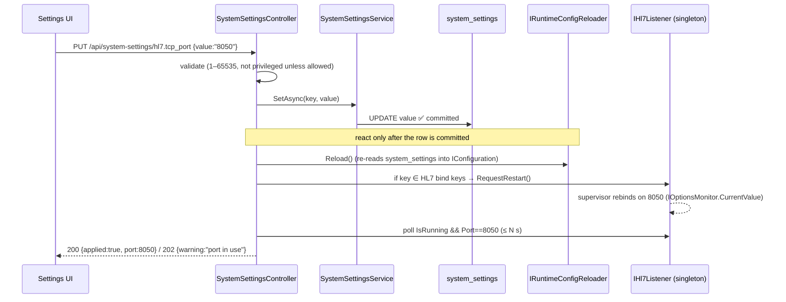

# Hot-Reload Config & HL7 Listener Restart — Implementation Plan

> **Status: ✅ Implemented & verified (2026-06-08).** `IRuntimeConfigReloader`, `IOptionsMonitor`-based
> retention, a re-entrant `Hl7TcpListener` with `RequestRestart()`, and settings-driven orchestration
> (validate → persist → `Reload()` → restart → confirm) are live. End-to-end test: a `hl7.tcp_port`
> change rebound the listener immediately without a host restart and returned `{ applied:true, port,
> running }`; an invalid port returned `400`. Verification also surfaced that `SetAsync` never
> committed settings — fixed (commit via `IUnitOfWork`), which was the missing link for hot-reload.

## Goal

Make DB-backed settings (`system_settings`) take effect **without restarting the Hub**, using an
**explicit-restart** model for resources that own a socket (the HL7 TCP listener) and a
**re-read** model for periodic jobs (data retention). The trigger for both is a single
`IConfigurationRoot.Reload()` after a setting is saved.

Two outcomes:
1. **Retention** day/interval changes apply on the next cycle — closes the pending hot-reload gap.
2. **HL7 port / enabled** changes rebind the TCP listener on demand, with operator feedback.

## Current State (verified)

| Component | Reads config via | Reacts to reload? | Notes |
|---|---|---|---|
| `system_settings` → `IConfiguration` | `HubDatabaseConfigurationProvider.Load()` | ❌ loads **once** at startup | `Program.cs:98`, added after appsettings → DB wins |
| `Hl7TcpListener` (singleton) | `IOptions<Hl7ListenerOptions>` (frozen) | ❌ | binds `new TcpListener(IPAddress.Any, _options.Port)` in `StartAsync` |
| `Hl7ListenerHostedService` | — | ⚠️ already has a **supervisor restart loop** (backoff 2s→60s) | reused below |
| `DataRetentionHostedService` / `HubDataRetentionService` | `IOptions<HubBackgroundJobsOptions>` (frozen) | ❌ | |
| `SystemSettingsService.SetAsync` | — | persists row only | no reload, no side effect |

Two implementation hazards found:
- **`IConfiguration.Reload()` ≠ `IOptions<T>` update.** `IOptions<T>` is a one-time singleton snapshot.
  Only `IOptionsMonitor<T>.CurrentValue` re-binds on a config reload token. So consumers must move to
  `IOptionsMonitor<T>`, **and** the option must be bound to a config *section* (not a lambda) so a
  change token exists.
- **`Hl7TcpListener.StopAsync()` is not re-entrant.** It calls `_messageChannel.Writer.Complete()`, and
  the channel + `_connectionSemaphore` are created in the **constructor**. A naive Stop→Start reuses a
  completed channel. Restart therefore requires recreating channel/semaphore and using an **internal
  run token** (separate from the host `stoppingToken`).

---

## Phase 0 — Reload primitive (foundation, no behavior change)

- Add `IRuntimeConfigReloader` (Infrastructure) wrapping `((IConfigurationRoot)_configuration).Reload()`
  with structured logging and a guard (no-op if the configuration is not an `IConfigurationRoot`).
- Audit every option that is fed from `system_settings` and confirm it is registered with
  `services.Configure<T>(configuration.GetSection(...))` / `.BindConfiguration(...)` (token-backed) so
  `IOptionsMonitor<T>` will observe reloads. Fix any that bind via a plain lambda.

**Acceptance:** calling `IRuntimeConfigReloader.Reload()` re-runs `HubDatabaseConfigurationProvider.Load()`
(verify via a debug log of a changed key). No consumer behavior change yet.

## Phase 1 — Retention hot-reload (closes the pending gap)

- `HubDataRetentionService`: `IOptions<HubBackgroundJobsOptions>` → `IOptionsMonitor<…>`; read
  `monitor.CurrentValue.DataRetention` **at the start of each retention cycle** (not cached in a field).
- `DataRetentionHostedService`: `IOptions` → `IOptionsMonitor`; read `EnableDataRetention` and
  `DataRetentionIntervalSeconds` **each loop iteration** (so interval/enable changes apply live).
- No new keys — the catalog/seed work was done previously (`retention.*` incl. `retention.node_outbox_days`).

**Acceptance:** edit a `retention.*` value via the settings UI → `Reload()` → the **next** retention
cycle uses the new value, **no Hub restart**. Setting a day value to `0` disables that table's purge live.

## Phase 2 — Make the HL7 listener restartable (re-entrant Start/Stop)

Refactor `Hl7TcpListener`:
- `IOptions<Hl7ListenerOptions>` → `IOptionsMonitor<Hl7ListenerOptions>`; read `CurrentValue` when
  (re)binding so a restart picks up the new `Port` / `MaxQueuedMessages` / `MaxConcurrentConnections` /
  `ProcessingWorkers`.
- Move `_messageChannel` and `_connectionSemaphore` creation **out of the constructor and into
  `StartAsync`** (fresh per start, sized from `CurrentValue`).
- Introduce an **internal run CTS** linked to the host token:
  `_runCts = CancellationTokenSource.CreateLinkedTokenSource(hostToken)`. The accept loop **and** the
  processing workers use `_runCts.Token` (today the workers use the host token — they must not outlive a
  restart).
- Add to `IHl7Listener`:
  - `void RequestRestart()` — sets `_restartRequested = true` and cancels `_runCts` (stops accept loop +
    workers, completes the old channel).
  - `bool RestartRequested { get; }` — read by the supervisor.

Reuse the existing supervisor in `Hl7ListenerHostedService`:
- When `StartAsync` returns because `_runCts` was cancelled **but the host token is not cancelled**, the
  supervisor already loops and calls `StartAsync` again → rebinds. Add one refinement: if the return was a
  **requested restart**, reset the backoff to immediate (skip the 2s→60s delay used for crashes).

**Acceptance:** calling `RequestRestart()` rebinds the socket on the current port with a fresh
channel/workers, the Hub host keeps running, and a real crash still backs off as before.

## Phase 3 — Orchestrate: save → reload → restart (the explicit flow)

- **Validation before persist:** reject out-of-range/privileged ports with `400` so we never restart into
  a bad bind.
- **Wiring (recommended — event-driven, keeps Application free of Infrastructure):**
  `SystemSetting.UpdateValue()` raises `SystemSettingChangedEvent(Key)`; an Infrastructure
  `SettingChangeReactionHandler : IDomainEventHandler` runs (via the existing
  `DomainEventDispatchInterceptor`, post-commit) and performs `Reload()` + conditional
  `RequestRestart()`. This reuses the domain-event machinery already in place.
  *Alternative (simpler, more coupled):* the controller calls `IRuntimeConfigReloader.ApplyAsync(key)`
  directly after `SetAsync`.
- **Operator feedback:** after triggering, poll `IHl7Listener.IsRunning && Port == newValue` for up to
  N seconds → `200 {applied:true}`; on timeout → `202 {warning}` (likely port-in-use). This is the core
  advantage of the explicit model over silent `OnChange`.
- **Bind keys** that trigger a listener restart: `hl7.tcp_port`, `hl7.tcp_enabled` (and optionally the
  other `hl7.*` resource sizes, since Phase 2 recreates them on restart).

**Acceptance:** changing `hl7.tcp_port` via the API rebinds the listener and returns the applied state;
an occupied/invalid port is reported, not silently failed.

## Phase 4 — UI & observability

- Settings page: on save of an HL7/retention setting, show the applied result (reuse
  `Hl7StatusController` / `Hl7MonitoringService` for `Port`, `IsRunning`, `ActiveConnections`). Toast:
  "HL7 listener rebound to port 8050" or the bind error.
- Emit a `HubAuditLog` entry for every config change + listener restart (who, key, old→new, bind result).
- `Hl7ListenerHealthCheck` already reflects listener state — surfaces a failed rebind as Unhealthy.

---

## Cross-Cutting

- **Security:** writes stay behind `Policies.EditConfiguration`; restart is a side effect of an
  already-authorized config change.
- **Graceful restart (optional):** on `RequestRestart`, stop accepting new connections but allow a short
  drain window for in-flight MLLP messages before disposing the socket, to avoid mid-message loss.
- **Failure handling:** a rebind failure (port in use, privileged) leaves the supervisor retrying with
  backoff, the health check Unhealthy, and an audit entry written — the operator is not left guessing.
- **Generality:** the same `IOptionsMonitor` + `Reload()` pattern lets other `system_settings`-driven
  options (MessageQueue dispatch, background-job intervals) become live-tunable later with no new plumbing.

## Risks / Trade-offs

| Risk | Mitigation |
|---|---|
| Brief listening gap during rebind; existing connections dropped | Rare admin action; optional drain window; document the momentary blip |
| New port already in use / privileged (<1024 on Linux) | Validate on write + poll-confirm + audit + health check |
| `IOptions<T>` left somewhere → stale value | Phase 0 audit ensures all DB-driven consumers use `IOptionsMonitor<T>` |
| `Reload()` cost (re-queries Postgres each save) | Negligible at admin-save frequency |

## Phase Summary

| Phase | Scope | Risk |
|---|---|---|
| 0 | `IRuntimeConfigReloader` + bind-token audit | 🟢 Low |
| 1 | Retention → `IOptionsMonitor`, live re-read | 🟢 Low |
| 2 | `Hl7TcpListener` re-entrant + `RequestRestart()` | 🟡 Medium |
| 3 | save → reload → restart orchestration + validation + confirmation | 🟡 Medium |
| 4 | UI applied-state feedback + audit | 🟢 Low |
