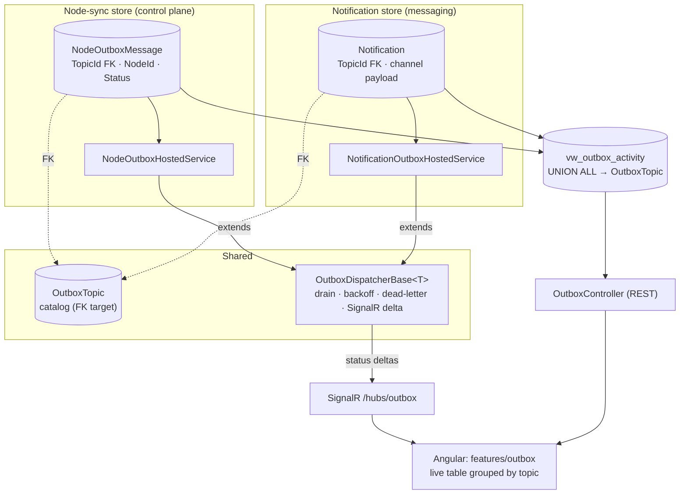

# Outbox Unification & Real-Time Monitoring — Implementation Plan

## Goal

Consolidate the platform's three divergent dispatch mechanisms into a **coherent outbox model**
that is durable, observable in real time, and easy to extend — **without** collapsing well-typed
aggregates into a generic blob.

Today there are three mechanisms with different reliability guarantees:

| Mechanism | Storage | Durable? | Problem |
|---|---|---|---|
| Notifications | `Notification` table + `NotificationOutboxHostedService` | ✅ Yes (`Attempts`, `NextAttemptAt`, backoff, per-channel lanes) | None — **this is the reference pattern** |
| Domain events | `DomainEventDispatchInterceptor` (post-`SaveChanges`) | ❌ In-memory | Handler failures swallowed; lost on crash |
| Node push | `NodePushQueue` (in-memory `Channel`) + `NodePushDispatchHostedService` | ❌ In-memory | Anything queued is lost on process restart |

## Design Decision: how much to separate

**Separate the physical stores and dispatch lanes by category; unify the topic catalog, the retry
contract, and the monitoring/real-time projection.**

- ❌ *Not* one generic `OutboxMessage` table — it would force `Notification`'s rich typed columns
  into an opaque `Payload` JSON and destroy queryability.
- ❌ *Not* two unrelated silos — they would duplicate retry logic and fragment the UI.
- ✅ Two stores (`Notification`, `NodeOutboxMessage`), both pointing at a shared **`OutboxTopic`**
  catalog (FK), both driven by a shared **`OutboxDispatcherBase`**, both surfaced through **one**
  read model + SignalR feed + Angular module.



---

## Topic Catalog

`OutboxTopic` is a small seeded lookup table. Both stores FK into it; it is the single source of
truth the UI filters and groups by.

| Key | Category | Display name | Handler | Notes |
|---|---|---|---|---|
| `node.config` | `NodeSync` | Node Configuration | `INodeConfigPushService` | full snapshot |
| `node.rules` | `NodeSync` | DICOM Routing Rules | `INodeDicomRoutingRulePushService` | |
| `node.pacs` | `NodeSync` | PACS Destinations | `INodePacsDestinationPushService` | |
| `node.equipment` | `NodeSync` | Equipment Catalog | `INodeEquipmentPushService` | |
| `notification.whatsapp` | `Notification` | WhatsApp | WhatsApp `INotificationChannelSender` | maps from `NotificationChannel.WhatsApp` |
| `notification.email` | `Notification` | Email | Email `INotificationChannelSender` | maps from `NotificationChannel.Email` |

`OutboxTopic` columns: `Id`, `Key` (unique), `Category`, `DisplayName`, `Description`, `Enabled`,
`DefaultMaxAttempts`, `CreatedAt`, `UpdatedAt`. The `NodePushKind` enum (Config/Rules/Pacs/Equipment)
maps 1:1 to the four `node.*` topics; `NotificationChannel` maps to the two `notification.*` topics.

---

## Data Model Changes

### `OutboxTopic` (new, `Domain/Aggregates/Outbox`)
Seeded via migration. Referenced by both stores.

### `Notification` (existing — minimal change)
Add `TopicId` FK (derived from `Channel`). **No other change**; its retry methods
(`ScheduleRetry`, `MarkSent`, `MarkFailed`, `MarkSkipped`) become the shared contract template.
Backfill `TopicId` for existing rows in the migration.

### `NodeOutboxMessage` (new — replaces `NodePushQueue`)
```
NodeOutboxMessage
  Id            string  (PK, stable → idempotency key)
  TopicId       FK → OutboxTopic   (= NodePushKind)
  NodeId        string
  Status        Pending | Processing | Sent | Failed | DeadLettered
  Attempts      int
  NextAttemptAt DateTime?           (backoff)
  LastError     string?
  CreatedAt / ProcessedAt
```
**Coalescing:** before inserting, if a `Pending` row already exists for `(NodeId, TopicId)`, skip —
re-pushing the same config kind is idempotent, so duplicates collapse into one.

### `vw_outbox_activity` (new DB view — read model for the UI)
`UNION ALL` of the two stores, joined to `OutboxTopic`, projecting a common shape:
`Id, TopicKey, Category, DisplayName, Target (NodeId or recipient), Status, Attempts, NextAttemptAt, LastError, CreatedAt, ProcessedAt`.
A view keeps the read model always consistent with no extra write path.

---

## Dispatch Layer

Extract the proven loop from `NotificationOutboxHostedService` into an abstract base:

```
OutboxDispatcherBase<TMessage> : BackgroundService
  - drain loop: claim batch (FOR UPDATE SKIP LOCKED), process in lanes, persist
  - exponential backoff via NextAttemptAt; dead-letter after MaxAttempts
  - hybrid wakeup: in-memory signal (Channel) for low latency + 30s poll as durability/restart safety net
  - on each status transition → publish SignalR delta
```

- `NotificationOutboxHostedService : OutboxDispatcherBase<Notification>` — refactor, **behavior preserved**.
- `NodeOutboxHostedService : OutboxDispatcherBase<NodeOutboxMessage>` — new; routes each row to the
  push service for its topic (Polly retry stays inside the push service for transient HTTP).
- Lanes isolate failure: per-channel for notifications, **per-node** for node-sync (preserves the
  current pacs → rules → config ordering within a node).

## Write Side (transactional outbox)

- New `INodeOutbox.Enqueue(nodeId, kind)` that **adds a `NodeOutboxMessage` to the current
  `DbContext`** (same Unit of Work as the state change) — atomic, no dual-write.
- `NodeService`, `PacsServerService`, routing & equipment services: replace
  `pushQueue.Enqueue(new NodePushRequest(...))` with `nodeOutbox.Enqueue(...)`.
- After commit, raise the in-memory wakeup signal so the dispatcher drains immediately.

## Monitoring & Real-Time UI

- **REST** `OutboxController` (`[Authorize(Policy = Policies.ViewSystemStatus)]`):
  - `GET /api/outbox` — filter by `category`, `topic`, `status`; paged (mirror `QueueMonitoringController`).
  - `GET /api/outbox/{id}` — detail + attempt history.
  - `POST /api/outbox/{id}/retry` and `/dead-letter` (`Policies.ManageQueue`).
- **SignalR** — new `/hubs/outbox` (or an `outbox` group on `EdgeHubNotificationHub`); dispatchers
  publish `OutboxEntryChanged { topicKey, id, status, attempts }` on every transition.
- **Angular** — new `features/outbox` feature module: category tabs (**Node Sync** | **Notifications**),
  live table grouped by topic, status chips, retry button; subscribes through the existing SignalR
  client service. Mirrors the existing `features/queue` module.

---

## Rollout Phases (each independently shippable)

| Phase | Scope | Risk |
|---|---|---|
| **0** | `OutboxTopic` aggregate + EF config + seed migration | 🟢 Low |
| **1** | Add `Notification.TopicId` FK + backfill; extract `OutboxDispatcherBase`; refactor `NotificationOutboxHostedService` onto it (no behavior change) | 🟢 Low |
| **2** | `NodeOutboxMessage` table + repo + `INodeOutbox`; `NodeOutboxHostedService`; producers write outbox in UoW. **Feature-flag dual-run** with `NodePushQueue`; verify; cut over; **delete** `NodePushQueue`, `INodePushQueue`, `NodePushDispatchHostedService` | 🟡 Medium |
| **3** | `vw_outbox_activity` view + `OutboxController` REST + SignalR deltas | 🟢 Low |
| **4** | Angular `features/outbox` real-time module | 🟢 Low |
| **5** | Cross-cutting: retention (extend `IHubDataRetentionService` to purge `Sent`/`DeadLettered` rows), dead-letter UI actions, node-endpoint idempotency by `Id`, metrics + tests. *Optional:* route durable domain-event side effects through the same infra | 🟡 Medium |

## Cross-Cutting Concerns

- **Idempotency** — delivery is at-least-once; node sync endpoints must dedupe by `OutboxMessage.Id`
  (or treat re-push as a safe full overwrite, which it already is).
- **Ordering** — node-sync lane is per-node sequential to keep pacs → rules → config order.
- **Retention** — processed rows accumulate; cleanup belongs in the existing
  `IHubDataRetentionService` / `StudyCleanupPolicy` machinery, not a new job.
- **Security** — read = `ViewSystemStatus`, actions (retry/dead-letter) = `ManageQueue`.
- **Build policy** — new injected dependencies must actually be used; `Directory.Build.props`
  already fails the build on dead constructor params (CS9113), so half-wired services won't merge.

## Out of Scope / Deliberately Deferred

- Replacing the `DomainEventDispatchInterceptor` entirely. Most domain-event side effects already
  terminate in the Notification outbox (auto-delivery) or are pure DB writes (audit). Making
  domain-event dispatch durable is **Phase 5, optional** — the visible UI only needs the two
  user-facing categories (Node Sync, Notifications).
- An external broker (RabbitMQ/Kafka). The DB-backed outbox + hybrid wakeup meets current scale;
  revisit only if cross-service fan-out appears.
