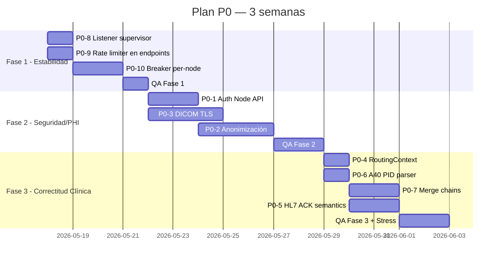

# Plan de Remediación P0 — EdgeGuard Platform

> **Estado:** Borrador inicial — pendiente de aprobación
> **Fecha:** 2026-05-17
> **Alcance:** Top 10 hallazgos críticos de la auditoría de producción
> **Objetivo:** Cerrar gaps de seguridad HIPAA, estabilidad del Hub y correctitud clínica antes del despliegue piloto

---

## Resumen Ejecutivo

| # | Hallazgo | Severidad | Categoría | Esfuerzo | Fase |
|---|---|---|---|---|---|
| P0-1 | Node API sin autenticación | 🔴 Critical | Seguridad | M | 2 |
| P0-2 | Anonimización es no-op | 🔴 Critical | PHI / Compliance | L | 2 |
| P0-3 | DICOM sin TLS | 🔴 Critical | PHI / Compliance | L | 2 |
| P0-4 | `StudyRoutingContext` con campos NULL | 🔴 Critical | Lógica de negocio | S | 3 |
| P0-5 | ACK HL7 siempre `AA` antes de validar | 🔴 Critical | Integridad de datos | M | 3 |
| P0-6 | A40 toma el primer PID (no el surviving) | 🔴 Critical | Seguridad del paciente | S | 3 |
| P0-7 | Merge chains no se colapsan | 🔴 Critical | Seguridad del paciente | M | 3 |
| P0-8 | `Hl7ListenerHostedService` re-throw mata el host | 🔴 Critical | Estabilidad | S | 1 |
| P0-9 | Rate limiter nunca aplicado | 🔴 Critical | Estabilidad / DoS | XS | 1 |
| P0-10 | Circuit breaker compartido entre nodos | 🔴 Critical | Resiliencia | M | 1 |

**Esfuerzo total estimado:** ~14 días-persona
**Tiempo en calendario:** 3 semanas (con QA + validación)

**Leyenda esfuerzo:** XS=2-4h · S=½ día · M=1-2 días · L=2-4 días

---

## Estrategia por Fases



### Por qué este orden

1. **Fase 1 (Estabilidad)** — Sin breaking changes, sin redeployment coordinado. Reducen el blast radius antes de tocar lógica de negocio. Si algo sale mal en fases siguientes, el sistema ya es más resistente.
2. **Fase 2 (Seguridad/PHI)** — Requieren despliegue coordinado Hub+Node y migración de configuración. Bloquean go-live a producción por compliance.
3. **Fase 3 (Correctitud clínica)** — Cambios en parsing y dominio. Mayor riesgo de regresión, requieren validación con datos reales.

---

## FASE 1 — Estabilidad (días 1-4)

### P0-8 · Supervisar `Hl7ListenerHostedService` para que no mate al Host

**Problema:** `catch (Exception ex) { _logger.LogError(...); throw; }` propaga al host con `BackgroundServiceExceptionBehavior.StopHost` por defecto → un blip de TCP tira el Hub completo (API + SignalR + dispatch HL7 + dispatch Hub→Node).

**Solución:**
1. Configurar `HostOptions.BackgroundServiceExceptionBehavior = Ignore`:
   ```csharp
   services.Configure<HostOptions>(o =>
       o.BackgroundServiceExceptionBehavior = BackgroundServiceExceptionBehavior.Ignore);
   ```
2. Envolver el cuerpo de `ExecuteAsync` en un supervisor con retry+backoff:
   ```csharp
   while (!stoppingToken.IsCancellationRequested)
   {
       try { await _listener.StartAsync(stoppingToken); }
       catch (OperationCanceledException) { break; }
       catch (Exception ex)
       {
           _logger.LogError(ex, "HL7 listener crashed — restart in {Delay}s", delay);
           await Task.Delay(delay, stoppingToken);
           delay = Math.Min(delay * 2, 60);
       }
   }
   ```
3. Aplicar el mismo patrón a `MessageDispatchHostedService` y `WhatsAppNotificationHostedService` (consistencia).

**Archivos:**
- `src/backend/Dicom.Edge.Hub.Infrastructure/HostedServices/Hl7ListenerHostedService.cs`
- `src/backend/Dicom.Edge.Hub.Api/Program.cs` (HostOptions)

**Tests:**
- Unit: provocar excepción en `StartAsync` y verificar que el supervisor reintenta sin matar el host
- Integración: matar el socket :8001 mientras hay clientes conectados → Hub sigue sirviendo /health

**Rollback:** Revert directo, sin migración. No hay cambio de contrato.

**Riesgo en deploy:** Ninguno. Solo reduce blast radius.

---

### P0-9 · Aplicar Rate Limiter a los Controllers

**Problema:** `AddRateLimiter` registra "edge" (100/min) y "api" (200/min) pero **ningún controller los usa**. `[EnableRateLimiting]` no existe en el código → políticas son código muerto.

**Solución:**
1. Decorar `EdgeController` y endpoints internos `/api/edge/*` con `[EnableRateLimiting("edge")]`.
2. Decorar el resto de controllers con `[EnableRateLimiting("api")]` (o aplicar global limiter).
3. Reconsiderar el límite "edge": **50 nodos × 12 telemetry events/min = 600/min**, el bucket de 100/min se satura. Particionar por `NodeId`:
   ```csharp
   options.AddPolicy("edge", context =>
       RateLimitPartition.GetFixedWindowLimiter(
           partitionKey: context.User.FindFirst("nodeId")?.Value ?? context.Connection.RemoteIpAddress!.ToString(),
           factory: _ => new FixedWindowRateLimiterOptions { PermitLimit = 100, Window = TimeSpan.FromMinutes(1) }));
   ```
4. Excluir `/health/live` y endpoints de SignalR del rate limiter.

**Archivos:**
- `src/backend/Dicom.Edge.Hub.Api/Program.cs`
- Todos los controllers en `src/backend/Dicom.Edge.Hub.Api/Controllers/`

**Tests:**
- Disparar 250 requests en 60s contra `/api/studies` → confirmar 50 con 429
- Verificar que cada nodo tiene su propio bucket (no se afectan entre sí)

**Rollback:** Comentar los atributos. Hub funciona igual.

**Riesgo en deploy:** Si los límites son muy bajos para tráfico legítimo → 429 a usuarios reales. Recomendación: empezar con `PermitLimit = 500` y bajar tras observar métricas.

---

### P0-10 · Circuit Breaker por Nodo (no compartido)

**Problema:** Polly v8 pipeline `StandardPipelineName` compartido entre todas las llamadas Hub→Node. Cuando Nodo-3 está caído, el breaker abre y **bloquea llamadas a Nodo-1 y Nodo-2**.

**Solución:**
1. Usar `ResiliencePipelineRegistry<string>` con key `nodeId`:
   ```csharp
   services.AddSingleton(sp =>
   {
       var registry = new ResiliencePipelineRegistry<string>();
       registry.TryAddBuilder(string.Empty /*key*/, (builder, _) =>
       {
           builder
               .AddRetry(new RetryStrategyOptions<HttpResponseMessage> {
                   ShouldHandle = args => ValueTask.FromResult(IsTransient(args.Outcome)),
                   MaxRetryAttempts = 3,
                   BackoffType = DelayBackoffType.Exponential,
               })
               .AddCircuitBreaker(new CircuitBreakerStrategyOptions<HttpResponseMessage> {
                   FailureRatio = 0.5,
                   MinimumThroughput = 10,
                   BreakDuration = TimeSpan.FromSeconds(30),
               });
       });
       return registry;
   });
   ```
2. En `NodeHttpDispatcher`, obtener el pipeline por nodo: `var pipeline = registry.GetPipeline<HttpResponseMessage>(nodeId);`
3. Corregir `ShouldHandle` para **no reintentar 4xx** (`HttpRequestException` cubre 401/422 indebidamente):
   ```csharp
   private static bool IsTransient(Outcome<HttpResponseMessage> o)
   {
       if (o.Result is { } r)
           return r.StatusCode is HttpStatusCode.RequestTimeout
                              or HttpStatusCode.TooManyRequests
                              or >= HttpStatusCode.InternalServerError;
       return o.Exception is HttpRequestException or TimeoutRejectedException;
   }
   ```

**Archivos:**
- `src/shared/Dicom.Edge.Common/Resilience/ResilienceServiceCollectionExtensions.cs`
- `src/backend/Dicom.Edge.Hub.Infrastructure/Services/NodeHttpDispatcher.cs`
- `src/backend/Dicom.Edge.Hub.Infrastructure/Services/Node*PushService.cs`

**Tests:**
- Simular Nodo-3 retornando 503 repetidamente → su breaker abre
- Simular Nodo-1 saludable durante la misma ventana → llamadas siguen pasando
- Simular 401 desde un nodo → no se reintenta

**Rollback:** Mantener `StandardPipelineName` legacy en paralelo durante 1 semana, feature flag para alternar.

**Riesgo en deploy:** Cambio en signatura interna del dispatcher. Cubrir con tests de integración antes de merge.

---

## FASE 2 — Seguridad y PHI (días 5-13)

### P0-1 · Autenticación en Node API

**Problema:** Los endpoints `/api/dicom-routing-rules/sync`, `/api/pacs-destinations/sync`, `/api/configuration/sync` **no tienen autenticación**. Cualquiera en la red del nodo puede redirigir estudios DICOM (con PHI) a un PACS atacante.

**Solución:**
1. **Mecanismo: API Key + HMAC firma.** Cada nodo recibe un `ApiKey` único al registrarse (ya existe en `node.ApiKey` en Hub). El Hub firma cada request con HMAC-SHA256 sobre `(timestamp + bodyHash)`.
2. **Lado Hub** — `DelegatingHandler` adjunta:
   - `Authorization: Bearer <ApiKey>`
   - `X-Hub-Timestamp: <unix>`
   - `X-Hub-Signature: <hmac-sha256(timestamp + bodyHash, ApiKey)>`
3. **Lado Node** — `NodeAuthenticationMiddleware`:
   - Valida `ApiKey` contra valor local en `appsettings`/secret store
   - Valida `timestamp` dentro de ±5 min (anti-replay)
   - Recalcula HMAC y compara con `X-Hub-Signature` (timing-safe)
   - Devuelve `401` si falla
4. Cargar `ApiKey` en el Node desde Bootstrap (al registrarse) y persistir en `node_settings`.
5. **Rotación:** Endpoint `PUT /api/nodes/{id}/rotate-key` en Hub que genera nuevo ApiKey y lo pushea al nodo antes de invalidar el viejo (ventana de 1 min con dos llaves válidas).

**Archivos:**
- Nuevo: `src/edge/Dicom.Edge.Node.Api/Middleware/HubAuthenticationMiddleware.cs`
- Nuevo: `src/backend/Dicom.Edge.Hub.Infrastructure/Http/HubAuthDelegatingHandler.cs`
- `src/edge/Dicom.Edge.Node/Program.cs` (registrar middleware)
- `src/backend/Dicom.Edge.Hub.Infrastructure/Services/NodeHttpDispatcher.cs`
- `src/edge/Dicom.Edge.Node.Persistence/Services/NodeSettingsService.cs`

**Tests:**
- Request sin header → 401
- Request con timestamp viejo → 401 (replay protection)
- Request con signature inválida → 401
- Request válida → 200 y persiste

**Rollback:** Feature flag `Auth:Enabled=false` en Node permite saltar el middleware durante el rollout. Quitarla a la siguiente release.

**Riesgo en deploy:**
- **ALTO** si Hub se despliega antes que Nodes (Nodes rechazan llamadas no firmadas vs Hub que aún no firma).
- **Mitigación:** Deploy Nodes primero con flag `Auth:Enforce=false` (acepta no firmadas). Deploy Hub con firma activada. Luego flip `Auth:Enforce=true` en todos los Nodes.

---

### P0-2 · Implementar Anonimización DICOM

**Problema:** El flag `AnonymizeBeforeSending` se persiste y muestra en la UI, pero `FoDicomPacsSender.SendStudyAsync` envía el archivo `untouched`. **Falsa confianza de compliance — PHI fluye sin redacción.**

**Solución:**
1. Crear `IDicomAnonymizer` en `Node.Sender`:
   ```csharp
   public interface IDicomAnonymizer
   {
       DicomFile Anonymize(DicomFile source, AnonymizationProfile profile);
   }
   ```
2. Implementar `BasicDicomAnonymizer` siguiendo **DICOM PS3.15 Annex E Basic Profile**. Tags a eliminar/redactar como mínimo:
   - `(0010,0010)` PatientName → `ANONYMIZED`
   - `(0010,0020)` PatientID → hash determinístico del original
   - `(0010,0030)` PatientBirthDate → `19000101` o solo año
   - `(0010,0040)` PatientSex → mantener (no PHI)
   - `(0010,1000)` OtherPatientIDs → eliminar
   - `(0010,1001)` OtherPatientNames → eliminar
   - `(0010,1040)` PatientAddress → eliminar
   - `(0010,2154)` PatientTelephoneNumbers → eliminar
   - `(0008,0050)` AccessionNumber → hash determinístico
   - `(0008,0090)` ReferringPhysicianName → eliminar
   - `(0008,1048)` PhysiciansOfRecord → eliminar
   - `(0008,0080)` InstitutionName → eliminar o mapear
   - `(0008,0081)` InstitutionAddress → eliminar
   - `(0032,1032)` RequestingPhysician → eliminar
   - `(0032,1033)` RequestingService → eliminar
   - `(0040,A123)` PersonName tags → eliminar
   - **Re-mapeo de UIDs** (Study/Series/SOP Instance) por hash determinístico para mantener integridad referencial entre las imágenes del mismo estudio.
3. Cargar `AnonymizeBeforeSending` desde la rule en `Router.RoutingRule` (actualmente no se propaga del DB a memoria — bug doble).
4. En `FoDicomPacsSender.SendStudyAsync`, si la rule pide anonimización:
   ```csharp
   var file = await DicomFile.OpenAsync(filePath);
   if (rule.AnonymizeBeforeSending)
       file = _anonymizer.Anonymize(file, AnonymizationProfile.BasicConfidentiality);
   await client.AddRequestAsync(new DicomCStoreRequest(file));
   ```

**Archivos:**
- Nuevo: `src/edge/Dicom.Edge.Node.Sender/Anonymization/IDicomAnonymizer.cs`
- Nuevo: `src/edge/Dicom.Edge.Node.Sender/Anonymization/BasicDicomAnonymizer.cs`
- Nuevo: `src/edge/Dicom.Edge.Node.Sender/Anonymization/AnonymizationProfile.cs`
- `src/edge/Dicom.Edge.Node.Sender/FoDicomPacsSender.cs`
- `src/edge/Dicom.Edge.Node.Persistence/Services/RoutingRuleLoaderService.cs` (propagar el flag)

**Tests:**
- Unit: tomar un DICOM con PatientName/Address/Phone → verificar que se eliminan tras anonimización
- Unit: dos archivos del mismo estudio → mismo UID después de remap (integridad)
- Integración: crear rule con `AnonymizeBeforeSending=true`, recibir C-STORE, enviar al PACS test → PACS recibe DICOM sin PHI

**Rollback:** Bandera `AnonymizationEnabled=false` en `appsettings` del Node. Si rollback, deshabilitar la rule de anonimización en Hub.

**Riesgo en deploy:**
- PACS destino puede rechazar UIDs nuevos si ya tenía estudios bajo los UIDs originales.
- **Mitigación:** Validar contra un PACS de staging antes. Documentar contrato de remap (hash determinístico vs aleatorio).

---

### P0-3 · DICOM con TLS (in-transit encryption)

**Problema:** SCP del Edge Node escucha en `:11112` sin TLS. SCU hacia PACS hard-codea `UseTls=false`. PHI viaja en texto plano. **Falla HIPAA encryption-in-transit.**

**Solución:**
1. **SCP del Node:**
   - Agregar a `DicomServerOptions`:
     ```csharp
     public TlsOptions Tls { get; set; } = new();
     public class TlsOptions {
         public bool Enabled { get; set; }
         public string? CertificatePath { get; set; }
         public string? CertificatePassword { get; set; }
         public bool RequireClientCert { get; set; }
     }
     ```
   - En `DicomServerHostedService.StartAsync`:
     ```csharp
     var cert = opts.Tls.Enabled
         ? new X509Certificate2(opts.Tls.CertificatePath!, opts.Tls.CertificatePassword)
         : null;
     _server = dicomServerFactory.Create<CStoreScp>(
         port: opts.Port,
         tlsAcceptor: cert is not null ? new DefaultTlsAcceptor(cert) : null,
         userState: userState,
         maxClientsAllowed: opts.MaxClients);
     ```
2. **SCU hacia PACS:**
   - Persistir `UseTls` en `NodePacsServer` (campo ya existe en contract pero no en entity)
   - Migración EF: agregar columna `use_tls BOOLEAN NOT NULL DEFAULT false`
   - En `PacsDestinationsController.Sync`, mapear `d.UseTls`
   - En `RoutingRuleLoaderService`, propagar a `PacsDestination`
   - En `FoDicomPacsSender`: `DicomClientFactory.Create(host, port, useTls: destination.UseTls, ...)`
3. **Hub:** Agregar campo `UseTls` en el form de PACS en SPA (boolean toggle).
4. **Certificados:**
   - Recomendar wildcard certificate por sitio (`*.imaging.hospital.com`)
   - Documentar generación con `openssl`/`certbot` en `docs/07-operations/deployment-node.md`

**Archivos:**
- `src/edge/Dicom.Edge.Node.DicomServer/DicomServerOptions.cs`
- `src/edge/Dicom.Edge.Node.DicomServer/DicomServerHostedService.cs`
- `src/edge/Dicom.Edge.Node.Persistence/Entities/NodePacsServer.cs`
- `src/edge/Dicom.Edge.Node.Persistence/Configurations/NodePacsServerConfiguration.cs`
- Nueva migración EF Node: `AddPacsUseTls`
- `src/edge/Dicom.Edge.Node.Api/Controllers/PacsDestinationsController.cs`
- `src/edge/Dicom.Edge.Node.Persistence/Services/RoutingRuleLoaderService.cs`
- `src/edge/Dicom.Edge.Node.Sender/FoDicomPacsSender.cs`
- `src/frontend/dicomedge-ui/src/app/features/pacs/presentation/pacs-form-dialog/`

**Tests:**
- Unit: crear PACS con TLS, verificar que `DicomClient` recibe `useTls=true`
- Integración: C-ECHO contra DCMTK `storescp` con TLS habilitado
- Integración: SCP del Node con TLS, conectar SCU sin TLS → rechazado

**Rollback:** `Tls.Enabled=false` en `appsettings`. PACS sin TLS sigue funcionando si `UseTls=false`.

**Riesgo en deploy:**
- PACS que no soportan TLS rompen si admin marca `UseTls=true` por error.
- Modalities sin soporte TLS no pueden conectar si TLS es obligatorio.
- **Mitigación:** TLS opcional al inicio. Habilitar en producción tras validar todas las modalidades.

---

## FASE 3 — Correctitud Clínica (días 14-21)

### P0-4 · Poblar `StudyRoutingContext` con datos reales

**Problema:**
```csharp
var context = new StudyRoutingContext { StudyInstanceUid = studyInstanceUid };
var destinations = await router.ResolveDestinationsAsync(context, ct);
```
Todos los campos NULL → **toda regla con filtro nunca matchea**. El operador configura reglas en la UI pero son inertes.

**Solución:**
1. Cargar el `Study` desde DB antes de evaluar reglas:
   ```csharp
   var study = await studyRepo.GetByStudyInstanceUidAsync(studyInstanceUid, ct);
   if (study is null) { /* log error */ return; }

   var firstSeries = study.Series.FirstOrDefault();
   var context = new StudyRoutingContext {
       StudyInstanceUid = studyInstanceUid,
       Modality          = firstSeries?.Modality,
       SourceAeTitle     = study.SourceAeTitle,
       InstitutionName   = study.InstitutionName,
       StudyDescription  = study.StudyDescription,
       InstanceCount     = study.InstanceCount,
   };
   ```
2. **Importante:** Evaluar solo cuando `Status == Received` (no `Receiving`), porque `InstanceCount` aún cambia. Mover la evaluación al hook `MarkAsReceived` (no al primer C-STORE).
3. Confirmar que `Modality` se persiste en `StudySeries` cuando llega el primer C-STORE (verificar `DicomInstanceHandler`).
4. Normalizar comparaciones: trim + ToUpperInvariant para `Modality`; trim case-insensitive para AE Title.

**Archivos:**
- `src/edge/Dicom.Edge.Node.Processing/StudyPipeline.cs`
- `src/edge/Dicom.Edge.Node.Processing/StudyProcessingHostedService.cs`
- `src/edge/Dicom.Edge.Node.Router/StudyRoutingContext.cs`
- `src/edge/Dicom.Edge.Node.Router/Routers/RuleBasedStudyRouter.cs` (verificar normalización)

**Tests:**
- Integración: recibir C-STORE de CT, crear regla `MatchModality=CT` → matchea
- Integración: regla `MatchSourceAeTitle="MODALITY-1"` → matchea con AE entrante
- Unit: rule con `MaxInstanceCount=50` no evalúa hasta que `Status=Received`

**Rollback:** Revert directo. Reglas vuelven a ser inertes pero el sistema no se rompe.

**Riesgo en deploy:** **MEDIO-ALTO.** Reglas que estuvieron inertes por meses ahora **sí** matchean. Estudios que estaban yendo al default destination ahora van al destino de la regla. **Validar con admins antes:**
- Listar todas las reglas activas en producción
- Revisar destinos con cada cliente
- Considerar feature flag `RoutingRulesEnabled=false` para activar gradualmente

---

### P0-6 · A40 Parser de PID — tomar el surviving, no el primero

**Problema:** `ExtractField(content, "PID", ...)` toma el **primer** segmento PID. En ADT^A40, el spec permite que `PID` aparezca dos veces: una "merge-context" (prior) y luego el surviving. Si el HIS envía el prior primero, **el código intercambia surviving y prior** → reasignación de estudios al revés. **Riesgo de seguridad del paciente.**

**Solución:**
1. **Parser explícito para A40:** El surviving PID es el último PID antes del segmento MRG según HL7 v2.x spec.
   ```csharp
   private static string? ExtractSurvivingPatientId(string content)
   {
       var segments = content.Split(new[] { '\r', '\n' }, StringSplitOptions.RemoveEmptyEntries);
       var mrgIndex = Array.FindIndex(segments, s => s.StartsWith("MRG|", StringComparison.OrdinalIgnoreCase));
       if (mrgIndex < 0) return ExtractFirstPid(content);

       // Last PID before MRG
       for (int i = mrgIndex - 1; i >= 0; i--)
           if (segments[i].StartsWith("PID|", StringComparison.OrdinalIgnoreCase))
               return ExtractField(segments[i], 3, componentIndex: 0);

       return null;
   }
   ```
2. Verificar que `MRG-1` extrae el prior correctamente (es CX type, componente 0).
3. Agregar test específico con un mensaje A40 real con dos PIDs en orden invertido.

**Archivos:**
- `src/backend/Dicom.Edge.Hub.Domain/Entities/Hl7Message.cs`

**Tests:**
- A40 con un solo PID → comportamiento actual (no regresión)
- A40 con dos PIDs (orden surviving-prior) → toma el surviving
- A40 con dos PIDs (orden prior-surviving) → toma el surviving (no el primero)
- A40 sin MRG → falla validación (ya implementado)

**Rollback:** Revert directo. Vuelve al bug pero mensajes con un solo PID siguen funcionando.

**Riesgo en deploy:** **BAJO** si la base de mensajes históricos solo tiene un PID por mensaje (caso común). **ALTO** si algún HIS envía dos PIDs porque corregimos el sentido del merge — estudios ya merged al revés se quedarán al revés (no se re-procesan).
- **Mitigación:** Auditar mensajes históricos ADT^A40 con `SELECT id, content FROM hl7_messages WHERE trigger_event='A40' AND content ~ 'PID\|.*\r.*PID\|'`. Si hay match, evaluar reprocesamiento manual.

---

### P0-7 · Colapsar cadenas de merge transitivamente

**Problema:** Paciente A → merge → B (A.MergedIntoPatientId = B). Luego B → merge → C. **A queda apuntando a B (broken chain).** Lookups por A's DICOM ID llegan a B que está deactivado. **Riesgo de identificación incorrecta.**

**Solución:**
1. En `Hl7PatientSyncService.HandleAdtMergeAsync`, tras `prior.MergeInto(survivingId)`:
   ```csharp
   // Collapse chain: any patient previously merged into the now-prior must point to surviving
   var chainedPatients = await patientRepo.GetByMergedIntoPatientIdAsync(priorId, ct);
   foreach (var chained in chainedPatients)
   {
       chained.UpdateMergeTarget(survivingId); // new domain method
       await patientRepo.UpdateAsync(chained, ct);
       _logger.LogInformation("Collapsed merge chain: patient {Id} now points to {Surviving}",
           chained.Id, survivingId);
   }
   ```
2. Agregar método de dominio:
   ```csharp
   public void UpdateMergeTarget(string newSurvivingPatientDicomId)
   {
       if (!IsMerged) throw new InvalidOperationException("Not merged");
       if (newSurvivingPatientDicomId == PatientDicomId.Value)
           throw new InvalidOperationException("Self-merge prevented");
       MergedIntoPatientId = newSurvivingPatientDicomId;
       UpdatedAt = DateTime.UtcNow;
   }
   ```
3. Agregar `IPatientRepository.GetByMergedIntoPatientIdAsync(priorId, ct)`.
4. Agregar guard de **self-merge** en `Patient.MergeInto` (también es P0):
   ```csharp
   if (survivingPatientDicomId == PatientDicomId.Value)
       throw new InvalidOperationException("Cannot merge a patient into itself");
   ```
5. Agregar guard de **circular merge** (A→B y luego B→A):
   ```csharp
   var surviving = await patientRepo.GetByPatientDicomIdAsync(survivingPatientDicomId, ct);
   if (surviving?.IsMerged == true && surviving.MergedIntoPatientId == prior.PatientDicomId.Value)
       throw new InvalidOperationException("Circular merge detected");
   ```

**Archivos:**
- `src/backend/Dicom.Edge.Hub.Domain/Aggregates/Patients/Patient.cs`
- `src/backend/Dicom.Edge.Hub.Domain/Aggregates/Patients/IPatientRepository.cs`
- `src/backend/Dicom.Edge.Hub.Application/Hl7/Hl7PatientSyncService.cs`
- `src/backend/Dicom.Edge.Hub.Persistence/Repositories/PatientRepository.cs`

**Tests:**
- Merge A→B → solo A apunta a B
- Merge A→B, luego B→C → tanto A como B apuntan a C
- Self-merge A→A → throw
- Circular A→B, luego B→A → throw
- 3 niveles: A→B, B→C, C→D → A, B, C todos apuntan a D

**Rollback:** Revert directo. Pacientes ya colapsados quedan colapsados (no se rompen).

**Riesgo en deploy:** **BAJO.** Es backward-compatible. **Considerar migración one-shot** para colapsar cadenas existentes:
```sql
-- Detectar cadenas
WITH RECURSIVE chain AS (
    SELECT id, merged_into_patient_id, 1 AS depth
    FROM patients WHERE merged_into_patient_id IS NOT NULL
    UNION ALL
    SELECT c.id, p.merged_into_patient_id, c.depth + 1
    FROM chain c JOIN patients p ON p.patient_dicom_id = c.merged_into_patient_id
    WHERE p.merged_into_patient_id IS NOT NULL AND c.depth < 10
)
SELECT * FROM chain WHERE depth > 1;
```

---

### P0-5 · Semántica del ACK HL7 — validar antes de aceptar

**Problema:**
```csharp
await repository.AddAsync(message, linked.Token);
await _messageChannel.Writer.WriteAsync(message, linked.Token);
var ack = BuildHl7Ack(message); // Always AA
await stream.WriteAsync(...);
```
Validación corre **después** del ACK. Mensajes inválidos (falta PID, MSH malformado, trigger no permitido) reciben `AA` (Application Accept). El HIS nunca reintenta. **PHI silenciosamente perdido.**

**Solución:**
1. **Mover la validación al receive path, antes del ACK:**
   ```csharp
   await foreach (var content in ReadMllpMessagesAsync(stream, endpoint, linked.Token))
   {
       var message = Hl7Message.Create(content, endpoint, _options.Port);

       // Validate BEFORE ACK
       var validation = _validator.Validate(message);

       if (!validation.IsValid)
       {
           message.MarkAsValidationFailed(validation.ErrorMessage);
           await repository.AddAsync(message, linked.Token);

           var nack = BuildHl7Nack(message, "AE", validation.ErrorMessage);
           await stream.WriteAsync(Encoding.GetEncoding("ISO-8859-1").GetBytes(nack), linked.Token);
           continue;
       }

       await repository.AddAsync(message, linked.Token);
       var ack = BuildHl7Ack(message);
       await stream.WriteAsync(..., linked.Token);
       await _messageChannel.Writer.WriteAsync(message, linked.Token);
   }
   ```
2. **Construir NACK:** Mismo formato que ACK pero `MSA|AE|<controlId>|<errorText>` (AE = Application Error) o `AR` (Application Reject) para errores de protocolo.
3. **Persistir con status `ValidationFailed`** (no `Received`) para evitar que el dispatcher los procese.
4. **Métricas:** Contador de NACKs por tipo de error en OpenTelemetry → dashboard de calidad del HIS.

**Archivos:**
- `src/backend/Dicom.Edge.Hub.Infrastructure/Services/Hl7TcpListener.cs`
- `src/backend/Dicom.Edge.Hub.Domain/Entities/Hl7Message.cs` (status `ValidationFailed`)
- `src/backend/Dicom.Edge.Hub.Application/Hl7/Pipeline/Hl7ValidationService.cs` (inyectar al listener)

**Tests:**
- Mensaje válido → AA
- Mensaje sin PID → AE con texto descriptivo en MSA-3
- Mensaje con MSH malformado → AR
- Mensaje con trigger ADT^A02 → AE ("trigger not allowed")
- HIS recibe AE → reintenta (depende del HIS pero documenta comportamiento)

**Rollback:**
- Feature flag `Hl7ValidationOnAck=false` para mantener comportamiento legacy.
- Si rollback: HIS deja de recibir NACKs y vuelve a perder mensajes silenciosamente (no recomendado).

**Riesgo en deploy:** **MEDIO.** HIS que históricamente enviaban mensajes inválidos sin saberlo ahora reciben NACK y pueden:
- Reintentar indefinidamente (saturando)
- Reportar errores al equipo del hospital
- **Mitigación:** Anunciar a integradores HIS antes del deploy. Activar primero en modo `WarnOnly=true` (loggea pero envía AA) durante 1 semana para medir.

---

## Métricas de Éxito

Tras cada fase, validar con estos KPIs:

| Métrica | Antes | Objetivo Post-Fase |
|---|---|---|
| Disponibilidad Hub (uptime) | desconocido | ≥99.5% mensual |
| HL7 messages perdidos silenciosamente | 100% de inválidos | 0% (todos generan NACK o se procesan) |
| Estudios DICOM con PHI in-transit en texto plano | 100% | 0% (TLS obligatorio en prod) |
| Reglas de ruteo que efectivamente matchean | 0% (todas inertes) | 100% según condiciones |
| Tiempo medio de propagación de cambio admin → 50 nodos | desconocido (≤2.5 min worst case) | ≤30s p95 |
| Falsos positivos de "anonimización" en SPA | 100% (no anonimiza) | 0% (DICOM sin PHI tras anonimizar) |
| Nodos sin autenticación expuestos | 100% | 0% |
| Cascading failures (un nodo caído tira al Hub) | Sí | No |

---

## Riesgos Transversales

| Riesgo | Mitigación |
|---|---|
| Deploy coordinado Hub+Node falla en algunos sitios | Feature flags por componente; rollback procedure documentado; canary deploy a 1 sitio piloto antes del rollout |
| Validación HL7 más estricta rompe integraciones HIS | Modo `WarnOnly` 1 semana antes de hacerlo bloqueante; comunicación previa a equipos del hospital |
| TLS rompe modalities legacy | Mantener `:11112` plaintext + abrir `:11113` TLS en paralelo durante transición de 30 días |
| Anonimización rompe correlación en PACS destino | Hash determinístico de UIDs garantiza referential integrity; documentar el mapping |
| Cambio en `RoutingContext` activa reglas dormidas | Auditar reglas en producción con admins antes del deploy; flag de "dry-run" que logea match pero no actúa |
| Migraciones EF fallan | `pg_dump` previo obligatorio; rollback con `dotnet ef database update <previous>` documentado |

---

## Siguiente Iteración (P1)

Tras cerrar P0, el siguiente lote (P1, 20 hallazgos) incluye:

- Push síncrono que cuelga el SPA
- `MaxClients` no plumbed a fo-dicom (DoS trivial)
- Race conditions en Study/Patient/Series creation
- Sin retry / MaxRetries en Sender
- State machine del Study sin validación de transiciones
- SignalR sin Redis backplane
- LIKE `%search%` sin trigram indexes
- Domain events sync dentro de SaveChanges
- Encoding HL7 UTF-8 hardcoded (rompe acentos)
- PHI en logs

Plan P1 detallado en `docs/10-remediation/p1-remediation-plan.md` (próxima iteración).

---

## Aprobaciones Requeridas

| Rol | Responsabilidad | Aprobado |
|---|---|---|
| Tech Lead | Diseño técnico de cada P0 | ☐ |
| Security Officer | P0-1, P0-2, P0-3 (HIPAA) | ☐ |
| Product Owner | Comunicación a integradores HIS para P0-5 | ☐ |
| DevOps | Plan de deploy + rollback | ☐ |
| QA Lead | Plan de pruebas + criterios de aceptación | ☐ |
