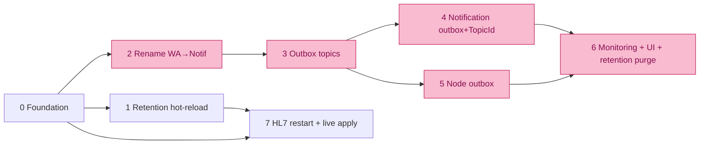

# Master Plan — Unified Outbox, Notification Rename, DB-Driven Retention & Hot-Reload

> **Status: ✅ Implemented & verified end-to-end (2026-06-08).** All phases 0–7 landed; the
> solution builds clean (0 errors) and the Angular SPA builds. Migrations ①–⑥ applied. A live Hub
> run verified: outbox topics seeded (6), `node_outbox_messages` + `vw_outbox_activity` present,
> auth-enforced `GET /api/outbox` + `/topics`, a node-sync row drained by the dispatcher with
> retry/backoff and projected through the view, `retry`/`dead-letter` actions, and a live
> `hl7.tcp_port` change that **rebound the listener (8001→8005→8001) without a host restart**
> (`{ applied:true }`), plus port validation (`400`).
>
> **Bug found & fixed during verification:** `SystemSettingsService.SetAsync`/`SeedDefaultsAsync`
> never committed (no `SaveChanges`), so *no* setting change had ever persisted — which also blocked
> the hot-reload flow. Now commits via `IUnitOfWork`.

Consolidates four workstreams into one sequenced plan:

- **A. Outbox unification** — durable, topic-driven outbox for node-sync + notifications, with real-time monitoring. (detail: [outbox-unification-plan.md](outbox-unification-plan.md))
- **B. WhatsApp → Notification rename** — drop the legacy "WhatsApp" name from the parts that are now channel-agnostic.
- **C. DB-driven retention** — retention lives in `system_settings`, per-outbox retention days, applied hot (no restart). (detail of hot-reload: [hot-reload-and-hl7-restart-plan.md](hot-reload-and-hl7-restart-plan.md))
- **D. HL7 listener explicit restart** — port/enabled changes rebind the socket on demand.

> **Key fact that drives the migration count:** `system_settings` is seeded at **runtime** by
> `HubSettingsSeed.SeedMissingAsync` on every startup (idempotent, inserts only missing keys).
> So **adding new settings keys needs NO EF migration** — only *schema* changes (new tables/columns/
> views/renames) and the single *data* rename of an existing key do.

---

## Rename scope (Workstream B) — what changes vs. what stays

The `Notification` entity/table was already renamed (`notifications`). What is left carrying "WhatsApp":

| Artifact | Decision | Reason |
|---|---|---|
| `WhatsAppAutoSendRule` + `whatsapp_auto_send_rules` + repo/interface/service | **Rename → Notification…** | Already channel-agnostic (has a `Channel` column: Email/WhatsApp) |
| `retention.whatsapp_notification_days` key + `WhatsAppNotificationRetentionDays` property | **Rename → notification** | Governs the whole `notifications` table, not just WhatsApp |
| `WhatsAppTemplate` / `whatsapp_templates` / `WhatsAppTemplateVariable` | **Keep** | Twilio content templates (`ContentSid`) — genuinely WhatsApp-channel-specific |
| `WhatsAppChannelSender`, `HubSettingKeys.WhatsApp.*` (provider/Twilio) | **Keep** | The WhatsApp channel implementation & its provider config |

Also a **cleanup**: there are two settings seeders — `HubSettingsSeed` (Persistence, runs at startup, canonical) and `SystemSettingsService.SeedDefaultsAsync` (Application, only via `POST /seed-defaults`). Consolidate to **one** (`HubSettingsSeed`) and add the new keys there.

---

## Phases

### Phase 0 — Foundation (no schema change)
- Add `IRuntimeConfigReloader` (wraps `((IConfigurationRoot)config).Reload()`).
- Consolidate the two settings seeders into `HubSettingsSeed`; add `retention.node_outbox_days` to it.
- Audit that every DB-driven option binds to a config **section** (so `IOptionsMonitor<T>` reacts to reloads).
- **EF migration: none** (new key seeded at startup).

### Phase 1 — Retention hot-reload + per-outbox retention
- `HubDataRetentionService` & `DataRetentionHostedService`: `IOptions<T>` → `IOptionsMonitor<T>`, re-read `CurrentValue` each cycle.
- `NodeOutboxRetentionDays` (default 14) already added to options + mapping; wire purge later (Phase 6).
- **EF migration: none.**

### Phase 2 — WhatsApp → Notification rename
- Rename `WhatsAppAutoSendRule` → `NotificationAutoSendRule` (entity, `IWhatsAppAutoSendRuleRepository` → `INotificationAutoSendRuleRepository`, service, EF config, `ToTable("notification_auto_send_rules")`).
- Rename retention key constant `DataRetention.WhatsAppNotificationDays` (`retention.whatsapp_notification_days`) → `DataRetention.NotificationDays` (`retention.notification_days`); property `WhatsAppNotificationRetentionDays` → `NotificationOutboxRetentionDays`; update the config-provider map path.
- **EF migrations: ① table rename, ② data rename of the settings key.**

### Phase 3 — Outbox topic catalog
- `OutboxTopic` aggregate + EF config + repo. Seed the 6 topics (`node.config/rules/pacs/equipment`, `notification.email/whatsapp`) via the runtime seeder.
- **EF migration: ③ create `outbox_topics`.** (Topic rows seeded at runtime → no data migration, unless you prefer `HasData`.)

### Phase 4 — Notification outbox onto the shared base
- Add `Notification.TopicId` FK → `outbox_topics`; backfill from `Channel`.
- Extract `OutboxDispatcherBase<T>`; refactor `NotificationOutboxHostedService` onto it (behavior unchanged).
- **EF migration: ④ add `notifications.topic_id` + FK + index (+ backfill UPDATE).**

### Phase 5 — Node outbox (durable; replaces the in-memory `NodePushQueue`)
- `NodeOutboxMessage` entity/config/repo; `NodeOutboxHostedService : OutboxDispatcherBase<NodeOutboxMessage>`.
- Producers (`NodeService`, `PacsServerService`, routing/equipment) write a `NodeOutboxMessage` in the same Unit of Work; coalesce duplicate `(NodeId, TopicId)` Pending rows.
- Feature-flag dual-run with `NodePushQueue`; cut over; **delete** `NodePushQueue` / `INodePushQueue` / `NodePushDispatchHostedService`.
- **EF migration: ⑤ create `node_outbox_messages` (+ indexes on `status`, `next_attempt_at`; FK `topic_id`).**

### Phase 6 — Unified monitoring + real-time UI + outbox retention
- `vw_outbox_activity` view = `UNION ALL` of `notifications` + `node_outbox_messages` joined to `outbox_topics`.
- `OutboxController` (REST, paged, filter by category/topic/status; retry/dead-letter actions) + SignalR `/hubs/outbox` deltas + Angular `features/outbox` (tabs **Node Sync** | **Notifications**).
- Wire `HubDataRetentionService` to purge `node_outbox_messages` (`NodeOutboxRetentionDays`) and `notifications` (`NotificationOutboxRetentionDays`).
- **EF migration: ⑥ create view `vw_outbox_activity` (raw SQL).**

### Phase 7 — HL7 listener explicit restart (config applied live)
- `Hl7TcpListener` re-entrant (`IOptionsMonitor`, channel/semaphore + internal run-CTS created in `StartAsync`) + `RequestRestart()`; reuse the supervisor loop in `Hl7ListenerHostedService`.
- On settings write of a bind key (`hl7.tcp_port`, `hl7.tcp_enabled`): validate → persist → `Reload()` → `RequestRestart()` → confirm rebind. Recommended wiring: `SystemSettingChangedEvent` (domain event) → Infrastructure handler via the existing `DomainEventDispatchInterceptor`.
- **EF migration: none** (domain event only; audit uses existing `hub_audit_logs`).

---

## EF Core Migrations by Phase  *(you run these)*

| # | Phase | Migration name (suggested) | Type | Contents |
|---|---|---|---|---|
| — | 0, 1 | — | — | New `system_settings` keys are inserted at startup by `HubSettingsSeed.SeedMissingAsync`. **No migration.** |
| ① | 2 | `RenameAutoSendRuleToNotification` | Schema | `RenameTable whatsapp_auto_send_rules → notification_auto_send_rules`; rename its PK / indexes / FK constraint names |
| ② | 2 | `RenameRetentionSettingKey` | Data | `UPDATE system_settings SET key='retention.notification_days' WHERE key='retention.whatsapp_notification_days'` (preserves the operator's current value; removes the orphan) |
| ③ | 3 | `AddOutboxTopics` | Schema | `CREATE TABLE outbox_topics` (Id, Key unique, Category, DisplayName, Description, Enabled, DefaultMaxAttempts, timestamps) |
| ④ | 4 | `AddNotificationTopicId` | Schema + Data | `ALTER TABLE notifications ADD topic_id` + FK → outbox_topics + index; backfill `topic_id` from `channel` |
| ⑤ | 5 | `AddNodeOutboxMessages` | Schema | `CREATE TABLE node_outbox_messages` (Id, topic_id FK, node_id, status, attempts, next_attempt_at, last_error, created_at, processed_at) + indexes on `status`, `next_attempt_at` |
| ⑥ | 6 | `AddOutboxActivityView` | Schema (view) | `migrationBuilder.Sql("CREATE VIEW vw_outbox_activity AS …")` UNION ALL of the two stores ⋈ outbox_topics |
| — | 7, 8 | — | — | Hot-reload, HL7 restart and retention wiring are code/events only. **No migration.** |

**6 migrations total**, all in phases 2–6. Phases 0, 1, 7 need none.

Notes for when you scaffold them:
- Tables are **snake_case** (`ToTable("…")`); match `outbox_topics`, `node_outbox_messages`.
- Topic catalog rows and all new settings keys are runtime-seeded — keep them **out** of migrations unless you deliberately prefer `HasData` (which would turn ③ and the topic rows into data migrations too).
- ① and ② are independent of A/C/D — they can ship first as a self-contained rename PR.
- ④ backfill and ⑤ indexes are the two with real data/perf impact — review the index list against the dispatcher query (`WHERE status=Pending AND next_attempt_at <= now()`).

---

## Dependency Order

Pink = phases that carry an EF migration.
